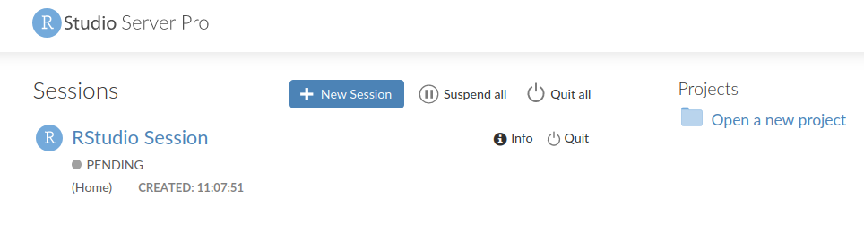
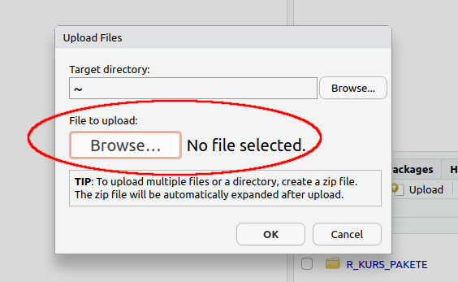

# Erste Schritte in R {#erste-schritte}

```{block, type = 'rmdoutcomes'}
- Layout und Bedeutung einzelner Fenster in RStudio kennen
- Anweisungen aus dem Skript an die Konsole schicken
- R als Taschenrechner benutzen
- erste Funktionen aufrufen
- Objekte mit eckigen Klammern [ ] ansprechen
- R-Hilfeseiten aufrufen
- Ihren ersten Olot erstellen
```


## Was ist `r fa("r-project", fill = "steelblue")`?
R ist eine Programmiersprache für Datenanalyse und statistische Modellierung. Es ist frei verfügbar (*open source software*) und neben Python einer der am meisten benutzten Programmiersprachen zur Datenanalyse und -visualisierung. R wurde von Ross Ihaka und Robert Gentleman 1996 veröffentlicht [@Ihaka1996]. Es gibt für R eine Vielzahl von Zusatzpaketen, die die Funktionalität und die Einsatzmöglichkeiten enorm erweitern.

Sie können R für Ihren Computer auf der offiziellen R-Seite https://www.r-project.org/ herunter laden und installieren. Auch die Pakete finden Sie dort unter CRAN (*The Comprehensive R Archive Network*). Auf den CRAN-Seiten finden Sie sogen. [CRAN Task Views](http://cran.r-project.org/web/views/), eine Übersicht über Pakete in verschiedenen Themenbereichen. Für den Umweltbereich sind folgende Paketsammlungen besonders relevant:

- Environmetrics: Analyse von Umweltdaten
- Multivariate: Multivariate Statistik
- Spatial: Analyse von räumlichen Daten
- TimeSeries: Zeitreihenanalyse

Zu Beginn des Kurses, werden wir jedoch nicht auf Ihren lokalen Rechnern arbeiten, sondern auf der RStudio Server Pro, der extra für die digitale Lehre mit R an der UzK eingeführt wurde. Das ermöglicht einen schnelleren Einstieg in R und bietet eine fast-live Unterstützung durch den Dozenten beim Programmieren. Daher biete ich zu diesem frühen Zeitpunkt im Kurs keine Unterstützung bei der Installation von R auf Ihren Privatrechnern. Für die ganz Ungeduldigen, gibt es hier eine kurze *Einleitung zur Installation*.

<iframe width="640" height="360" src="https://www.youtube.com/embed/kygOqp_zijk?list=PLG4WP9jv27SeMbBjhVcyXrGKQgnaex-0o" frameborder="0" allow="accelerometer; autoplay; encrypted-media; gyroscope; picture-in-picture" allowfullscreen></iframe>


## Was ist RStudio?
RStudio Desktop ist eine Entwicklungsumgebung für R. Sie können die *open source* Version kostenlos für Ihren Rechner [hier](https://rstudio.com/products/rstudio/#rstudio-desktop) herunterladen.

Es gibt eine live Einführung in RStudio im Kurs. Zusätzlich können Sie hier ein Video dazu ansehen.

<iframe width="640" height="360" src="https://www.youtube.com/embed/r5wOhFVWXUE?list=PLG4WP9jv27SeMbBjhVcyXrGKQgnaex-0o" frameborder="0" allow="accelerometer; autoplay; encrypted-media; gyroscope; picture-in-picture" allowfullscreen></iframe>


## RStudio Server Pro
### Einloggen und eine Session starten
Zu Beginn des Kurses werden wir auf dem RStudio Server Pro (RSSP) arbeiten. Jede(r) von Ihnen wird ein persönliches Login für den Server erhalten. **Dieses Login darf nicht weiter gegeben werden.** Damit ich mich im Falle von Programmierfehlern in Ihre Konto einloggen darf, müssen Sie eine Einwilligung unterschreiben und per Email an Herrn Dr. Bolten schicken (andreas.bolten@uni-koeln.de).

Bevor Sie sich auf dem RSSP einloggen können, müssen Sie Ihre VPN-Verbindung aktivieren (aus dem Uni-Netz geht es auch ohne). Auf den Seiten der Rechenzentrums finden Sie eine [Anleitung](https://rrzk.uni-koeln.de/internetzugang-web/netzzugang/vpn) zur Einrichtung des VPN-Zugangs.

Anschließend können Sie sich [hier](https://cheops-rstudio-edu.rrz.uni-koeln.de:8787/auth-sign-in) einloggen. Alternativ können Sie die Adresse des Servers https://cheops-rstudio-edu.rrz.uni-koeln.de:8787/auth-sign-in.htm in Ihren Browser kopieren. Nach dem Einloggen sehen Sie die Home-Oberfläche, aus der Sie eine neue Sitzung starten können (Abbildung \@ref(fig:rserver)).

```{r rserver, echo = F, fig.cap = 'RStudio Server Pro Home', fig.width = 6, out.width = "100%"}
knitr::include_graphics('figures/RServer_Oberflaeche.png')
```

Um eine neue Sitzung zu starten, klicken Sie auf den blauen Button `+ New Session` oder auf `New Session` neben dem R-Symbol und stellen Sie Folgendes ein (Sie dürfen der Session einen anderen Namen geben, wenn Sie möchten):

```{r neue-sesssion, echo = F, fig.cap = 'Einstellungen für neue Session', fig.width = 6, out.width = "100%"}
knitr::include_graphics('figures/neue_session.png')
```

Anschließend sehen Sie die neue Sitzung, auf die Sie nur noch klicken müssen, damit es los geht:

```{r neue-session-pending, echo = F, fig.cap = "Neue Sitzung erstellt", fig.with = 6, out.width = "100%"}

```


Der große Vorteil des RSSPs ist, dass ich direkt in Ihre Projekte eingreifen kann, wenn es mal zu Fehlern kommt. Während ich in Ihrem Projekt arbeite, werden Sie kurz aus der R-Sitzung ausgeloggt. Ihnen stehen auf dem Server unbegrenzt Arbeitsstunden zur Verfügung.

Sowohl auf dem RSSP als auch in einer lokalen Installation, ist Ihr RStudio so aufgebaut wie in Abbildung \@ref(fig:rstudio).

```{r rstudio, echo = F, fig.cap = 'Aufbau von RStudio', fig.width = 6, out.width = "100%"}
knitr::include_graphics('figures/RStudio.png')
```

### Dateimanagement
Sie werden regelmäßig Dateien in die Sitzungen auf den RSSP hoch laden und auch herunter laden müssen. Für eine übersichtliche Organisation bietet es sich an, einen Ordner für Dateien anzulegen. Klicken Sie dafür auf `New Folder` auf dem Reiter `Files` rechts unten und geben Sie dem Ordnder den Namen `data`.

Um Dateien hoch zu laden, klicken Sie auf den Button `Upload` auf dem Reiter `Files` rechts unten (Abbildung \@ref(fig:files-upload)).

```{r files-upload, echo = F, fig.cap = 'Dateien hoch laden', fig.width = 6, out.width = "100%"}
knitr::include_graphics('figures/files_upload.png')
```

Anschließend klicken Sie auf den Button `Browse` unter der Überschrift "File to upload" und navigieren zu der Datei, die Sie hoch laden möchten (Abbildung \@ref(fig:files-upload-browse)).

```{r files-upload-browse, echo = F, fig.cap = 'Dateien zum Hochladen auswählen', fig.width = 6, out.width = "100%"}

```

Um Dateien herunter zu laden, markieren Sie zunächst die Datei oder die Dateien, die Sie herunterladen möchten. Dann klicken Sie auf den Button `More` im Reiter `Files` und dann auf Export und anschließend auf Download (Abbildungen \@ref(fig:files-export) und \@ref(fig:files-download)). Speichern Sie die Datei(en) auf Ihrem Rechner.

```{r files-export, echo = F, fig.cap = 'Dateien zum herunter laden auswählen und herunter laden', fig.width = 6, out.width = "100%"}
knitr::include_graphics('figures/files_export.png')
```

```{r files-download, echo = F, fig.cap = 'Dateien zum Herunterladen speichern', fig.width = 6, out.width = "100%"}
knitr::include_graphics('figures/files_download.png')
```

Sie sollten auch auf Ihrem eigenen Rechner einen Ordner für die Veranstaltung anlegen und darin jeweils einen Ordner für Daten und Skripte.

## Lesestoff
Kapitel 1.1 und 1.2 in @ModernDive.

## Aufgaben
### Ars Haushaltsbuch

Der angehende Datenanalyst Ar Stat möchte dem Rat seiner Mutter folgen und ein Haushaltsbuch anlegen. Als erstes möchte er sich einen Überblick über seine Ausgaben in der Uni-Mensa verschaffen und erstellt die folgende Tabelle:

<br>

```{r, results='asis', echo = F}

tab <- tibble(Wochentag = c('Montag', 'Dienstag', 'Mittwoch', 'Donnerstag', 'Freitag'), `Ausgaben (€)` = c(2.57, 2.90, 2.73, 3.23, 3.90))
knitr::kable(tab, 
             #format = 'latex',
             caption = 'Ars Mensaausgaben', booktabs = T,
             format.args = list(decimal.mark = ',')) %>%
  kable_styling(bootstrap_options = "striped", full_width = F,
                position = "left")
```


1. Wie viel hat Ar insgesamt in der Woche ausgegeben?
2. Wie viel hat er im Schnitt pro Tag ausgegeben?
3. Wie stark schwanken seine Ausgaben?

Leider hat Ar sich beim übertragen der Daten vertippt. Er hat am Dienstag seine Freundin zum Essen eingeladen und 7,95 € statt 2,90 € ausgegeben.

4. Korrigieren Sie Ars Fehler.
5. Wie verändern sich die Ergebnisse aus den Teilaufgaben 1 bis 3 Warum?


### Fehlende Werte {#rob2}

R kodiert fehlende Werte mit `NA`. Ar Stat hat am Montag der darauffolgenden Woche in der Mensa gegessen, aber vergessen die Ausgaben zu notieren.

```{r, results='asis', echo = F}

tab <- tibble(`Wochentag` = c('Montag, 9. März', 'Dienstag, 10. März', 'Mittwoch, 11. März', 'Donnerstag, 12. März', 'Freitag, 13. März', 'Montag, 16. März'), `Amount spent (€)` = c(2.57, 2.90, 2.73, 3.23, 3.90, NA))
knitr::kable(tab, 
             #format = 'latex',
             caption = "Ars Mensaausgaben, cont.", booktabs = T,
             format.args = list(decimal.mark = ',')) %>%
  kable_styling(bootstrap_options = "striped", full_width = F,
                position = "left")
```

- Wie ändert der fehlende Wert die Berechnung der Summe?
- Lesen Sie was passiert, wenn der Datenvektor bei der Berechnung der Summe fehlende Werte enthält. Rufen Sie dazu die Hilfe auf, i.e. `?sum`.
- Korrigieren Sie die Berechnung der Summe entsprechend.

### Ihr erster Plot {#firstplot}
Vor allem am Anfang kann die Lernkurve in R recht flach verlaufen. Daher sollten Sie nicht vergessen, warum Sie R lernen, nämlich um echte Datensätze zu analysieren.

Auch wenn Sie den Code unten noch nicht (ganz) verstehen, kopieren Sie ihn in Ihr R und lassen Sie ihn laufen.

```{r, echo = T, results = 'hide', fig.show='hide'}
library(tidyverse)
library(gapminder)

gapminder2007 <- gapminder %>% 
  filter(year == 2007)

ggplot(gapminder2007, aes(x = gdpPercap, y = lifeExp, color = continent, size = pop)) +
  geom_point() +
  scale_x_log10() +
  xlab('GDP per capita') +
  ylab('Life expectancy') +
  labs(title = 'Gapminder data for the year 2007')
  
```

- Welche Daten sind in diesem Datensatz enthalten? Nutzen Sie die Hilfe, i.e. `?gapminder`.
- Was stellen die Farben in der Abbildung dar?
- Was wird durch die Symbolgröße dargestellt?
- Wie würden Sie den Zusammenhang zwischen den Variablen `GDP per capita` und `Life expectancy` beschreiben?


### R als Taschenrechner

R ist ein großer Taschenrechner mit vielen voreingebauten Funktionen. Es gelten die üblichen Rechenregeln wie z.B. Punkt-vor-Strich und die Klammern.

- Schreiben Sie den Code, der 2 und 10 addiert

Das korrekte Multiplikationszeichen in R ist `*`.

- Geben Sie den folgenden Befehl korrekt in R ein: (2 + 10) $\times$ 27

Bei Dezimalzahlen wird der Dezimalpunkt und nicht das Komma verwendet. Das ist wichtig zu beachten, wenn Sie später Daten in R einlesen möchten.

- Berechnen Sie die Summe von 2,34 und 4,98.

### Zuweisungen
In R arbeitet man mit Objekten. Ein Objekt kann alles Mögliche sein: eine Variable, Daten, Vektoren etc. Wenn also das Ergebnis einer Berechnung oder ein Datenobjekt im R-Arbeitsbereich (*workspace*) zur Verfügung stehen soll, muss daraus ein Objekt erstellt werden.

Objekte erstellt man, indem man ihnen Namen gibt. Diesen Vorgang nennt man **Zuweisung** (*assignment*). Im Beispiel unten wird ein Objekt, in diesem Fall ein Skalar, namens `x` erzeugt mit dem Wert 42. Um den Wert von `x` anzuzeigen, tippen Sie `x` ein.

```{r "2_assignment", results = 'hide'}
x <- 42

# Zeige den Wert von x
x
```


Zuweisungen können in R entweder mit dem `=` erfolgen oder mit `<-`. Beide Varianten sind gleichwertig. Dabei ist allerdings Pfeilrichtung entscheidend! `x <- 42` bedeutet: die linke Seite (Zahl 42) wird dem Objekt `x` zugeordnet. Wenn man die Pfeilrichtung umdreht, macht die Zuweisung keinen Sinn und man erhält eine Fehlermeldung.

```{r "2_assignment_long", error = T, results = 'hide'}
# Sinnvolle Zuweisung
x <- 42
# Gleichwertige sinnvolle Zuweisung
x = 42
# Sinnloser Ausdruck. Fehlermeldung!
x -> 42
```

Objektnamen können (fast) frei gewählt werden. Sie müssen mit einem Buchstaben beginnen und dürfen keine Sonderzeichen enthalten. Bei längeren Namen empfiehlt sich ein `_`. **Streng verboten sind Namen von vordefinierten Funktionen!**

- Erstellen Sie ein Objekt namens `mein_objekt` und weisen Sie ihm das Ergebnis der Berechnung $23^{2}$ zu. Eine Potenz berechnen Sie mit `^`.

Eine Zuweisung kann auch kompliziertere Anweisungen enthalten. Hier erstellen wir z.B. einen Vektor mit Hilfe der Funktion `c` (*concatenate*) und weisen das Ergebnis dem Objekt `my_a` zu.

```{r "2_3", results = 'hide'}
my_a <- c(32, 54, 1.2, 398)
```


### Funktionsaufruf
In R gibt es eine Vielzahl von vordefinierten Funktionen. Ein kleine Übersicht davon haben Sie in unserem Begleitskript im Kapitel 3. Ein Funktionsaufruf hat immer die gleiche Form: *mach_das(damit)* oder *mach_das(damit, und_mit_dieser_einstellung)*. Z.B. wird die Summe auf einem Objekt `mein_objekt` mit `sum(mein_objekt)` berechnet.

- Erstellen Sie einen Vektor mit den Zahlen 32, 54, 1,2 und 398 und weisen Sie ihn der Variablen `my_a` zu.
- Berechnen Sie die summe von `my_a`. 

Sie können im Übrigen auch Vektoren sinnvoll addieren.

- Erstellen Sie einen Vektor `my_b` mit der passenden Länge und addieren Sie ihn zum Vektor `my_a`. Die Addition erfolgt elementeweise.

Häufig wollen wir für unsere Daten den Mittelwert berechnen.

- Berechnen Sie den Mittelwerts von `my_a`
- Berechnen Sie die Standardabweichung von `my_a`.

### Objekte ansprechen

Um das "Innenleben" der Objekte in R anzusprechen, gibt es verschieden Möglichkeiten. In diesem Tutorial konzentrieren wir uns auf Vektoren. Um die einzelnen Komponenten im Vektor anzusprechen, benutzt man eckige Klammern `[ ]`. Um eine bestimmte Komponente zu adressieren (anzusprechen), schreibt man die Platznummer der Komponente in die Klammer. Wenn man im Vektor `my_c`, z.B. die dritte Komponente extrahieren möchte, dann schreibt man `my_c[3]`

```{r "a_3", resutls = 'hide'}
my_c <- c(2, 45.7, pi, sqrt(23), 2^6)
my_c[3]
```


Wir können auch Vektoren erstellen, bei denen einzelne Elemente benannt sind.

```{r}
benannt <- c('Koeln' = 50667, 'Berlin' = 10965, "Stuttgart" = 70173)
```

Elemente in solchen Vektoren kann man mit Namen in eckigen Klammern ansprechen. Die Namen müssen in Anführungszeichen geschrieben werden. Es spielt keine Rolle, ob Sie einfache oder doppelte Anführungszeichen benutzen.

- Fragen Sie nach dem Element `Koeln` im Vektor `benannt`.

## Ihre Arbeit einreichen
- Speichern Sie Ihre .R Datei auf dem Server ab.
- Laden Sie diese Datei herunter und speichern Sie sie auf Ihrem Computer ab.
- Laden Sie die Datei auf ILIAS in der dazugehörigen Übung hoch.
- Nach der Abgabe erhalten Sie die Musterlösung.
- Vergelichen Sie Ihre Lösung sebstständig mit der Musterlösung.
- Stellen Sie entweder in Campuswire (im class-chat) oder in der nächsten live Sitzung Fragen, falls Sie bei den Aufgaben etwas nicht verstanden haben und die Musterlösung es nicht aufklären konnte.
