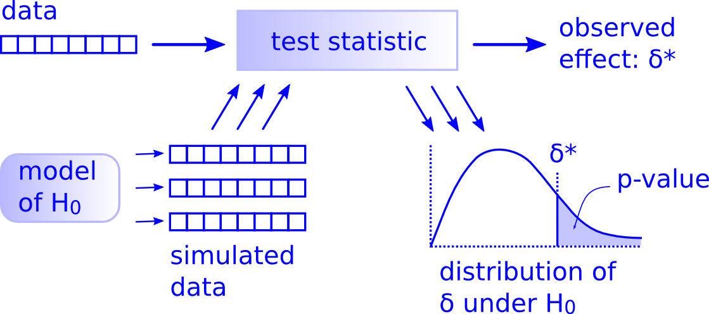

# Hypothesentests mit dem Paket `infer` {#hypothesentsts}

```{block, type = 'rmdoutcomes'}
- Idee hinter simulationsbasierten Tests erklären
- Tests mit dem Paket `infer` durchführen
```


## Es gibt nur einen Test
Ich weiß nicht, wie es Ihnen ergangen ist, aber ich habe in meiner Grundausbildung in Statistik verschiedene Tests kennen gelernt: $t$-Test für gepaarte und ungepaarte Stichproben, $F$-Test für die Varianz, $z$-Test etc. Am Ende war ich verwirrt und wusste nicht mehr, welchen ich wann nehmen soll. Am Ende des Tages musste ich, wenn ich einen neuen Datensatz hatte und einen Test brauchte, lange nachdenken, welchen ich nutzen soll.

Diese vielen Tests stammen noch aus der Urzeit der Statistik, als Rechenzeit, wenn überhaupt vorhanden, unbezahlbar war. Daher haben die Väter der Statistik (war damals überwiegend eine reine Männerclique `r emo::ji('angry')`) viele Näherungsverfahren entwickelt. Diese Näherungsverfahren leiten eine theoretische Verteilung für verschiedene Teststatistiken ab. Tests, die auf solchen Näherungen basieren, haben häufig starke Annahmen über die Daten, wie z.B. dass die Daten normalverteilt sein müssen, oder dass der Datensatz groß sein muss, damit die Näherung stimmt.

Heute ist für die meisten unserer Analysen ausreichen Rechenkapazität vorhanden. Daher müssen wir nicht mehr auf solche Näherungen zurück greifen, sondern können Computersimulationen benutzen. Diese Computersimulationen setzt man ein, um bei Hypothesentests Daten unter der Nullhypothese zu generieren. Abbildung \@ref(fig:one-test) zeigt das allgemeine Vorgehen, wie es für jeden beliebigen Test gültig ist. Dieses Vorgehen kann man auf folgende Schritte "runterkochen":

**Teststatistik aus Stichprobe berechnen** 
Wir haben eine Stichprobe (*data* in der Abbildung \@ref(fig:one-test)), die wir mit Hilfe einer Teststatistik zusammen fassen. Wir nennen diese Teststatistik $\sigma^*$. Sie kann z.B. der Mittelwert der Differenzen zwischen einer Behandlung und einer Kontrolle in einem Experiment sein.

**Nullhypothese formulieren**
Wir denken gut über unsere Forschungsfrage nach und überlegen uns, welches Modell am besten die Nullhypothese $H_0$, also eine Situation ohne jeglichen Effekt, wiedergibt. Im Falle des Mittelwerts ist es eine Welt, in der der besagte Mittelwert Null ist, es also keinen Behandlungseffekt in unserem Experiment gibt. Das Modell für $H_0$ kann eine Permutation der Daten sein (Permutationstests) oder aus einer theoretischen Verteilung stammen (z.B. Normalverteilung). Es kann auch ein richtig kompliziertes Modell sein. Letzteres ist nicht Bestandteil diese Kurses.

**Simulation der Daten unter der Nullhypothese**
Wir simulieren Daten aus diesem Modell ohne Effekt, d.h. Daten unter der Nullhypothese, und berechnen aus jedem simulierten Datensatz dieselbe Teststatistik wie aus der echten Stichprobe.

**Berechnen der Stichprobenverteilung**
Die vielen simulierten Teststatistiken ergeben eine Stichprobenverteilung.

**Vergleich der beobachteten Teststatistik mit der Stichprobenverteilung -- Entscheidung**
Nun können wir die aus unseren Daten berechnete Teststatistik $\sigma^*$ mit der Stichprobenverteilung der Teststatistik der simulieren Daten vergleichen. Wir entscheiden, ob $\sigma^*$ in der Welt ohne Effekt, also unter der Nullhypothese, häufig oder eher selten vorkommt. Der $p$-Wert gibt an, wie wahrscheinlich es ist, unter der Nullhypothese einen Effekt zu beobachten, der mindestens so extrem ist, wie derjenige, den wir durch unsere Daten errechnet haben, sprich mindestens so extrem wie $\sigma^*$. Wenn $\sigma^*$ selten vorkommt, der $p$-Wert also klein ist, verwerfen wir die Nullhypothese und sagen, dass es einen Effekt gibt. Mit anderen Worte, es ist dann unwahrscheinlich, dass das beobachtete $\sigma^*$ auf den Zufall zurück zu führen ist.

Diese Schritte gelten wirklich für jeden beliebigen Test. Daher kann man verallgemeinert sagen, dass es nur einen Test (ein Testframework) gibt. 

```{r one-test, echo = F, fig.cap = 'Logik hinter den Hypothesentests aus der Sicht der modernen Datenanlyse (Quelle: http://allendowney.blogspot.com/2016/06/there-is-still-only-one-test.html).', fig.width = 6, out.width = "80%"}

```


## Workflow in `infer`
Das Paket `infer` bietet so ein einheitliches Framework für Hypothesentests (Abbildung \@ref(fig:ht)). Es hat 4 Verben, die den oben beschriebenen Prozess der Hypothesentests vereinheitlichen und ein Verb für die Visualisierung der Ergebnisse:

1. `specify()` Variablen festlegen
1. `hypothesize()` Nullhypothese definieren
1. `generate()` Daten unter der Nullhypothese generieren
1. `calculate()` Stichprobenverteilung (d.h. Verteilung der Teststatistik) berechnen
1. `visualize()` Stichprobenverteilung darstellen

Mit `get_p_value` kann man den $p$-Wert berechnen und mit `shade_p_value` diesen darstellen lassen.

```{r ht, echo = F, fig.cap = 'Verallgemeinertes Vorgehen bei Hypothesentests (Quelle: https://infer.netlify.app/).', fig.width = 6, out.width = "80%"}
knitr::include_graphics('figures/ht-diagram.png')
```

### Stadt- und Landbewohner in Werdeschlau
Wir möchten gerne wissen, ob sich unter den Studierenden in Werdeschlau genauso viele Stadt- wie Landbewohner gibt oder ob sich die Anteile der Stadt- und Landbewohner unterscheiden.

Zunächst laden wir die nötigen Bibliotheken.
```{r, message = F, error = F}
library(tidyverse)
library(infer)
```

Wir simulieren erneut unsere Grundgesamtheit.
```{r}
set.seed(123)

student_id <- 1:12000
  
anreise <- c(runif(n = 12000 * 0.8, min = 5, max = 40),
             runif(n = 12000 * 0.2, min = 60, max = 120))

geschlecht <- sample(c('m', 'w'), size = 12000, replace = TRUE)

wohnort <- sapply(anreise, function(x) {
  if(x < 30) 'stadt'
  else 'land'
})

verkehrsmittel <- sapply(anreise, function(x) {
  if(x <= 10) 'zu_fuss'
  else if(x > 10 & x <= 15) sample(c('zu_fuss', 'fahrrad'), size = 1)
  else if(x > 15 & x <= 45) sample(c('bus', 'fahrrad', 'auto'), size = 1)
  else sample(c('bus', 'auto'), size = 1)
})

zeit_bib <- 5 * 60 - 0.7 * anreise + rnorm(length(anreise), 0, 20)

grundgesamtheit <- tibble(student_id, geschlecht, wohnort, verkehrsmittel, anreise, zeit_bib)

datatable(grundgesamtheit, options = list(scrollX = T)) %>%
  formatRound(c('zeit_bib', 'anreise'), 1)
```


Nun befragen wir 200 Studierende.

```{r}
set.seed(345)

befragung_size <- 200

befragung <- rep_sample_n(grundgesamtheit, size = befragung_size, replace = FALSE, reps = 1)

datatable(befragung, options = list(scrollX = T)) %>%
  formatRound(c('zeit_bib', 'anreise'), 1)
```

Wir berechnen den Anteil der Stadtbewohner in der Befragung.

```{r}
prop_hat <- befragung %>% 
  specify(response = wohnort, success = "stadt") %>%
  calculate(stat = "prop")

prop_hat
```

Die Nullhypothese und die Alternativhypothese lauten:

>- $H_0$: es gibt keinen Unterschied in der Anzahl der Stadt- und Landbewohner, d.h. Anteil der Stadtbewohner $p = 0.5$.
>- $H_A$: Anteil der Stadtbewohner $p \neq 0.5$

Wir setzten das Ganz nun mit `infer` um.

```{r}
set.seed(123)

null_distn <- befragung %>%
  specify(response = wohnort, success = "stadt") %>%
  hypothesize(null = "point", p = .5) %>%
  generate(reps = 10000) %>%
  calculate(stat = "prop")
```
Das Paket `infer` setzt in `generate()` die Art der Simulation automatisch (*bootstrap*, *simulate* oder *permute*). Für sogen. Punkthypothesen `null = "point"` bei kategoriellen Variablen, z.B. *$H_0$: Anteil der Stadtbewohner = 0.5*, simuliert `generate()` neue Daten mit Hilfe der Funktion `sample()` und nutzt die in `hypothesize()` definierten Anteil `p` als Wahrscheinlichket für `success`. D.h. in unserem Fall simuliert `generate()` 10000 neue Stichproben mit der Wahrscheinlichkeit von 0.5 für Stadtbewohner (`success = 'stadt'`), wie von $H_0$ verlangt `r emo::ji('smile')`.

Wir sehen uns die Stichprobenverteilung an.
```{r, out.width = '90%'}
visualize(null_distn) +
  shade_p_value(obs_stat = prop_hat, direction = "two-sided")
```

Am Ende berechnen wir den $p$-Wert.
```{r}
null_distn %>%
  get_p_value(obs_stat = prop_hat, direction = "two-sided")
```
Der $p$-Wert ist sehr klein, es ist also unwahrscheinlich, den Anteil von Stadtbewohnern von `r prop_hat` zu beobachten, wenn wirklich gleich viele Stad- und Landbewohner sind, der Anteil also 0.5 beträgt. Daher schließen wir, dass das Verhältnis von Stadt- zu Landbewohnern ist nicht eins zu eins ist. 

### Präferenzen für den Wohnort
Haben weibliche und männliche Studierende unterschiedliche Präferenzen für den Wohnort? Das ist ein ähnlicher Fall wie in der Einführung zu Hypothesentests, als wir uns mit den Beförderungschancen von Frauen und Männern in den 70ern befasst haben. Wir haben hier zwei kategoriale Variablen, nämlich `wohnort` und `geschlecht` und wollen wissen, ob die beiden miteinander zusammenhängen. Daher lauten unsere Nullhypothese und Alternativhypothese:

>- $H_0$: `wohnort` und `geschlecht` sind unabhängig.
>- $H_A$: `wohnort` und `geschlecht` hängen zusammen.

Wir berechnen zunächst den Unterschied zwischen Stadtbewohnern nach Geschlecht.
```{r}
d_hat <- befragung %>% 
  specify(wohnort ~ geschlecht, success = "stadt") %>%
  calculate(stat = "diff in props", order = c("w", "m"))

d_hat
```
Wir basieren unseren Test auf Permutation, d.h. wir permutieren mehrfach eine der Variablen und berechnen die Differenzen in den Anteilen der Stadtbewohner je nach Geschlecht für jede Permutation. Die Permutation wird von `generate()` automatisch richtig gewählt.
```{r}
set.seed(123)

null_distn <- befragung %>%
  specify(wohnort ~ geschlecht, success = "stadt") %>%
  hypothesize(null = "independence") %>% 
  generate(reps = 10000) %>% 
  calculate(stat = "diff in props", order = c("w", "m"))

null_distn
```

Nun Plotten wir die Stichprobenverteilung, die auf Permutation basiert, und färben den $p$-Wert ein. Der rote Balken zeigt der Wert der Statistik in den Daten, `d_hat`.
```{r, out.width = '90%'}
visualize(null_distn) +
  shade_p_value(obs_stat = d_hat, direction = "two-sided")
```

Der $p$-Wert beträgt
```{r}
null_distn %>%
  get_p_value(obs_stat = d_hat, direction = "two-sided")
```

Der $p$-Wert ist auch in diesem Fall klein. Wir würden also wie im oberen Beispiel schließen, dass es unwahrscheinlich ist, dass die Unterschiede zwischen Männern und Frauen bei der Präferenz des Wohnorts zufällig sind. 

An dieser Stelle ein kleiner Ausflug in die Welt der **statistischen Signfikanz**. Sehr häufig wird für die Entscheidung, ob eine Nullhypothese abgelehnt wird, ein willkürlicher Schwellenwert, das Signifikanzniveau $\alpha$ (meistens 5%) genutzt. Wenn der $p$-Wert darunter liegt, wird die Nullhypothese verworfen, ansonsten wird sie beibehalten. Es gibt also eine **Dichotomisierung**, eine Klassifizierung der $p$-Werte in statistisch signifikant und statistisch nicht signifikant. Dieses Vorgehen wird seit vielen Jahren stark kritisiert [@Wasserstein2019]. Und an unserem Beispiel wird auch klar, warum. Hier ist der $p$-Wert etwas größer als das Signifikanzniveau und wir müssten die Nullhypothese beibehalten, wegen einer winzigen Überschreitung von 0.42%. Das macht wissenschaftlich keinen Sinn und ist extrem unbefriedigend. Zudem sorgt die "Jagd" nach signifikanten Ergebnissen für allerlei Missbrauch. Man könnte z.B. im Nachhinein das Signifikanzniveau höher setzten. Das nennt man **$p$-Hacking**. Um diesem Missbrauch vorzubeugen und um mehr Informationen aus einem Hypothesentest zu ziehen, berichten Sie einfach den $p$-Wert und ordenen ihn ein. Ist so ein Effekt, wie er in den Daten beobachtet wurde, selten oder häufig unter der Annahme der Nullhypothese? 

BTW, der wahre Unterschied aus der Grundgesamtheit zwischen den Mannern und Frauen ist extrem klein. Nur weil etwas signifikant oder nicht signifikant ist, ist es noch lange nicht relevant. Das zu beurteilen braucht es Fachwissen (*domain knowledge*) und eine richtige Einordnung der Ergebnisse. Daher ist die Berechnung von Effektgrößen (s. nächstes Kapitel) sehr viel spannender als das Durchführen von Hypothesentests.
```{r}
grundgesamtheit %>% 
  specify(wohnort ~ geschlecht, success = "stadt") %>%
  calculate(stat = "diff in props", order = c("w", "m"))
```

$p$-Werte werden häufig miss- oder überinterpretiert. Es geht soweit, dass nur wissenschaftliche Ergebnisse mit signifikanten Ausgängen bei Hypothesentests als wertvoll und publizierbar angesehen werden. Davor kann man nur dringend warnen. Diese Einstellung führt zur Verzerrung der wissenschaftlichen Ergebnissen. Ich lade Sie ein, mehr dazu bei @Wasserstein2016 und im Kapitel 9.6 in @ModernDive nachzulesen.

## Lesestoff
Kapitel 9.3 bis 9.6 in @ModernDive

## Aufgaben
### Sind Anreisezeit und Zeit in der Bibliothek correliert?
Führen Sie einen Hypothesentest durch, ob die Anreisezeit und die Zeit in der Bibliothek (`zeit_bib`) korreliert sind. Formulieren Sie die Null- und die Alternativhypothese mit Ihren eigenen Worten, bevor Sie den Test durchführen.

Tipps: `specify(anreise ~ zeit_bib)` und `calculate(stat = "correlation")`. Sehr hilfreich dazu ist auch die Webseite von `infer` (s.u.).

### Hängt die Wahl des Verkehrsmittels vom Wohnort ab?
Vielleicht können Sie sich noch erinnern, dass wir in einer der früheren Stunden die Kontingenztabelle durchgenommen haben (s. Vorlesung Zusammenhangsmaße). In einer solchen Tabelle fasst man die Häufigkeiten von zwei kategoriellen Variablen zusammen. Anhand von so einer Tabelle kann man entscheiden, ob es einen Zusammenhang zwischen diesen beiden Variablen gibt. Die Statistik, die man für so eine Tabelle ausrechnet, heißt Kontingenzkoeffizient. In einem Hypothesentest, genannt $\chi^2$-Test, kann man überprüfen, ob dieser Zusammenhang zufällig ist.

Überprüfen Sie nun, ob es einen Zusamenhang gibt zwischen der Wahl des Verkehrsmittels und dem Wohnort der befragten Studierenden. Tipps: `specify(formula = wohnort ~ verkehrsmittel)` und `calculate(stat = "Chisq")`. Auch hier lohnt ein Blick auf die Webseite von `infer` (s.u.).

## Ihre Arbeit einreichen
- Speichern Sie Ihr Notebook ab und laden Sie nur die .Rmd Datei vom Server.
- Laden Sie Ihre .Rmd Datei in ILIAS hoch. **Beachten Sie die Deadline!**
- Sie erhalten die Musterlösung nach dem Hochladen.

## Weiterführende Literatur und Videos
Webseite von `infer`: https://infer.netlify.app/

Vortrag des Autors von `infer`.

<p><a href="https://www.rstudio.com/resources/rstudioconf-2018/infer-a-package-for-tidy-statistical-inference/?wvideo=lkx9sw1ed2"></a></p><p><a href="https://www.rstudio.com/resources/rstudioconf-2018/infer-a-package-for-tidy-statistical-inference/?wvideo=lkx9sw1ed2">infer: a package for tidy statistical inference - RStudio</a></p>

