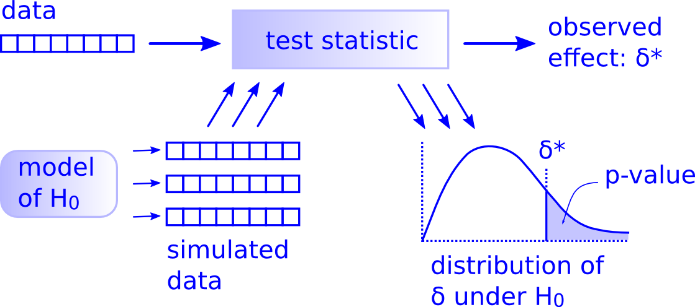

```{r include=FALSE, cache=FALSE}
# Load libraries
library(fontawesome)
library(kableExtra)
library(tidyverse)
library(DT)
library(emo)

knitr::knit_hooks$set(document = function(x) {
  sub('\\usepackage{graphicx, color}',
      '\\usepackage{graphicx,xcolor}', x, fixed = TRUE)
}) 


# These are different helper functions for the book

colorize <- function(x, color) {
  if (knitr::is_latex_output()) {
    sprintf("\\textcolor{%s}{%s}", color, x)
  } else if (knitr::is_html_output()) {
    sprintf("<span style='color: %s;'>%s</span>", color, 
            x)
  } else x
}

file.name <- function(x) {
  if (knitr::is_latex_output()) {
    sprintf("\\texttt{%s}", x)
  } else if (knitr::is_html_output()) {
    sprintf("<span style='font-family: sans-serif; font-size: medium'>%s</span>",
            x)
  } else x
}
```

# Vorwort {-}

> "And honey, we're gonna do it in style"

`r tufte::quote_footer('--- Fools Garden')`

## Organisatorisches {-}

```{block, type='rmdinfo'}
Die Coronaviruspandemie hat unser Leben und unser Lernen verändert. Die vergangenen digitalen Semester haben ein paar nützliche Werkzeuge etabliert, die ich gerne in die Präsenzlehre übernehmen möchte.
```

In dieser Veranstaltung werden wir folgende Werkzeuge verwenden:

**ILIAS**: die Online-Lernplattform der UzK. Entweder sind Sie bereits automatisch in dem Kurs registriert oder werden von mir per Hand angemeldet.

**Campuswire**: die Chatplattform dient der allgemeinen Kommunikation und der Selbstorganisation des Lernens. Verwenden Sie diese, um Fragen mit Ihren Kommilitonen*innen und mir zu diskutieren. Sie sollten eine Einladungsmail zu Campuswire erhalten haben.

**Zoom**: die Videokonferenz-Software bleibt unser Notfall-Werkzeug, falls keine Präsenz möglich ist.


## Verwendete Literatur {-}

Wir werden in diesem Kurs hauptsächlich das freie, englischsprachige Buch [ModernDive: Statistical Inference via Data Science](https://moderndive.com/) benutzen [@ModernDive]. Bitte lassen Sie sich nicht davon abschrecken, dass das Buch englischsprachig ist. Es ist sehr gut verständlich und bietet einen modernen Zugang zur Datenanalyse. Als ein weiteres Buch empfehle ich @Sauer2019.

Gelegentlich werde ich Ihnen auch andere Literatur empfehlen. Für Ihren Abschlussbericht werden Sie auch selbstständig weitere Literatur recherchieren.

## Sinn und Unsinn dieses Skripts {-}

Dieses Skript ist ein lebendiges Begleitdokument des Kurses. Es wird laufend angepasst und aktualisiert.

Ich nutze verschiedenfarbige Blöcke, um wichtige Stellen hervorzuheben:

```{block, type='rmdinfo'}
Infoblock
```

<br>

```{block, type='rmdalert'}
Achtung, wichtig!
```

<br>

```{block, type='rmddef'}
Definition
```

<br>

```{block, type='rmdoutcomes'}
Lernziele
```

<!-- <br> -->

<!-- ```{block, type='rmdsummary'} -->
<!-- Zusammenfassung -->
<!-- ``` -->

## Inspiration, Quellen und Danksagung {-}

Dieses Skript baut stark auf folgenden freien Quellen auf:

- r4ds: @r4ds
- ggplot2: @Wickham2020
- ModernDive: @ModernDive

Den Autoren dieser Bücher gilt ein großer Dank für Ihren Beitrag zur `r fa("r-project", fill = "steelblue")`-Community `r fa("heart", fill = "red")`!

## Reproduzierbarkeit {-}
Dieses Buch wurde in [RStudio](https://www.rstudio.com/products/rstudio/) mit [Bookdown](https://bookdown.org/) geschrieben und in `r R.version.string` gebaut. Folgende Pakete werden für die Beispiele und Übungen benötigt:

```{r, echo = FALSE, cache = FALSE}
# Dieser Code stammt aus dem ggplot2 Buch
# https://github.com/hadley/ggplot2-book/blob/master/introduction.Rmd
    deps <- desc::desc_get_deps()
    pkgs <- sort(deps$package[deps$type == "Imports"])
    pkgs2 <- strwrap(paste(encodeString(pkgs, quote = '"'), collapse = ", "), exdent = 2)
    install <- paste0(
      "install.packages(c(\n  ", 
      paste(pkgs2, "\n", collapse = ""), 
      "))"
    )
```


```{r, echo = FALSE, results="asis"}
# Dieser Code stammt aus dem ggplot2 Buch
# https://github.com/hadley/ggplot2-book/blob/master/introduction.Rmd
pkgs <- sessioninfo::package_info(pkgs, dependencies = FALSE)
df <- tibble(
  package = pkgs$package,
  version = pkgs$ondiskversion,
  source = gsub("@", "\\\\@", pkgs$source)
)
knitr::kable(df, format = "markdown")
```


Die komplette Information zur Session lautet:

```{r, echo = FALSE,}
sessionInfo()
```

{width=30%}

Dieses Skript ist lizenziert unter [Creative Commons Namensnennung - Nicht-kommerziell - Weitergabe unter gleichen Bedingungen 4.0 International.](https://creativecommons.org/licenses/by-nc-sa/4.0/deed.de/)

<!--chapter:end:index.Rmd-->

```{r include=FALSE, cache=FALSE}
# Load libraries
library(fontawesome)
library(kableExtra)
library(tidyverse)
library(DT)
library(emo)

knitr::knit_hooks$set(document = function(x) {
  sub('\\usepackage{graphicx, color}',
      '\\usepackage{graphicx,xcolor}', x, fixed = TRUE)
}) 


# These are different helper functions for the book

colorize <- function(x, color) {
  if (knitr::is_latex_output()) {
    sprintf("\\textcolor{%s}{%s}", color, x)
  } else if (knitr::is_html_output()) {
    sprintf("<span style='color: %s;'>%s</span>", color, 
            x)
  } else x
}

file.name <- function(x) {
  if (knitr::is_latex_output()) {
    sprintf("\\texttt{%s}", x)
  } else if (knitr::is_html_output()) {
    sprintf("<span style='font-family: sans-serif; font-size: medium'>%s</span>",
            x)
  } else x
}
```
# Der Kurs {-#einfuehrung}
## Zuordnung zum Modul und Leistungsnachweis {-}

Dieser Kurs gehört zum Modul *Fachmethodik I* oder *Fachmethodik II* und ist aus 4 SWS Praktikum und 2 SWS Seminar aufgebaut. Das wichtigste Ziel besteht darin, Ihnen einen sicheren Umgang mit `R` beizubringen.

Den Leistungsnachweis bildet ein benoteter Praktikumsbericht.

## Lernziele des Kurses {-}

```{block, type='rmdoutcomes'}
- Daten für Analysen vorbereiten
- Daten einlesen und visualisieren
- Code und Dokumentation in R Markdown schreiben
- eigene Funktionen schreiben
- reproduzierbare Datenanalysen durchführen
- gelernte Methoden auf einen neuen Datensatz anwenden
- Ergebnisse reproduzierbar im Praktikumsbericht darstellen
```

## Was mir im Umgang miteinander wichtig ist {-}

- Pünktlichkeit bei Präsenz- und Zoomsitzungen
- Gute Vorbereitung durch Erledigen der Hausaufgaben
- Respektieren anderer Meinungen
- Offenheit gegenüber neuen Sichtweisen, Themen und Methoden
- Geduld mit sich selbst und den anderen `r emo::ji('smile')`


<!--chapter:end:01-einfuehrung.Rmd-->

```{r include=FALSE, cache=FALSE}
# Load libraries
library(fontawesome)
library(kableExtra)
library(tidyverse)
library(DT)
library(emo)

knitr::knit_hooks$set(document = function(x) {
  sub('\\usepackage{graphicx, color}',
      '\\usepackage{graphicx,xcolor}', x, fixed = TRUE)
}) 


# These are different helper functions for the book

colorize <- function(x, color) {
  if (knitr::is_latex_output()) {
    sprintf("\\textcolor{%s}{%s}", color, x)
  } else if (knitr::is_html_output()) {
    sprintf("<span style='color: %s;'>%s</span>", color, 
            x)
  } else x
}

file.name <- function(x) {
  if (knitr::is_latex_output()) {
    sprintf("\\texttt{%s}", x)
  } else if (knitr::is_html_output()) {
    sprintf("<span style='font-family: sans-serif; font-size: medium'>%s</span>",
            x)
  } else x
}
```
# (PART) Teil I: Daten explorieren {-}
# Erste Schritte in R {#erste-schritte}

```{block, type = 'rmdoutcomes'}
- Layout und Bedeutung einzelner Fenster in RStudio kennen
- Anweisungen aus dem Skript an die Konsole schicken
- R als Taschenrechner benutzen
- erste Funktionen aufrufen
- Objekte mit eckigen Klammern [ ] ansprechen
- R-Hilfeseiten aufrufen
- Ihren ersten Olot erstellen
```


## Was ist `r fa("r-project", fill = "steelblue")`?
R ist eine Programmiersprache für Datenanalyse und statistische Modellierung. Es ist frei verfügbar (*open source software*) und neben Python einer der am meisten benutzten Programmiersprachen zur Datenanalyse und -visualisierung. R wurde von Ross Ihaka und Robert Gentleman 1996 veröffentlicht [@Ihaka1996]. Es gibt für R eine Vielzahl von Zusatzpaketen, die die Funktionalität und die Einsatzmöglichkeiten enorm erweitern.

Sie können R für Ihren Computer auf der offiziellen R-Seite https://www.r-project.org/ herunterladen und installieren. Eine kurze Anleitung finden Sie auf ILIAS, zusammen mit der Liste der Pakete, die wir in diesm Kurs brachen werden. Zusätzlich können Sie sich [hier](https://www.youtube.com/watch?v=kygOqp_zijk&list=PLG4WP9jv27SeMbBjhVcyXrGKQgnaex-0o&t=14s) ein Video zur Installation ansehen. 

Auf der offiziellen R-Seite finden Sie auch zusätzliche Pakete, und zwar unter CRAN (*The Comprehensive R Archive Network*). Manche Pakete sind auf den CRAN-Seiten thematische in sogen. [CRAN Task Views](http://cran.r-project.org/web/views/) gegliedert. Für den Umweltbereich sind folgende Paketsammlungen besonders relevant:

- Environmetrics: Analyse von Umweltdaten
- Multivariate: Multivariate Statistik
- Spatial: Analyse von räumlichen Daten
- TimeSeries: Zeitreihenanalyse

Zu Beginn des Kurses werden wir jedoch nicht auf Ihren lokalen Rechnern arbeiten, sondern auf der RStudio Server Pro, der extra für die digitale Lehre mit R an der UzK eingeführt wurde. Das ermöglicht einen schnelleren Einstieg in R und bietet eine fast-live Unterstützung durch den Dozenten beim Programmieren. Daher biete ich zu diesem frühen Zeitpunkt im Kurs keine Unterstützung bei der Installation von R auf Ihren Privatrechnern. Für die ganz Ungeduldigen, gibt es hier eine kurze [Einleitung zur Installation](https://www.youtube.com/watch?v=kygOqp_zijk&list=PLG4WP9jv27SeMbBjhVcyXrGKQgnaex-0o&t=14s).

## Was ist RStudio?
RStudio Desktop ist eine Entwicklungsumgebung für R. Sie können die *open source* Version kostenlos für Ihren Rechner [hier](https://rstudio.com/products/rstudio/#rstudio-desktop) herunterladen. Es gibt eine live Einführung in RStudio im Kurs. Zusätzlich können Sie hier ein [Video](https://www.youtube.com/watch?v=r5wOhFVWXUE&list=PLG4WP9jv27SeMbBjhVcyXrGKQgnaex-0o) dazu ansehen.

Die Oberfläche von RStudio ist in vier Bereiche unterteilt (Abbildung \@ref(fig:rstudio)).
```{r rstudio, echo = F, fig.cap = 'Aufbau von RStudio', fig.width = 6, out.width = "100%"}
knitr::include_graphics('figures/RStudio.png')
```

Sie sollten auch auf Ihrem eigenen Rechner einen Ordner für die Veranstaltung anlegen und darin jeweils einen Ordner für **Daten**, **Skripte** und **Notebooks**.

## Lesestoff
Kapitel 1.1 und 1.2 in @ModernDive.

## Aufgaben

```{block, type='rmdalert'}
Bitte speichern Sie Ihr Skript regelmäßig ab!
```
### Ars Haushaltsbuch

Der angehende Datenanalyst Ar Stat möchte dem Rat seiner Mutter folgen und ein Haushaltsbuch anlegen. Zuerst möchte er sich einen Überblick über seine Ausgaben in der Uni-Mensa verschaffen und erstellt die folgende Tabelle:

<br>

```{r, results='asis', echo = F}

tab <- tibble(Wochentag = c('Montag', 'Dienstag', 'Mittwoch', 'Donnerstag', 'Freitag'), `Ausgaben (€)` = c(2.57, 2.90, 2.73, 3.23, 3.90))
knitr::kable(tab, 
             #format = 'latex',
             caption = 'Ars Mensaausgaben', booktabs = T,
             format.args = list(decimal.mark = ',')) %>%
  kable_styling(bootstrap_options = "striped", full_width = F,
                position = "left")
```


1. Wie viel hat Ar insgesamt in der Woche ausgegeben?
2. Wie viel hat er im Schnitt pro Tag ausgegeben?
3. Wie stark schwanken seine Ausgaben?

Leider hat Ar sich beim Übertragen der Daten vertippt. Er hat am Dienstag seine Freundin zum Essen eingeladen und 7,95 € statt 2,90 € ausgegeben.

4. Korrigieren Sie Ars Fehler.
5. Wie und warum verändern sich die Ergebnisse aus den Teilaufgaben 1 bis 3?


### Fehlende Werte {#rob2}

R kodiert fehlende Werte mit `NA`. Ar Stat hat am Montag der darauffolgenden Woche in der Mensa gegessen, aber vergessen die Ausgaben zu notieren.

```{r, results='asis', echo = F}

tab <- tibble(`Wochentag` = c('Montag, 9. März', 'Dienstag, 10. März', 'Mittwoch, 11. März', 'Donnerstag, 12. März', 'Freitag, 13. März', 'Montag, 16. März'), `Amount spent (€)` = c(2.57, 2.90, 2.73, 3.23, 3.90, NA))
knitr::kable(tab, 
             #format = 'latex',
             caption = "Ars Mensaausgaben, cont.", booktabs = T,
             format.args = list(decimal.mark = ',')) %>%
  kable_styling(bootstrap_options = "striped", full_width = F,
                position = "left")
```

- Wie ändert der fehlende Wert die Berechnung der Summe?
- Lesen Sie, was passiert, wenn der Datenvektor bei der Berechnung der Summe fehlende Werte enthält. Rufen Sie dazu die Hilfe auf, i.e. `?sum`.
- Korrigieren Sie die Berechnung der Summe entsprechend.

### Ihr erster Plot {#firstplot}
Vor allem am Anfang kann die Lernkurve in R recht flach verlaufen. Daher sollten Sie nicht vergessen, warum Sie R lernen, nämlich um echte Datensätze zu analysieren.

Auch wenn Sie den Code unten noch nicht (ganz) verstehen, kopieren Sie ihn in Ihr R und lassen Sie ihn laufen.

```{r, echo = T, results = 'hide', fig.show='hide'}
library(tidyverse)
library(gapminder)

gapminder2007 <- gapminder %>% 
  filter(year == 2007)

ggplot(gapminder2007, aes(x = gdpPercap, y = lifeExp, color = continent, size = pop)) +
  geom_point() +
  scale_x_log10() +
  xlab('GDP per capita') +
  ylab('Life expectancy') +
  labs(title = 'Gapminder data for the year 2007')
  
```

- Welche Daten sind in diesem Datensatz enthalten? Nutzen Sie die Hilfe, i.e. `?gapminder`.
- Was stellen die Farben in der Abbildung dar?
- Was wird durch die Symbolgröße dargestellt?
- Wie würden Sie den Zusammenhang zwischen den Variablen `GDP per capita` und `Life expectancy` beschreiben?


### R als Taschenrechner

R ist ein großer Taschenrechner mit vielen bereits definierten Funktionen. Es gelten die üblichen Rechenregeln wie z.B. Punkt-vor-Strich und die Klammern.

- Schreiben Sie den Code, der 2 und 10 addiert

Das korrekte Multiplikationszeichen in R ist `*`.

- Geben Sie den folgenden Befehl korrekt in R ein: (2 + 10) $\times$ 27

Bei Dezimalzahlen wird der Dezimalpunkt und nicht das Komma verwendet. Das ist wichtig zu beachten, wenn Sie später Daten in R einlesen möchten.

- Berechnen Sie die Summe von 2,34 und 4,98.

### Zuweisungen
In R arbeitet man mit Objekten. Ein Objekt kann alles Mögliche sein: eine Variable, Daten, Vektoren etc. Wenn also das Ergebnis einer Berechnung oder ein Datenobjekt im R-Arbeitsbereich (*workspace*) zur Verfügung stehen soll, muss daraus ein Objekt erstellt werden.

Objekte erstellt man, indem man ihnen Namen gibt. Diesen Vorgang nennt man **Zuweisung** (*assignment*). Im Beispiel unten wird ein Objekt, in diesem Fall ein Skalar, namens `x` erzeugt, mit dem Wert 42. Um den Wert von `x` anzuzeigen, tippen Sie `x` ein.

```{r "2_assignment", results = 'hide'}
x <- 42

# Zeige den Wert von x
x
```


Zuweisungen können in R entweder mit dem `=` erfolgen oder mit `<-`. Beide Varianten sind gleichwertig. Dabei ist allerdings Pfeilrichtung entscheidend! `x <- 42` bedeutet: Die linke Seite (Zahl 42) wird dem Objekt `x` zugeordnet. Wenn man die Pfeilrichtung umdreht, macht die Zuweisung keinen Sinn und man erhält eine Fehlermeldung.

```{r "2_assignment_long", error = T, results = 'hide'}
# Sinnvolle Zuweisung
x <- 42
# Gleichwertige sinnvolle Zuweisung
x = 42
# Sinnloser Ausdruck. Fehlermeldung!
x -> 42
```

Objektnamen können (fast) frei gewählt werden. Sie müssen mit einem Buchstaben beginnen und dürfen keine Sonderzeichen enthalten. Bei längeren Namen empfiehlt sich ein `_`. **Streng verboten sind Namen von vordefinierten Funktionen!**

- Erstellen Sie ein Objekt namens `mein_objekt` und weisen Sie ihm das Ergebnis der Berechnung $23^{2}$ zu. Eine Potenz berechnen Sie mit `^`.

Eine Zuweisung kann auch kompliziertere Anweisungen enthalten. Hier erstellen wir z.B. einen Vektor mithilfe der Funktion `c` (*concatenate*) und weisen das Ergebnis dem Objekt `my_a` zu.

```{r "2_3", results = 'hide'}
my_a <- c(32, 54, 1.2, 398)
```


### Funktionsaufruf
In R gibt es eine Vielzahl von vordefinierten Funktionen. Ein Funktionsaufruf hat immer die gleiche Form: *mach_das(damit)* oder *mach_das(damit, und_mit_dieser_einstellung)*. Z.B. wird die Summe auf einem Objekt `mein_objekt` mit `sum(mein_objekt)` berechnet.

- Erstellen Sie einen Vektor mit den Zahlen 32, 54, 1,2 und 398 und weisen Sie ihn der Variablen `my_a` zu.
- Berechnen Sie die summe von `my_a`. 

Sie können im Übrigen auch Vektoren sinnvoll addieren.

- Erstellen Sie einen Vektor `my_b` mit der passenden Länge und addieren Sie ihn zum Vektor `my_a`. Die Addition erfolgt elementweise.

Häufig wollen wir für unsere Daten den Mittelwert berechnen.

- Berechnen Sie den Mittelwert von `my_a`
- Berechnen Sie die Standardabweichung von `my_a`.

### Objekte ansprechen

Um das "Innenleben" der Objekte in R anzusprechen, gibt es verschieden Möglichkeiten. In diesem Tutorial konzentrieren wir uns auf Vektoren. Um die einzelnen Komponenten im Vektor anzusprechen, benutzt man eckige Klammern `[ ]`. Um eine bestimmte Komponente zu adressieren (anzusprechen), schreibt man die Platznummer der Komponente in die Klammer. Wenn man im Vektor `my_c`, z.B. die dritte Komponente extrahieren möchte, dann schreibt man `my_c[3]`

```{r "a_3", resutls = 'hide'}
my_c <- c(2, 45.7, pi, sqrt(23), 2^6)
my_c[3]
```


Wir können auch Vektoren erstellen, bei denen einzelne Elemente benannt sind.

```{r}
benannt <- c('Koeln' = 50667, 'Berlin' = 10965, "Stuttgart" = 70173)
```

Elemente in solchen Vektoren kann man mit Namen in eckigen Klammern ansprechen. Die Namen müssen in Anführungszeichen geschrieben werden. Es spielt keine Rolle, ob Sie einfache oder doppelte Anführungszeichen benutzen.

- Fragen Sie nach dem Element `Koeln` im Vektor `benannt`.

## Ihre Arbeit einreichen
- Speichern Sie Ihre .R Datei ab.
- Laden Sie die Datei auf ILIAS in der dazugehörigen Übung hoch.
- Nach der Abgabe erhalten Sie die Musterlösung.
- Vergleichen Sie Ihre Lösung selbstständig mit der Musterlösung.
- Stellen Sie entweder in Campuswire (im #class-chat) oder in der nächsten Sitzung Fragen, falls Sie bei den Aufgaben etwas nicht verstanden haben und die Musterlösung es nicht aufklären konnte.

<br>

```{block, type='rmdalert'}
Beachten Sie die Deadline für das Hochladen der Hausaufgaben!
```

## Lesestoff
r4ds, Kapitel 4 [@r4ds]

<!--chapter:end:02-erste-schritte.Rmd-->

```{r include=FALSE, cache=FALSE}
# Load libraries
library(fontawesome)
library(kableExtra)
library(tidyverse)
library(DT)
library(emo)

knitr::knit_hooks$set(document = function(x) {
  sub('\\usepackage{graphicx, color}',
      '\\usepackage{graphicx,xcolor}', x, fixed = TRUE)
}) 


# These are different helper functions for the book

colorize <- function(x, color) {
  if (knitr::is_latex_output()) {
    sprintf("\\textcolor{%s}{%s}", color, x)
  } else if (knitr::is_html_output()) {
    sprintf("<span style='color: %s;'>%s</span>", color, 
            x)
  } else x
}

file.name <- function(x) {
  if (knitr::is_latex_output()) {
    sprintf("\\texttt{%s}", x)
  } else if (knitr::is_html_output()) {
    sprintf("<span style='font-family: sans-serif; font-size: medium'>%s</span>",
            x)
  } else x
}
```
# R Markdown für reproduzierbare Forschung {#reproduzieren}

```{block, type = 'rmdoutcomes'}
- Wichtigkeit der Reproduzierbarkeit erklären
- Begriff *literate programming* definieren
- Aufbau einer RMarkdown-Datei erklären
- Einen einfachen ersten reproduzierbaren Bericht schreiben
```

## Warum Reproduzierbarkeit in der Forschung wichtig ist
Als Motivation für dieses Thema empfehle ich das [Video](https://www.youtube.com/watch?v=4rBX6r5emgQ&list=PLjTlxb-wKvXOU4WW4p3qc4VKWTI4gLNUf) von Prof. Roger Peng der John Hopkins Bloogmerg School of Public Health.

## *Literate Programming* Idee von Donald Knuth
Die Idee, dass man den Code und die dazugehörige Interpretation (Text, Bericht etc.) nicht voneinander trennen sollte, geht auf @Knuth1984 zurück. Mit *Literate Programming* meinte Knuth, dass Programme auch nichts anderes wie literarische Werke sind. Er setzte den Fokus darauf, mit Programmen menschlichen Benutzern zu erklären, was man den Computer machen lassen möchte. Also weg vom computer- hin zum mensch-zentrierten Zugang. So wird Programmieren und in unserem Fall die Datenanalyse verständlich und vor allem reproduzierbar. 

Leider ist es in unserer modernen Forschungslandschaft immer noch nicht Standard. Das Trennen von Analyseergebnissen und Berichten (Forschungsartikeln) sorgt für viele (unentdeckte und unnötige) Fehler und Frust.

## Reproduzierbare Berichte mit R Markdown
R hat sein eigenes System von reproduzierbaren Berichten, genannt **R Markdown** [@RMarkdownGuide]. Es ist benutzerfreundlich und ermöglicht unterschiedliche Formate von Berichten, wie HTML-Dokumente, PDF-Dateien, Präsentationsfolien usw.

Es wird Sie vielleicht überraschen, aber das Skript, das Sie gerade lesen, ist nichts anderes als ein "literarisch" programmiertes Buch in R Bookdown [@RMarkdownGuide], einem R-Paket speziell für lange R Markdown-Dokumente.

Wir werden vor allem mit R Notebooks arbeiten, die eine gute Interaktion zwischen dem geschriebenen Text und dem R-Code ermöglichen. Das Notebook kann sowohl in ein HTML-Dokument als auch in PDF oder Word als endgültiges Dokument umgewandelt werden. Diesen Prozess nennt man *knit*.

## Ein neues R Notebook erstellen
Um ein neues R Notebook zu erstellen, klicken Sie das kleine grüne Plus oben links und wählen Sie R Notebook aus. Sie können es erst einmal bei untitled belassen (Abbildung \@ref(fig:r-notebook)).

```{r r-notebook, echo = F, fig.cap = 'Neues R Notebook anlegen', fig.width = 6, out.width = "40%"}
knitr::include_graphics('figures/r-notebook.png')
```

Wenn Sie ein neues Notebook erstellen, enthält das Template etwas Code. Lesen Sie sich das ruhig noch einmal durch, da es ein paar hilfreiche Tastenkürzel und Tipps. Danach können Sie den Text unterhalb des Headers löschen. 

## Der Header eines Notebooks {#header}
Ein R Notebook (und jedes andere R Markdown Dokument) besteht aus einem Header (Kopf) und dem eigentlichen Text und Code. Der Header hat dabei ein bestimmtes Layout, auf das Sie unbedingt achten müssen (Rechtschreibung!). Der Header ist **immer** zwischen drei Minuszeichen `---` eingeschlossen. Bei komplizierteren Headern gibt es auch Einrückungen (mit der Tab-Taste), die auch Bedeutung haben (s. weiterführende Literatur). Wir bleiben bei einem einfachen Header ohne Einrückungen (Abbildung \@ref(fig:rmarkdown-file)).

Um einen neuen R-Chunk hinzuzufügen, klicken Sie auf das kleine grüne `C+` oben rechts oder verwenden Sie das Tastenkürzel **Str+Alt+i**:
```{r rmarkdown-file, echo = F, fig.cap = 'Einen neuen Chunk hinzufügen', fig.width = 6, out.width = "100%"}
knitr::include_graphics('figures/new_chunk.png')
```


Text kann einfach unterhalb des Headers und *außerhalb der Chunks* getippt werden. Die wichtigsten Layoutelemente für den Text finden Sie [hier](https://rmarkdown.rstudio.com/authoring_basics.html). R Markdown unterstützt mathematische Notation in Latex-Stil. Eine Einführung in Latex würde an dieser Stelle aber zu weit führen.

Das R Notebook hat den Vorteil, dass man über den Button `Preview` oben in der Leiste sofort die Ergebnisse anzeigen lassen kann. Sie müssen also nicht `knitten`. Falls Sie es doch möchten, klicken Sie auf das kleine Dreieck neben dem Preview und suchen Sie sich ein Output-Format aus. Ein einmal "geknittetes" Notebook ist kein Notebook mehr (kein Preview). Damit es wieder zum Nobebook wird, müssen Sie im Header `output: html_notebbok` einstellen (Abbildung \@ref(fig:rmarkdown-file)).

## Wichtigste Regeln für Reproduzierbarkeit
Ein weiteres [Video](https://www.youtube.com/watch?v=pjL2uP-fmPY&list=PLjTlxb-wKvXOU4WW4p3qc4VKWTI4gLNUf) von Prof. Peng widmet sich den wichtigsten Regeln für Reproduzierbarkeit.


## Lesestoff
Intro zu Kapitel 2 (Basics), Kapitel 3.2.1 und 3.2.2 in @RMarkdownGuide

## Weiterführende Literatur
r4ds, Kapitel 27 [@r4ds]

## Aufgaben

### Erstes Notebook
- Erstellen Sie ein R Notebook. 
- Fügen Sie Layoutelemente hinzu:
  - Überschrift
  - Unterüberschrift
  - kursiver Text
  - ein Exponent: R^2^
  - ein Mathematikelement: $x^2$
  - eine Liste

Nutzen Sie die unter \@ref(header) verlinkte Liste der Layoutelemente.

### Erste Schritte als Notebook
- Wandeln Sie das R-Skript der ersten Session in ein R Notebooks um.
- Fügen Sie mehr Erklärungstext zu den einzelnen Schritten hinzu.
- Gliedern Sie Ihr Notebook mit passenden Layoutelementen.


<!--chapter:end:03-rmarkdown.Rmd-->

```{r include=FALSE, cache=FALSE}
# Load libraries
library(fontawesome)
library(kableExtra)
library(tidyverse)
library(DT)
library(emo)

knitr::knit_hooks$set(document = function(x) {
  sub('\\usepackage{graphicx, color}',
      '\\usepackage{graphicx,xcolor}', x, fixed = TRUE)
}) 


# These are different helper functions for the book

colorize <- function(x, color) {
  if (knitr::is_latex_output()) {
    sprintf("\\textcolor{%s}{%s}", color, x)
  } else if (knitr::is_html_output()) {
    sprintf("<span style='color: %s;'>%s</span>", color, 
            x)
  } else x
}

file.name <- function(x) {
  if (knitr::is_latex_output()) {
    sprintf("\\texttt{%s}", x)
  } else if (knitr::is_html_output()) {
    sprintf("<span style='font-family: sans-serif; font-size: medium'>%s</span>",
            x)
  } else x
}
```
# Datentypen in R {#daten}

```{block, type = 'rmdoutcomes'}
- einen Datensatz aus einem Paket mit `data()` laden
- einen Datensatz explorieren
- `data.frame()` und `tibble()` erstellen
- Datensätze zusammenfassen
```

In diesem Kapitel geht es um eine kurze Exploration des Datensatzes `gapminder` und die Vorstellung von Datenobjekten und -typen in R.

Zuerst laden wir die notwendigen Pakete mithilfe der Funktion `library()` und geben den Paketnamen (ausnahmsweise) ohne Anführungszeichen an.
```{r}
library(ggplot2)
library(gapminder)
```

Man kann nur solche Pakete laden, die man bereits installiert hat. Um ein Paket zu installieren, nutzen wir die Funktion `install.packages()` und geben den Namen des Pakets in Anführungszeichen an.
```{r, eval = F}
install.packages('gapminder')
```

## Datenobjekte
Nun laden wir den Datensatz `gapminder` aus dem gleichnamigen Paket mithilfe der Funktion `data()`. Diese Funktion lädt Datensätze, die bereits in R base oder mit einem Paket installiert wurden.
```{r}
data(gapminder)
```

Um sich die Daten anzeigen zu lassen, geben wir den Namen des Datensatzes ein.
```{r}
gapminder
```

Daten werden in R in Form von tabellenartigen Objekten abgelegt, sogen. `data.frame` oder `tibble`. Letztere sind die modernere Variante. Im Englischen würde man beides als dataframe bezeichnen.

Der Typ des Objekts steht oben, wenn man sich das Objekt anzeigen lässt. Im Fall des Objekts `gapminder` handelt es sich um ein `tibble`. Tibbles und Dataframes sind zweidimensional: erste Dimension sind die Zeilen, zweite die Spalten. Wir können die Anzahl der Zeilen und Spalten direkt in der ersten Zeile der Ausgabe ablesen: 1704 Zeilen und 6 Spalten. Alternativ kann man mit dem Befehl `dim()` die Größe des Objekts abfragen.

```{r, eval = F}
dim(gapminder)
```


## Der `$`-Operator
In einem `tibble` oder `data.frame` stellen Spalten verschiedene Variablen dar. So ist etwa die erste Spalte `country` eine Variable, die Ländernamen enthält. In einer Zelle befindet sich jeweils ein Wert. In jeder Zeile stehen Einträge für verschiedene Variablen, die logisch zusammengehören: in der ersten Zeile befinden sich Daten zu Afghanistan, das in Asien liegt, aus dem Jahr 1952 zu Lebenserwartung, Bevölkerungsgröße und Bruttoinlandsprodukt pro Einwohner. Solche Datenstrukturen nennt man **tidy**. Spalten (i.e. Variablen) haben in der Regel Namen, und können mit diesen direkt angesprochen werden. Dazu benutzt man das Dollarzeichen, den **`$`-Operator**. Um z.B. die Variable `country` anzusprechen, tippen wir:
```{r, eval = F}
gapminder$country
```

Eine einzelne Spalte eines `tibble` ist ein Vektor und wird nicht so schön dargestellt wie das Tibble selbst. Um nur die ersten 6 Zeilen zu sehen, kann man die Funktion `head()` benutzen.
```{r, eval = F}
head(gapminder$country)
```

## Datentypen
Die Datentypen der einzelnen Variablen sieht man in der zweiten Zeile der Ausgabe, wenn man sich das Tibble anzeigen lässt:

```{r}
gapminder
```

Die Variablen `country` und `continent` sind sogenannte Faktoren (abgekürzt mit `<fct>`). Es handelt sich hier um nominalskalierte Daten, i.e. eine endliche, abzählbare Anzahl von unterschiedlichen Messwerten ist möglich. 

Alternativ können wir nach dem Datentypen mithilfe der Funktion `class()` fragen.
```{r}
class(gapminder$country)
```

Die einzelnen Werte eines `factor` kann man sich mit der Funktion `levels()` anzeigen lassen.

```{r, eval = F}
levels(gapminder$country)
```

Die Variable `year` ist numerisch, beinhaltet aber nur ganze Zahlen und ist daher eine `integer` Variable (abgekürzt mit `<int>`).
```{r}
class(gapminder$year)
```

Die Variable `lifeExp` ist numerisch und verhältnisskaliert (abgekürzt mit `<dbl>` für double). Letzteres bedeutet, dass es für dies Variable einen absoluten Nullpunkt gibt, nämlich Lebenserwartung von null Jahren.
```{r}
class(gapminder$lifeExp)
```

Um einen installierten Datensatz kennenzulernen, empfiehlt es sich, die Hilfeseiten dazu zu lesen.
```{r, eval = F}
?gapminder
```

## Kurze Exploration
Die Funktion `summary()` zeigt einen ersten Überblick über die Daten. Je nach Datentyp fasst diese Funktion die Daten unterschiedlich zusammen.
```{r}
summary(gapminder)
```

Alternativ kann man sich einen ersten Eindruck von den Daten mithilfe der Funktion `glimpse()` verschaffen. Sie zeigt die ersten paar Einträge des Datensatzes. 

```{r}
glimpse(gapminder)
```


## Visualisieren
Einen Plot des Datensatzes haben wir schon einmal erzeugt.

```{r, out.width = '90%'}
gapminder2007 <- gapminder %>% 
  filter(year == 2007)

ggplot(gapminder2007, aes(x = gdpPercap, y = lifeExp, color = continent, size = pop)) +
  geom_point() +
  scale_x_log10() +
  xlab('GDP per capita') +
  ylab('Life expectancy') +
  labs(title = 'Gapminder data for the year 2007')
```

Die Variable `year` ist numerisch und kein `factor`. Daher kann man da keine Levels sehen. Wenn man aber trotzdem die einzelnen Jahre sich anzeigen lassen möchte, dann hilft die Funktion `unique()`.
```{r}
unique(gapminder$year)
```

Wir sehen, dass es Einträge seit 1952 gibt. Wir verändern den Code so, dass das Jahr 1952 dargestellt wird.
```{r, out.width = '90%'}
gapminder1952 <- gapminder %>% 
  filter(year == 1952)

ggplot(gapminder1952, aes(x = gdpPercap, y = lifeExp, color = continent, size = pop)) +
  geom_point() +
  scale_x_log10() +
  xlab('GDP per capita') +
  ylab('Life expectancy') +
  labs(title = 'Gapminder data for the year 1952')
```


## Lesestoff
r4ds, Kapitel 10 [@r4ds]

## Aufgaben

### Plot der Lebenserwartung
Stellen Sie statt der Variablen `gdpPercap`, die Bevölkerungsgröße `pop` auf der $x$-Achse dar. Wie verändern sich die Legenden? Die Skalierung der Symbole mit der Bevölkerungsgröße ist nicht sinnvoll. Verändern Sie die Skalierung zu Bruttoinlandsprodukt, indem Sie `size = pop` ersetzen mit `size = gdpPercap`.

### Abflugdaten
Arbeiten Sie das Kapitel 1.4 Explore your first datasets in @ModernDive durch. Eventuell müssen Sie das Paket `nycflights13` installieren.

### Pinguine
Der Datensatz `penguins` aus dem Paket `palmerpenguins` eignet sich hervorragend zum Üben der Exploration. Die [Website](https://allisonhorst.github.io/palmerpenguins/) zum Datensatz erklärt, wie er entstanden ist.

```{r penguins, echo = F, fig.cap = 'Artwork by `@allison_horst`', fig.width = 6, out.width = "100%"}
knitr::include_graphics('figures/lter_penguins.png')
```

Führen Sie eine ähnliche Exploration durch, wie wir sie für den Datensatz gapminder gemacht haben. Zum Visualisieren der Pinguine, nutzen Sie den folgenden Code:
```{r, eval = F}
ggplot(data = penguins, 
       mapping = aes(x = flipper_length_mm, y = body_mass_g, col = species)) +
  geom_point() +
  xlab('Flipper length (mm)') +
  ylab('Body mass (g)')
```


<!--chapter:end:031-daten.Rmd-->

```{r include=FALSE, cache=FALSE}
# Load libraries
library(fontawesome)
library(kableExtra)
library(tidyverse)
library(DT)
library(emo)

knitr::knit_hooks$set(document = function(x) {
  sub('\\usepackage{graphicx, color}',
      '\\usepackage{graphicx,xcolor}', x, fixed = TRUE)
}) 


# These are different helper functions for the book

colorize <- function(x, color) {
  if (knitr::is_latex_output()) {
    sprintf("\\textcolor{%s}{%s}", color, x)
  } else if (knitr::is_html_output()) {
    sprintf("<span style='color: %s;'>%s</span>", color, 
            x)
  } else x
}

file.name <- function(x) {
  if (knitr::is_latex_output()) {
    sprintf("\\texttt{%s}", x)
  } else if (knitr::is_html_output()) {
    sprintf("<span style='font-family: sans-serif; font-size: medium'>%s</span>",
            x)
  } else x
}
```
# Einführung in ggplot2 {#ggplot}

```{block, type = 'rmdoutcomes'}
- Aufbau des Aufrufs der Funktion `ggplot()` kennen
- fünf wichtigste Grafiktypen kennen und einsetzten
```

## Aufbau eines Visualisierungsbefehls

Das Paket `ggplot2` ist ein sehr mächtiges Visualisierungswerkzeug. Der Name steht für "the grammar of graphics". Das bedeutet, dass man mithilfe von verschiedenen Funktion in `ggplot2` seine Grafik Schritt für Schritt aufbaut, wie einen (grammatikalisch korrekten) Satz. In aller Kürze bedeutet das:

> Eine statistische Grafik ist eine Zuordnung (`mapping`) von Variablen in einem Datensatz (`data`) zu (ästhetischen) Attributen (`aes`) von geometrischen Objekten (`geom`).

Wir müssen also für das Visualisieren Folgendes festlegen:

1. `data`: der Datensatz, der die Variablen enthält, die wir darstellen möchten.

1. `aes`: (ästhetische) Attribute für die geometrischen Objekte, die dargestellt werden sollen. Diese Attribute sind, z.B. die x und y Koordinaten, Farbe, Form und Größe der geometrischen Objekte

1. `geom`: geometrische Objekte, die dargestellt werden sollen, z.B. Punkte, Linien, Boxen, Säulen etc.

Wir laden zunächst die nötigen Bibliotheken und filtern den Datensatz `gapminder`, um nur die Daten aus dem Jahr 2007 zu visualisieren.
```{r, message = F}
library(ggplot2)
library(gapminder)

gapminder2007 <- gapminder %>% 
  filter(year == 2007)
```

## Punktdiagramm
Ein typischer Befehl zur Visualisierung würde also so aussehen:
```{r, out.width = "90%"}
ggplot(data = gapminder2007, mapping = aes(x = gdpPercap, y = lifeExp, color = continent, size = pop)) +
  geom_point()
```

In Worten könnte man es vielleicht wie folgt umschreiben:

1. Nimm den Datensatz (`data`) `gapminder` und 

1. ordne folgende Attribute zu:
    a. auf die x-Achse die Variable `gdpPercap`
    a. auf die y-Achse die Variable `lifeExp`
    a. färbe ein mithilfe der Variablen `continent`
    a. bestimme die Größe der Symbole mithilfe der Variablen `pop`
  
2. Stelle das Ganze als geometrisches Objekte Punkte dar (`geom_point()`)

Sie sehen, dass diese Zuordnungen klar nach einer Legende verlangen, die dann auch automatisch, sowohl für die Farbe als auch für die Größe der Symbole, erstellt wird.

Die Anweisungen zur Visualisierung in `ggplot2` werden mit einem `+` verbunden. Man kann (und in diesem Fall soll) weitere Anweisungen geben. Z.B. sind die Beschriftungen der beiden Achsen so nichtssagend und müssen verbessert werden. Wir hängen mit einem `+`-Zeichen weitere Befehle hinzu:
```{r, out.width = "90%"}
ggplot(data = gapminder2007, mapping = aes(x = gdpPercap, y = lifeExp, color = continent, size = pop)) +
  geom_point() + 
  labs(x = 'Bruttoinlandsprodukt pro Kopf (US$)', y = 'Lebenserwartung (Jahre)',
       color = 'Kontinent', size = 'Bevölkerung')
```

## Weitere geoms
Das `geom_point()` produziert eine xy-Grafik (*scatter plot*). Weiter wichtige Grafiktypen sind

- `geom_line()`: Linien
- `geom_histogram()`: Histogramm
- `geom_boxplot()`: Boxplot
- `geom_bar()`: Säulen

## Liniendiagramm {#scatter}
Es ergibt wenig Sinn, die obere Grafik mit Linien darzustellen. Allerdings eignen sich Linien ausgezeichnet, um einen zeitlichen Verlauf zu visualisieren. Daher filtern wir aus dem Datensatz `gapminder` die Zeitreihen für Frankreich und Deutschland heraus. Weil wir jetzt zwei Länder haben möchten, muss beim Filtern ein Vektor mit Ländernamen angegeben werden und statt `==` der Operator `%in%`. Wir werden später noch ausführlich auf diese Operatoren zurückkommen.

```{r}
france_germany <- gapminder %>% 
  filter(country %in% c('France', 'Germany'))
```


```{r, out.width = "90%"}
ggplot(data = france_germany, mapping = aes(x = year, y = gdpPercap, color = country)) +
  geom_line()
```

## Histogramm
Wie ist das GDP im Jahre 2007 in Afrika und Europa verteilt? Dazu nutzen wir das Histogramm und filtern die Daten vorher entsprechend. Als Ästhetik eignet sich hier `fill` besser als `color`.

```{r, out.width = "90%"}
africa_europe <- gapminder2007 %>% 
  filter(continent %in% c('Africa', 'Europe'))

ggplot(africa_europe, mapping = aes(x = gdpPercap, fill = continent)) +
  geom_histogram(bins = 20)
```

## Boxplot
Wie ist das GDP im Jahre 2007 auf verschiedenen Kontinenten verteilt? Ein Histogramm mit allen Kontinenten würde schnell sehr unübersichtlich werden. Das geht mit einem Boxplot besser.

```{r, out.width = "90%"}
ggplot(gapminder2007, mapping = aes(x = continent, y = gdpPercap)) +
  geom_boxplot()
```

## Säulendiagramm
Wie viele Einträge gibt es pro Kontinent? Das Säulendiagramm zählt für uns die Einträge im Datensatz zusammen

```{r, out.width = "90%"}
ggplot(data = gapminder, mapping = aes(x = continent)) +
  geom_bar()
```

## Lesestoff
Kapitel 2.1 in @ModernDive


## Aufgaben

### Grafiken richtig beschriften
Bis auf die Grafik in \@ref(scatter) fehlen bei den Grafiken oben ordentliche Achsenbeschriftungen und Titel für die Legenden. Ergänzen Sie den Code entsprechend.

### Zeitreihen
Stellen Sie den zeitlichen Verlauf der Lebenserwartung in fünf europäischen Ländern Ihrer Wahl dar. Färben Sie die Linien nach Ländern.

### Boxplots
Stellen Sie die Lebenserwartung im Jahr 1952 und im Jahr 2007 pro Kontinent dar. Das sind zwei verschiedene Boxplots.

## Ihre Arbeit einreichen
- Speichern Sie Ihr Notebook ab und laden Sie nur die .Rmd Datei vom Server.
- Laden Sie Ihre .Rmd Datei in ILIAS hoch. **Beachten Sie die Deadline!**
- Sie erhalten die Musterlösung nach dem Hochladen.

<!--chapter:end:04-ggplot.Rmd-->

```{r include=FALSE, cache=FALSE}
# Load libraries
library(fontawesome)
library(kableExtra)
library(tidyverse)
library(DT)
library(emo)

knitr::knit_hooks$set(document = function(x) {
  sub('\\usepackage{graphicx, color}',
      '\\usepackage{graphicx,xcolor}', x, fixed = TRUE)
}) 


# These are different helper functions for the book

colorize <- function(x, color) {
  if (knitr::is_latex_output()) {
    sprintf("\\textcolor{%s}{%s}", color, x)
  } else if (knitr::is_html_output()) {
    sprintf("<span style='color: %s;'>%s</span>", color, 
            x)
  } else x
}

file.name <- function(x) {
  if (knitr::is_latex_output()) {
    sprintf("\\texttt{%s}", x)
  } else if (knitr::is_html_output()) {
    sprintf("<span style='font-family: sans-serif; font-size: medium'>%s</span>",
            x)
  } else x
}
```
# Daten einlesen und visualisieren

```{block, type = 'rmdoutcomes'}
- Daten aus Textdateien in R einlesen
- Grafiken anpassen (nebeneinander, Facetten, Transparenz)
- Grafiken speichern
```

## Daten aus Textdateien in R einlesen
Um Daten aus Textdateien (z.B. aus .csv, .txt, .dat) in R zu importieren (i.e. einzulesen) werden wir die Bibliothek `readr` aus `tidyverse` benutzen. Wir laden erst einmal `tidyverse`.

```{r, message = F, warning = F}
library(tidyverse)
```

Wir gehen davon aus, dass die Daten im Ordner `data` gespeichert sind. Falls Ihre Daten an einem anderen Ort abgelegt sind, müssen Sie den Pfad beim Einlesen entsprechend anpassen. 

Um die Daten zu laden, gibt es in der Bibliothek `readr` verschiedene Funktionen, die alle mit `read_` beginnen. Die allgemeinste davon ist `read_delim`. Darin kann man explizit einstellen, mit welchem Zeichen (z.B. Komma, Strichpunkt etc.) die einzlenen Spalten in der zu importierenden Datei getrennt sind.
```{r}
emissions <- read_delim(file = 'data/emissions.csv', delim = ';')
```

Ein kurzer Blick auf den Datensatz. Hierbei handelt es sich um Daten zu Treibhausgasemissionen auf der EU-Ebene, die ich bei [eurostat](https://appsso.eurostat.ec.europa.eu/nui/show.do?dataset=env_air_gge&lang=en) am 30.4.2021 heruntergeladen und vorgefiltert habe. Die Datenbank bietet sehr viele Datensäzte und ist als Quelle für Berichte hervorragend geeignet `r emo::ji('smile')`.

```{r}
emissions
```

Das Ergebnis des Einlesens mit `read_` Funktionen ist immer ein `tibble`. Kategorische Variablen werden als Text (*character*) eingelesen und nicht in `factor` umgewandelt. Wenn man `factor` möchte, muss man die Variablen per Hand umwandeln. 

Wir verschaffen uns einen kurzen Überblick über die Daten.
```{r}
summary(emissions)
```
Um die Anzahl der einzelnen Länder zu ermitteln, sehen wir uns die Länge der Ausgabe der Funktion `unique()` an, die die einzelnen verschiedenen Einträge ermitteln kann. Es sind Einträge für 33 verschiedene Länder vorhanden.
```{r}
length(unique(emissions$geo))
```


## Legende verschieben und Facetten
Wir stellen die Zeitreihen der Emissionen eingefärbt nach Land dar. Die Länder stehen in der Variablen `geo`.

```{r}
ggplot(data = emissions, mapping = aes(x = time, y = values, colour = geo)) +
  geom_line()
```

Als erstes fällt auf, dass die Legende sehr umfangreich ist (wir haben ja 33 Länder im Datensatz). Daher wäre es günstig, die Legende unterhalb der Grafik zu positionieren und den Titel der Legende oberhalb der Legende zu belassen. Das geht mit Hilfe der Funktionen `theme()` und `guides()`. Wie immer, werden sie im Plotaufbau (denken Sie *grammer of graphics*) mit `+` angehängt.

```{r, out.width = "90%"}
ggplot(data = emissions, mapping = aes(x = time, y = values, colour = geo)) +
  geom_line() +
  theme(legend.position = "bottom") +
  guides(colour = guide_legend(title.position = "top"))
```

Die Zeitreihen sehen echt seltsam aus. Wenn wir uns die Variable `vehicle` ansehen, wird auch klar, warum. Wir stellen gerade Emissionen für verschiedene Fahrzeuge dar, d.h. wir mischen mehrere Zeitreihen zusammen.
```{r}
unique(emissions$vehicle)
```
Die einfachste Lösung ist, drei verschiedene Grafiken pro Verkehrsmittel zu erstellen. Dies gelingt sehr leicht mit der Funktion `facet_wrap()`, die den Namen der Variablen erwartet, mit Hilfe derer die Grafiken gesplittet werden sollen. Vor der Variablen muss eine Tilde (`~`) stehen. In unserem Fall wollen wir nach Verkehrsmittel splitten, d.h. mit Hilfe der Varialben `vehicle`.
```{r, out.width = "90%"}
ggplot(data = emissions, mapping = aes(x = time, y = values, colour = geo)) +
  geom_line() +
  facet_wrap(~vehicle) +
  theme(legend.position = "bottom") +
  guides(colour = guide_legend(title.position = "top"))
```

Da die Emissionen sehr unterschiedlich sind, macht es Sinn, die Skalierungen der y-Achsen anzupassen. Aber Achtung: Das sollten Sie in Ihren Berichten unbedingt ansprechen (z.B. in der Bildunterschrift), da man unterschiedliche Skalierunge sehr leicht übersieht und dann die Interpretation der Daten leicht in die falsche Richtung gehen kann. Der Funktionsparameter `labeller = label_wrap_gen()` sorgt für geschickte Zeilenumbrüche bei zu langen Labels. Zum Vergleich können Sie ihn mal weglassen und sehen, was dann passiert.

```{r, out.width = "90%"}
ggplot(data = emissions, mapping = aes(x = time, y = values, colour = geo)) +
  geom_line() +
  facet_wrap(~vehicle, scales = 'free_y', labeller = label_wrap_gen()) +
  theme(legend.position = "bottom") +
  guides(colour = guide_legend(title.position = "top"))
```


## Fehlerbalken und Co.
Um die Variabilität der Daten grafisch darzustellen, bieten sich Fehlerbalken, Bereiche etc. an. Dafür hat `ggplot2` spezielle geoms. Hier ein Beispiel inspiriert vom dem Buch ggplot2 [@Wickham2020].
```{r, out.width = "90%"}
y <- c(10, 5, 23)
df <- tibble(x = 1:3, y = y, se = c(0.9, 1.5, 3.3))

basis_plot <- ggplot(df, aes(x, y, ymin = y - se, ymax = y + se))
basis_plot + geom_pointrange()
basis_plot + geom_errorbar()
```

Sie sehen, dass man `ggplot` Objekte so wie andere Objekte in R zuweisen kann, um mit ihnen später zu arbeiten. In diesem Fall ist `basis_plot` ein `ggplot` Objekt.
```{r}
class(basis_plot)
```


## Mehrere Grafiken nebeneinander
Um mehrere Grafiken nebeneinander zu plotten, nutzen wir die Bibliothek `patchwork`. Sie erlaubt verschieden Layouts. Details finden Sie [hier](https://patchwork.data-imaginist.com/). Die einfachsten Varianten sind zwei Grafiken nebeneinander. Dafür erstellen wir zwei `ggplot`-Objekte und verbinden sie mit einem `+`.


```{r, message = F, out.width = "90%"}
library(patchwork)

p1 <- basis_plot + geom_pointrange()
p2 <- basis_plot + geom_errorbar()

p1 + p2
```

Um die Grafiken untereinander abzubilden, nutzen wir das Zeichen `/`.

```{r, out.width = "90%"}
p1 / p2
```


## Grafiken abspeichern
Die Funktion `ggsave()` speichert `ggplot` Grafiken ab. Wenn nicht anders angegeben wird, wird der letzte aktuelle Plot gespeichert.
```{r}
ggsave(filename = 'Fehlerbalken.pdf', device = 'pdf', width = 7, height = 5)
```


Wir können aber auch explizit ein `ggplot` Objekt zum Speichern benennen.
```{r}
alles <- p1 + p2
ggsave(filename = 'Fehlerbalken_2.pdf', device = 'pdf', plot = alles, width = 7, height = 5)
```


## Weitere statistsiche Zusammenfassungen in Grafiken
Arbeiten Sie selbständig das Kapitel 5: Statistical summaries in @Wickham2020 (https://ggplot2-book.org/statistical-summaries.html).

## Lesestoff
Kapitel 2.2 bis 2.9 in @ModernDive


## Aufgaben

### Grafiken richtig beschriften
Beschriften Sie die finale Grafik der Zeitreihen (Achsen, Titel, Legende).

### Bestandesaufnahme im Wald {#bestandesaufnahme}

Ar Stat arbeitet als HiWi in der AG Ökosystemforschung und soll im Nationalpark Eifel eine Bestandsaufnahme durchführen (d.h. Baumhöhen und -durchmesser vermessen). Er notiert den BHD (Brusthöhendurchmesser) und die Art der Bäume.


1.  Lesen Sie den Datensatz `r file.name("BHD.txt")` ein und ordnen Sie ihn der Variable `BHD` zu.
2. Erstellen Sie einen Vektor `Nr` mit durchlaufenden Baumnummern. Von welcher Art sind die Elemente des Vektors `Nr`? Tipp: Verwenden Sie das Zeichen `:`, um durchlaufende Nummern zu erzeugen.
3. Fügen Sie die Datensätze `BHD` und `Nr` zu einem `tibble` zusammen und benennen Sie die Spalten dabei sinnvoll.
4. Löschen Sie den Vektor `Nr`. Tipp: Hilfe zu Funktion `rm()` lesen.
4. Lesen Sie den Datensatz `r file.name("Art.txt")` ein und ordnen Sie ihn der Variablen `art` zu.
5. Fügen Sie die Art in das `tibble` ein. Tipp: `tibble(altes_tibble, neue_spalte = XY)`.
6. Erstellen Sie eine Tabelle mit der Anzahl der jeweiligen Arten. Nutzen Sie die Funktion `table()`.
7. Speichern Sie die Tabelle mit `write_delim()` ab. Schlagen Sie in der Hilfe nach, wie diese Funktion arbeitet! Tipp: Vorher muss der Datensatz zu einem data.frame umgewandelt werden. Nutzen Sie die funktion `as.data.frame()`.

### Wahlbeteiligung bei der Bundestagswahl 2017 {#wahlbeteiligung} 

Bauen Sie die Grafik nach (Abbildung \@ref(fig:wahlbeteiligung)).

```{r wahlbeteiligung, echo = F, fig.cap = 'Wahlbeteiligung bei den Bundestagswahlen. Quelle: Der Bundeswahlleiter.', fig.width = 6, out.width = "90%", message = F, warning = F}
library(tidyverse)
beteiligung <- read_delim('data/Wahlbeteiligung.csv', delim = ';')

bet <- ggplot(beteiligung, aes(x = Wahljahr, y = Bundesgebiet)) +
  geom_point() +
  geom_line() +
  labs(x = 'Jahr', y = 'Anteil (%)', title = 'Wahlbeteiligung Bundestagswahl, Bundesgebiet gesamt')

bet
```


1. Lesen Sie den Datensatz `r file.name('Wahlbeteiligung.csv')` in R ein und ordnen Sie ihn dem Objekt `beteiligung` zu.
2. Sehen Sie sich den Datensatz an und fassen Sie ihn zusammen.
2. Stellen Sie die Wahlbeteiligung als Funktion der Zeit dar, wie in Abbildung \@ref(fig:wahlbeteiligung) gezeigt.
2. Beschriften Sie die Grafik.
2. Speichern Sie die Grafik als pdf ab.


### Zweitstimme bei der Bundestagswahl 2017 {#zweitstimme}

Bauen Sie die Grafik nach (Abbildung \@ref(fig:zweitstimme)).

```{r zweitstimme, echo = F, fig.cap = 'Zweitstimme bei der Bundestagswahl 2017. Quelle: Der Bundeswahlleiter.', fig.width = 6, out.width = "90%", message = F, warning = F}
zweitstimme <- read_delim('data/Zweitstimme_2017.csv', delim = ';')

zweitstimme$Partei <- as_factor(zweitstimme$Partei)

zweit <- ggplot(zweitstimme, aes(x = Partei, y = `Zweitstimme 2017`)) +
  geom_col(fill = c('black', 'red', 'magenta', 'darkgreen', 'yellow', 'blue', 'grey')) +
  labs(x = 'Partei', y = 'Anteil (%)', title = 'Zweitstimme Bundestagswahl 2017')


zweit
```


1. Lesen Sie den Datensatz `r file.name('Zweitstimme.csv')` in R ein und ordnen Sie ihn dem Objekt `zweitstimme` zu.
2. Sehen Sie sich den Datensatz an und fassen Sie ihn zusammen.
2. Stellen Sie die die Zweitstimmen pro Partei in einem Säulendiagramm dar. Nutzen Sie das geom `geom_col()` und lesen Sie den Unterschied zu `geom_bar()` in der Hilfe nach. Tipps: 
    a. Der Variablenname `Zweitstimme 2017` enthält ein Leerzeichen. Daher müssen Sie es beim Aufruf zu `ggplot` unbedingt in "`" setzten.
    b. Damit die Parteien in der selben Reihenfolge dargestellt werden, wie im Datensatz angegeben, wandeln Sie die Spalte `Partei` in ein `factor` um: `zweitstimme$Partei <- as_factor(zweitstimme$Partei)`.
    c. Farben stellen Sie direkt in `geom_col()` ein mit `fill = c('black', 'red', 'magenta', 'darkgreen', 'yellow', 'blue', 'grey')`
2. Beschriften Sie die Grafik.
2. Speichern Sie die Grafik als pdf ab.

### Ergebnisse der Bundestagswahl in einer Grafik {#zweigrafiken}

Stellen Sie beide Grafiken untereinander dar wie in Abbildung (\@ref(fig:zweigrafiken)) gezeigt.

```{r zweigrafiken, echo = F, fig.width = 6, fig.cap = 'Ergebnisse der Bundestagswahl 2017. Quelle: Der Bundeswahlleiter.', fig.width = 6, out.width = "90%"}
library(patchwork)

bet / zweit
```


## Ihre Arbeit einreichen
- Speichern Sie Ihr Notebook ab und laden Sie nur die .Rmd Datei vom Server.
- Laden Sie Ihre .Rmd Datei in ILIAS hoch. **Beachten Sie die Deadline!**
- Sie erhalten die Musterlösung nach dem Hochladen.

<!--chapter:end:05-einlesen-visualisieren.Rmd-->

```{r include=FALSE, cache=FALSE}
# Load libraries
library(fontawesome)
library(kableExtra)
library(tidyverse)
library(DT)
library(emo)

knitr::knit_hooks$set(document = function(x) {
  sub('\\usepackage{graphicx, color}',
      '\\usepackage{graphicx,xcolor}', x, fixed = TRUE)
}) 


# These are different helper functions for the book

colorize <- function(x, color) {
  if (knitr::is_latex_output()) {
    sprintf("\\textcolor{%s}{%s}", color, x)
  } else if (knitr::is_html_output()) {
    sprintf("<span style='color: %s;'>%s</span>", color, 
            x)
  } else x
}

file.name <- function(x) {
  if (knitr::is_latex_output()) {
    sprintf("\\texttt{%s}", x)
  } else if (knitr::is_html_output()) {
    sprintf("<span style='font-family: sans-serif; font-size: medium'>%s</span>",
            x)
  } else x
}
```
# Explorative Datenanalyse mit tidyverse {#explorative-datenanalyse}

```{block, type = 'rmdoutcomes'}
- Kernpakete aus `tidyverse` benennen
- ein einfaches Workflow (Daten einlesen, zusammenfassen, darstellen) mit `tidyverse` durchführen
- Funktionen des Pakets `dplyr` für Datentransformation anwenden
```

`tidyverse` ist eine Sammlung von R-Pakete, die explizit für Datenanalyse entwickelt wurden (https://www.tidyverse.org/). `tidyverse` versucht durch gemeinsame Philosophie in Design, Grammatik und Datenstruktur die Datenanalyse zu erleichtern (https://design.tidyverse.org/). Auch wenn `tidyverse` auf den ersten Blick etwas fremd erscheint, es ist ein Teil von R, kein eigenes Universum. Es ist also völlig in Ordnung, R-Basisfunktionen mit Funktionen aus `tidyverse` zu mischen.

Das wichtigste Einführungsbuch zu `tidyverse` ist sicherlich **R4DS**: "R for Data Science" [@r4ds], das Sie kostenlos online lesen können (https://r4ds.had.co.nz/).

## Grundpakete

`tidyverse` enthält folgende Grundpakete, die alle installiert werden, wenn Sie `install.packages('tidyverse')` ausführen.


Paketname | Kurzbeschreibung|
:-------- | :------------ |
`ggplot2`| Visualisierung |
`dplyr`| Datentransformation |
`tidyr`| Datenbereinigung |
`readr`| Daten einlesen  |
`purrr`| Funktionale Programmierung (Funktionen auf Objekte anwenden) |
`tibble`| Erweiterung von `data.frame` |
`stringr`| Funktionen für Strings, d.h. Textvariablen |
`forcats`| Funktionen für `factor` |


Jedes dieser Pakete hat ein Cheat Sheet, eine übersichtliche Zusammenstellung der Funktionen des Pakets. Sie bekommen die Cheet Sheats über die `tidyverse`-Seite (https://www.tidyverse.org/packages/), indem Sie auf das jeweilige Paket klicken und zum Abschnitt 'Cheatsheet' scrollen.

## Der explorative Workflow

### Daten einlesen, revisited

Als Erstes laden wir die Bibliothek `tidyverse`.

```{r, message = F, warning = F}
library(tidyverse)
```


Sie kennen bereits die Funktion `read_delim()` zum Einlesen von Textdateien. Die Funktion ist die allgemeinste Funktion der `read_*` Familie aus `readr` in `tidyverse`; `read_csv()` und `read_csv2()` sind jeweils für komma- und strichpunkt-getrennte Datensätze gedacht. In der Basisinstallation von R (also außerhalb von `tidyverse`) gibt die sehr umfangreiche Funktion `read.table()`, die ebenfalls zum Einlesen von Textdateien verwendet wird. Man könnte berechtigterweise fragen, warum neue Funktion (`read_*`) für etwas erfinden, was es schon gibt. Die Autoren von `tidyverse` versprechen Konsistenz und Geschwindigkeit. Ersteres war schon immer ein Problem von R, da es nicht von Computerspezialisten, sondern von Anwendern erfunden wurde. Daher ist eine Vereinheitlichung durch `tidyverse` mehr als willkommen. Und Geschwindigkeit ist spätestens bei größeren Datensätzen ein wichtiger Punkt.

Wir sehen uns Daten des Deutschen Wetterdienstes an, die ich am 24. Mai 2020 heruntergeladen habe (https://www.dwd.de/DE/leistungen/klimadatendeutschland/klimadatendeutschland.html). Auch das ist eine tolle Datenquelle für Berichte `r emo::ji('smile')`. Der Datensatz enthält Stundenwerte für relative Luftfeuchte (%) und Lufttemperatur (°C) von drei Wetterstationen, nämlich Hof, Frankfurt und Köln-Bonn. Die Daten sind in der Datei `r file.name("Drei_Stationen.csv")` gespeichert.

Beim Einlesen zeigt Ihnen `read_delim()` bereits, welche Spalten und welche Datentypen es erkennt, mit `trim_ws = T` werden Leerzeichen aus Spalten entfernt.

```{r}
temp_humid <- read_delim('data/Drei_Stationen.csv', delim = ';',    trim_ws = T)
```
Eine weitere Kontrolle bietet die Funktion `print()`, die das eingelesene Ergebnis übersichtlich (und im Notebook interaktiv) darstellt. Sie müssen hier nicht `head()` verwenden, da grundsätzlich nur die ersten 10 Zeilen dargestellt werden.

```{r}
print(temp_humid)
```

Das gleiche Ergebnis bekommen Sie auch ohne `print()`, wenn Sie wie gewohnt den Namen des Objekts tippen.

```{r}
temp_humid
```


In diesem Datensatz sind folgende Variablen (Spalten) enthalten (s. Datensatzbeschreibung des DWDs)

Variablen | Beschreibung |
:--------|:---------------|
STATIONS_ID | Stationsidentifikationsnummer |
MESS_DATUM | Zeitstempel im Format yyyymmddhh |
QN_9 | Qualitätsniveau der nachfolgenden Spalten |
TT_TU | Lufttemperatur in 2m Höhe °C |
RF_TU | relative Feuchte % |
eor | Ende data record


```{r}
class(temp_humid)
```

Das Objekt `temp_humid` ist ein `tibble`, ein `data.frame` mit "modernem" Verhalten. Z.B. gibt die Funktion `print()` nur die ersten 10 Zeilen aus, die Datentypen in den Spalten werden in hellgrau zwischen '<>' mit angegeben etc. Mehr zu Tibbles finden Sie in Kapitel 10 "Tibbles" in R4DS.

## Geschickter Umgang mit Zeit und Datum
Ein weiteres Paket, das zwar nicht zum Kern von `tidyverse` gehört, jedoch trotzdem extrem nützlich ist, heißt `lubridate`. Es hilft, Text sehr einfach in richtige Datums-Objekte zu transformieren (in Base-R muss man sich dafür kryptischen Datumsformate merken). Wir transformieren die Spalte `temp_humid$MESS_DATUM` in ein richtiges Datum mit Uhrzeit. Die Funktion `ymd_h()` kann `character` in ein richtiges Datumsformat transformieren, wenn das Datum als **y**ear, **m**onth, **d**ay, **h**our codiert ist. Es gibt noch weitere Varianten der Codierung, die Sie bei Bedarf in der Hilfe nachschlagen sollten.

```{r, message = F, warning = F}
library(lubridate)

temp_humid$MESS_DATUM <- ymd_h(temp_humid$MESS_DATUM)

temp_humid
```

### Daten zusammenfassen

Die drei Wetterstationen haben folgende IDs:

```{r}
station_ids <-  c('2261' = 'Hof', '1420' = 'Frankfurt', '2667' = 'Koeln')
```


Wir zählen nach, wie viele Messpunkte es pro Station gibt. Dazu müssen wir den Datensatz nach der Variablen `STATION_ID` gruppieren und dann pro Gruppe die Anzahl der Datenpunkte ermitteln:
```{r}
temp_humid %>% 
  group_by(STATIONS_ID) %>% 
  count()
```

Die Zeichenkombination `%>%` heißt Pipe-Operator (*pipe*) und wird als 'und dann' gelesen (*then*). Der Ausdruck `temp_humid %>% group_by(STATIONS_ID) %>% count()` heißt also: nimm das Objekt `temp_humid`, gruppiere es nach der Variablen `STATION_ID` und dann zähle die Einträge pro Gruppe zusammen. Der Pipe-Operator ist die Kernphilosophie von `tidyverse` und wird Ihnen überall begegnen. Der Operator stammt aus dem Paket `magrittr` (https://magrittr.tidyverse.org/). Seine Hauptaufgabe ist es, den Code übersichtlicher und besser lesbar zu machen (vielleicht nicht gleich zu Beginn der Lernkurve, aber schon bald `r emo::ji('sunglasses')`).

## Die Grammatik der Datenmanipulation -- `dplyr`
Die Funktion `count()` gehört zum Paket `dplyr`, das für Datentransformationen zuständig ist. Es ist mal wieder eine Grammatik. Dieses Paket enthält 5 Grundfunktionen (alle nach Verben benannt, damit man gleich weiß, was frau tut `r emo::ji('smile')`):

Funktion | Bedeutung |
:-----------|:-----------|
`filter()` | Wähle Daten anhand ihrer Werte |
`arrange()` | Sortiere Zeilen |
`select()` | Wähle Variablen anhand ihrer Namen |
`mutate()` | Erstelle neue Variablen als Funktionen vorhandener Variablen |
`summarize()` | Fasse Daten zusammen |

Wir möchten nur von einer bestimmten Station die Anzahl der Messwerte wissen möchten, dann filtern wir vorher.

```{r}
temp_humid %>% 
  filter(STATIONS_ID == '2667') %>%
  count()
```

Beim Filtern läuft eine logische Abfrage. D.h. es wird bei jeden Eintrag in `STATION_ID` nachgesehen, ob da der Wert 2667 steht. Wenn da 2667 steht, dann gibt `==` ein `TRUE` zurück, wenn da etwas anderes steht, dann gibt `==` ein `FALSE` zurück. Und die Funktion `filter()` behält nur die Zeilen, bei denen `==` ein `TRUE` zurückgegeben hat.

Weiter wichtige logische und relationale Operatoren finden Sie hier in der Hilfe zu `filter()`. Hier ein paar einfache Beispiele

Operator | Bedeutung |
:-----------|:-----------|
`==`/ `>` / `>=`| ist die linke Seite gleich / größer / größer-gleich als die rechte Seite |
`!=`| ist die linke Seite ungleich der rechten Seite |

Zudem kann man bei `filter()` die Anfragen auch kombinieren. Wir wollen z.B. die Stationen Köln und Hof haben. `|` ist der logische Operator *oder*. Wenn man also sowohl Köln als auch Hof haben will, sagt man: finde alles, was entweder gleich Köln **oder** gleich Hof ist.
```{r}
temp_humid %>% 
  filter(STATIONS_ID == '2667' | STATIONS_ID == '2261') %>%
  group_by(STATIONS_ID) %>% 
  count()
```
Das Gleiche erreicht man mit folgendem Code, indem man Frankfurt ausschließt:
```{r}
temp_humid %>% 
  filter(STATIONS_ID != '1420') %>%
  group_by(STATIONS_ID) %>% 
  count()
```
Alternative kann man auch den Operator `%in%` verwenden. Dieser ist sehr nützlich, wenn man anhand einer einzelnen Variablen filtert, aber unterschiedliche Einträge auswählen möchte (z.B. zwei Messstationen). Es wird bei jeder Zeile in der Variablen `STATIONS_ID` nun überprüft, ob hier entweder `2667` oder `2261` stehen.
```{r}
temp_humid %>% 
  filter(STATIONS_ID %in% c('2667', '2261')) %>%
  group_by(STATIONS_ID) %>% 
  count()
```


### Daten plotten

Wir sehen uns die Daten erst mal an, bevor wir weiter machen. Wir plotten die Temperatur. Weil es sich um Zeitreihen handelt, möchten wir sie eher untereinander als nebeneinander haben. Daher setzen wir bei `facet_wrap()` den Parameter `nrow = 3`.

```{r, out.width = "90%"}
ggplot(data = temp_humid, aes(x = MESS_DATUM, y = TT_TU)) + 
  geom_line() +
  facet_wrap(~STATIONS_ID, nrow = 3) +
  labs(x = 'Zeit', y = 'Temperatur (°C)')
```

### Neue Variablen erstellen mit `mutate()`

Wir wollen die Monatsmittelwerte und die Standardabweichungen für die Temperatur berechnen und diese darstellen. Als Erstes erstellen wir zwei neue Spalten, die jeweils das Jahr und den Monat beinhalten. Die beiden neuen Spalten werden am Ende von `temp_humid` angehängt. Um neue Spalten zu erstellen, nutzen wir die Funktion `mutate()`. Die Funktionen `year()`und `month()` gehören zur Bibliothek `lubridate` und extrahieren jeweils das Jahr und den Monat aus `MESS_DATUM`.

```{r}
temp_humid <- temp_humid %>% 
  mutate(year = year(MESS_DATUM),
         month = month(MESS_DATUM))

temp_humid
```

Jetzt können wir einen neuen Datensatz mit den Mittelwerten erstellen. Dafür gruppieren wir erst einmal die Daten nach `STATIONS_ID`, `year` und `month`. Die Mittelwerte sollen ja je Station, Jahr und Monat berechnet werden. Beim Gruppieren gibt man die Variablen ohne Anführungszeichen und ohne einen Vektor zu bilden, einfach durch Kommas getrennt an.

```{r}
monthly_means <- temp_humid %>%
  group_by(STATIONS_ID, year, month) %>% 
  summarize(mean_T = mean(TT_TU), mean_RH = mean(RF_TU),
            sd_T = sd(TT_TU), sd_RH = sd(RF_TU))

monthly_means
```

Die Struktur von `monthly_means` zeigt uns, dass es sich um gruppierte Daten handelt.

```{r}
str(monthly_means)
```

Da wir aber mit den Daten weiter rechnen wollen, ist es besser, die Gruppierung wieder aufzugeben. Es könnte sonst später Fehlermeldungen geben.

```{r}
monthly_means <- ungroup(monthly_means)
```


Um die Daten als Zeitreihen zu plotten, erstellen wir noch eine ordentliche Zeit-Spalte. Die Funktion `parse_date_time()` kann aus *character* richtige Datums-Zeitobjekte erstellen. Sie ist allgemeiner als die oben verwendete `ymd_h()` Funktion, da man hier das Format explizit angeben kann. In unserem Fall ist das Format 'ym' für Jahr und Monat.

```{r}
monthly_means <- monthly_means %>%
  mutate(year_month = parse_date_time(paste0(year, month), orders = 'ym', tz = 'CET'))

monthly_means
```

Der Code `paste0(year, month)` "klebt" die Daten in der Variablen `year` und `month` zusammen. Das ist nötig, da die Funktion `parse_date_time()` einen Charaktervektor als Input erwartet und keine zwei getrennten Spalten. Da das Datum außer dem Jahr und dem Monat noch einen Tag braucht, hat `parse_date_time()` den Ersten eines jeden Monats genommen.

```{r, out.width = "90%"}
ggplot(data = monthly_means, aes(x = year_month, y = mean_T, col = factor(STATIONS_ID))) + 
  geom_line() + 
  labs(x = 'Zeit', y = 'Temperatur (°C)', color = 'Messstation')
```

Alternativ können wir die Mittelwerte mit den Standardabweichungen darstellen.
```{r, out.width = "90%"}
ggplot(monthly_means, aes(x = year_month, y = mean_T, ymin = mean_T - sd_T, ymax = mean_T + sd_T)) +
  geom_errorbar() +
  geom_point() +
  facet_wrap(~STATIONS_ID, nrow = 3) + 
  labs(x = 'Zeti', y = 'Temperatur (°C)')
```

Oder, weil es gerade Spaß macht, als halb-transparentes Band. Ich hoffe, Sie haben jetzt Lust, das Kapitel 5 im ggplot2 Buch zu lesen `r emo::ji('sunglasses')`.
```{r, out.width = "90%"}
ggplot(monthly_means, aes(x = year_month, y = mean_T, ymin = mean_T - sd_T, ymax = mean_T + sd_T)) +
  geom_ribbon(alpha = 0.5) +
  geom_line() +
  facet_wrap(~STATIONS_ID, nrow = 3) + 
  labs(x = 'Zeit', y = 'Temperatur (°C)')
```

Ein letzter Trick. Die Überschriften für die Teilgrafiken sind ungeschickt, da man die IDs als Mensch einfach nicht zuordnen kann. Weiter oben haben wir einen benannten Vektor definiert, der die Klarnamen enthält.
```{r}
station_ids
```

Diesen Vektor nutzen wir als Titel.
```{r, out.width = "90%"}
ggplot(monthly_means, aes(x = year_month, y = mean_T, ymin = mean_T - sd_T, ymax = mean_T + sd_T)) +
  geom_ribbon(alpha = 0.5) +
  geom_line() +
  facet_wrap(~STATIONS_ID, nrow = 3, labeller = labeller(STATIONS_ID = station_ids)) + 
  labs(x = 'Zeit', y = 'Temperatur (°C)')
```

## Lesestoff
Kapitel 3 in @ModernDive

## Weiterführende Literatur und Videos

- R4DS @r4ds: Kapitel 5 "Data transformation"

- Eine [live Analyse](https://www.youtube.com/watch?v=go5Au01Jrvs) des Hauptautors von `tidyverse`, Hadley Wickham. Empfehlenswert, auch wenn er viel zu schnell tippt `r emo::ji('smile')`.

<!--chapter:end:06-explorative-datenanalyse.Rmd-->

```{r include=FALSE, cache=FALSE}
# Load libraries
library(fontawesome)
library(kableExtra)
library(tidyverse)
library(DT)
library(emo)

knitr::knit_hooks$set(document = function(x) {
  sub('\\usepackage{graphicx, color}',
      '\\usepackage{graphicx,xcolor}', x, fixed = TRUE)
}) 


# These are different helper functions for the book

colorize <- function(x, color) {
  if (knitr::is_latex_output()) {
    sprintf("\\textcolor{%s}{%s}", color, x)
  } else if (knitr::is_html_output()) {
    sprintf("<span style='color: %s;'>%s</span>", color, 
            x)
  } else x
}

file.name <- function(x) {
  if (knitr::is_latex_output()) {
    sprintf("\\texttt{%s}", x)
  } else if (knitr::is_html_output()) {
    sprintf("<span style='font-family: sans-serif; font-size: medium'>%s</span>",
            x)
  } else x
}
```
# (PART) Teil II: Statistische Inferenz {-}
# Stichproben und Variabilität {#stichproben}

```{block, type = 'rmdoutcomes'}
- Begriffe Stichprobenverteilung und Standardfehler erklären
- Zufall bei wiederholter Stichprobenerhebung erkennen
- Stichprobenverteilung darstellen
- Einfluss der Stichprobengröße auf Stichprobenverteilung benennen
```

Mit diesem Kapitel steigen wir in die schließende Statistik ein. Wir beginnen damit, wie man in der Statistik zu Daten kommt (**Stichprobenerhebung**) und welche Rolle der Zufall dabei spielt. Dabei konzentrieren wir uns auf die Erhebung von einfachen zufälligen Stichproben (**Zufallsstichproben**), nicht auf das Designen von komplizierten Erhebungen. Das ist eine Kunst für sich und geht über die Ziele dieses Kurses hinaus.

```{r, message = F, error = F}
library(tidyverse)
library(moderndive)
```


## Stichproben

Wir nutzen wieder die selbst erstellten Daten aus der Aufgabe \@ref(werdeschlau). Die 12000 Studierenden sind unsere **Grundgesamtheit**. Da wir die Daten selbst erstellt haben, wissen wir alles über sie. Das ist ein großer Vorteil von Computerexperimenten `r emo::ji('smile')`. Damit alle dieselben Daten erstellen, ist die Zeile `set.seed(123)` notwendig. Sie sorgt dafür, dass der Generator für Zufallszahlen in einen zufälligen, aber reproduzierbaren Zustand versetzt wird. Die Zahl in den Klammern ist nicht wichtig. Wichtig ist, dass alle dieselbe benutzen.

Für bessere Nachvollziehbarkeit, nummerieren wir unsere Studierenden diesmal durch.

```{r}
set.seed(123)

student_id <- 1:12000
  
anreise <- c(runif(n = 12000 * 0.8, min = 5, max = 40),
             runif(n = 12000 * 0.2, min = 60, max = 120))

geschlecht <- sample(c('m', 'w'), size = 12000, replace = TRUE)

wohnort <- sapply(anreise, function(x) {
  if(x < 30) 'stadt'
  else 'land'
})

verkehrsmittel <- sapply(anreise, function(x) {
  if(x <= 10) 'zu_fuss'
  else if(x > 10 & x <= 15) sample(c('zu_fuss', 'fahrrad'), size = 1)
  else if(x > 15 & x <= 45) sample(c('bus', 'fahrrad', 'auto'), size = 1)
  else sample(c('bus', 'auto'), size = 1)
})

zeit_bib <- 5 * 60 - 0.7 * anreise + rnorm(length(anreise), 0, 20)

grundgesamtheit <- tibble(student_id, geschlecht, wohnort, verkehrsmittel, anreise, zeit_bib)

grundgesamtheit
```
Wir wollen nun 50 Studierende befragen. Durch die zufällige Auswahl an Befragten erzeugen wir eine **zufällige Stichprobe**.  Übersetzt in unser Computerexperiment bedeutet es, dass wir zufällig 50 Zeilen aus dem Datensatz `grundgesamtheit` ziehen, und zwar so, dass sich diese Zeilen nicht wiederholen (d.h. niemand mehrfach befragt wird). Dazu nutzen wir die Funktion `rep_sample_n()`, die wiederholt (*rep*) *n* Zeilen zieht (*sample*), und zwar mit der Einstellung `replace = FALSE`, also ohne Zurücklegen. Wir befragen nur einmal, daher `reps = 1`. 

Damit alle wieder dieselben Daten bekommen, setzen wir vorher den seed (Zustand des Zufallszahlengenerators). Die Variable `befragung_size` gibt die **Stichprobengröße** an.

```{r}
set.seed(345)

befragung_size <- 50

befragung <- rep_sample_n(grundgesamtheit, size = befragung_size, replace = FALSE, reps = 1)

befragung
```
Die Variable `replicate` zeigt immer 1. Das bedeutet, dass wir die Befragung einmal wiederholt (repliziert) haben und alle Datenpunkte zu dieser Wiederholung gehören.

Wir wollen nun wissen, wie viele Studierende unter den Befragten in der Stadt oder auf dem Land wohnen.

```{r}
befragung %>% 
  group_by(wohnort) %>% 
  count()
```
Das Ganze möchten wir als Anteile ausdrücken. Die Funktion `n()` kann innerhalb der Funktion `summarise()` zum Auszählen genutzt werden. Wir teilen durch die Stichprobengröße.
```{r}
befragung %>% 
  group_by(wohnort) %>% 
  summarise(prop = n()/befragung_size)
```
Es wohnen also 42% auf dem Land und 58% in der Stadt.


Was passiert, wenn wir die Befragung mehrfach wiederholen, sagen wir 33 Mal? In der Realität ist dieses Szenario sehr unwahrscheinlich, aber in einem Computerexperiment einfach zu implementieren. Es hilft uns ein Gefühl für die **Variabilität**, die durch das zufällige Auswählen der Studierenden bei der Befragung entsteht, zu entwickeln.

Wir setzten erneut den seed, damit alle dieselben Ergebnisse bekommen.

```{r}
set.seed(234)

befragung_reps <- rep_sample_n(grundgesamtheit, size = befragung_size, replace = FALSE, reps = 33)

befragung_reps
```
Jetzt wird uns angezeigt, dass es in dem Datensatz `befragung_reps` 33 replicates (Wiederholgungen) gibt. Diese sind einfach nacheinander in `befragung_reps` angeordnet (blättern Sie durch den Datensatz). Dementsprechend hat der Datensatz 50 $\times$ 33 = 1650 Zeilen.

Wie sieht es jetzt mit den Anteilen von Stadt- und Landbewohnern aus? Wir müssen nun zusätzlich zum `wohnort` auch noch nach `replicate` gruppieren.

```{r, message = F}
wohnort_props <- befragung_reps %>% 
  group_by(replicate, wohnort) %>% 
  summarise(prop = n()/befragung_size)

wohnort_props
```

Erwartungsgemäß bringt jede Wiederholung der Befragung, die wir ja als zufälliges Herausgreifen der Studierenden ohne Mehrfachbefragung programmiert haben, etwas andere Ergebnisse. Sehen Sie sich die `student_id` in den replicates an, es werde unterschiedliche Studierende befragt! In einem Histogramm sieht das Ganze so aus:

```{r, out.width = '90%'}
ggplot(data = wohnort_props, aes(x = prop)) + 
  geom_histogram(binwidth = 0.05, boundary = 0.4, col = 'white') +
  facet_wrap(~ wohnort) +
  labs(x = 'Anteile beim Wohnort', title = 'Verteilung der Wohnorte', y = 'Häufigkeit')
```

Die häufigsten Anteile sind um die 40% für Land und um die 60% für Stadt. Wir können es sogar etwas genauer ablesen, da wir `binwidth = 0.05` gewähnt haben, also Schritte von 5%. Es sind 35--40% für Land und 55--60% für Stadt.

## Anzahl der Wiederholungen und Variabilität

Was passiert, wenn wir unsere Umfrage 1000 Mal wiederholen? Wir können den ganzen Code wiederverwenden und müssen nur die reps entsprechend verändern. Wir erstellen dafür eine zusätzliche Variable `befragung_num`. Beim Histogramm sollten wir die `binwidth` etwas heruntersetzten, da wir jetzt sehr viel mehr Daten haben und diese detaillierter anzeigen lassen können. Zusätzlich wird die x-Achse "frei" gegeben, i.e. die Skalierung wird jetzt auf jeder Achse separat bestimmt `scales = 'free_x'` in `facet_wrap()`, um die Verteilungen besser zu sehen.

```{r, out.width = '90%', message = F}
set.seed(345)

befragung_num <- 1000

befragung_reps <- rep_sample_n(grundgesamtheit, size = befragung_size, replace = FALSE, reps = befragung_num)

wohnort_props <- befragung_reps %>% 
  group_by(replicate, wohnort) %>% 
  summarise(prop = n()/befragung_size)


ggplot(data = wohnort_props, aes(x = prop)) + 
  geom_histogram(binwidth = 0.02, boundary = 0.4, col = 'white') +
  facet_wrap(~ wohnort, scales = 'free_x') +
  labs(x = 'Anteile beim Wohnort', title = 'Verteilung der Wohnorte', y = 'Häufigkeit')
```

Die häufigsten Anteile beim Land liegen bei 40--42% und bei der Stadt bei 58--60%.

Die Histogramme geben nun gut die Verteilung der Anteile der Stadt- und Landbewohner wieder. Solche Verteilungen nennt man **Stichprobenverteilungen**. Sie zeigen die Verteilung einer statistischen Kenngröße (Statistik), in unserem Fall Anteil, die aus zufälligen Stichproben ausgerechnet wurde. Die Stichprobenverteilung beantwortet die Frage: Wenn ich eine zufällige Menge (Stichprobengröße) an Daten (Zufallsstichprobe) aus der Grundgesamtheit herausgreife und eine Kenngröße (z.B. Anteil) berechne, welchen Wert werde ich im Mittel erhalten und wie stark wird der Wert schwanken.


## Stichprobengröße
Was passiert, wenn wir die Größe der Stichproben variieren? Das würde Befragungen mit unterschiedlicher Anzahl von Teilnehmern entsprechen. Wir vergleichen 25, 50 und 100 Befragte und wiederholen jeweils 1000 Mal, um erneut Stichprobenverteilungen plotten zu können. Das ist eine repetitive Aufgabe und ich werde dafür eine Funktion definieren. Wie man das macht, wird in einer späteren Stunde erklärt.

```{r}
calculate_props <- function(grund_data = grundgesamtheit, befragung_size, befragung_reps = 1000) {
  
  befragung <- rep_sample_n(grund_data, size = befragung_size, replace = FALSE, reps = befragung_reps)

wohnort_props <- befragung %>% 
  group_by(replicate, wohnort) %>% 
  summarise(prop = n()/befragung_size)

wohnort_props
}
```

Nun wenden wir diese selbst definierte Funktion an und führen die Befragungen durch.
```{r, message = F}
set.seed(123)

# Stichprobengröße 25
wohnort_props_25 <- calculate_props(grund_data = grundgesamtheit, befragung_size = 25, befragung_reps = 1000)
  
# Stichprobengröße 50
wohnort_props_50 <- calculate_props(grund_data = grundgesamtheit, befragung_size = 50, befragung_reps = 1000)

# Stichprobengröße 100
wohnort_props_100 <- calculate_props(grund_data = grundgesamtheit, befragung_size = 100, befragung_reps = 1000)
```
Wir stellen die drei Stichprobenverteilungen dar. Die Einstellung für `binwidth` ist jeweils eine andere.

```{r, out.width = '90%'}
ggplot(data = wohnort_props_25, aes(x = prop)) + 
  geom_histogram(binwidth = 0.04, boundary = 0.4, col = 'white') +
  facet_wrap(~ wohnort, scales = 'free_x') +
  labs(x = 'Anteile beim Wohnort', title = 'Verteilung der Wohnorte, Stichprobengröße = 25', y = 'Häufigkeit')

ggplot(data = wohnort_props_50, aes(x = prop)) + 
  geom_histogram(binwidth = 0.02, boundary = 0.4, col = 'white') +
  facet_wrap(~ wohnort, scales = 'free_x') +
  labs(x = 'Anteile beim Wohnort', title = 'Verteilung der Wohnorte, Stichprobengröße = 50', y = 'Häufigkeit')

ggplot(data = wohnort_props_100, aes(x = prop)) + 
  geom_histogram(binwidth = 0.02, boundary = 0.4, col = 'white') +
  facet_wrap(~ wohnort, scales = 'free_x') +
  labs(x = 'Anteile beim Wohnort', title = 'Verteilung der Wohnorte, Stichprobengröße = 100', y = 'Häufigkeit')
```

Wie kann man diese Stichprobenverteilungen charakterisieren? Es sind in erster Linie Daten und wie bei jedem Datensatz kann man auch hier einen Mittelwert und eine Standardabweichung angeben. Die Standardabweichung der Stichprobenverteilung heißt **Standardfehler** und fasst den Einfluss der Variabilität (zufälliges Herausgreifen der Studierenden) zusammen.

```{r}
wohnort_props_25 %>% 
  group_by(wohnort) %>% 
  summarise(prop_sd = sd(prop))

wohnort_props_50 %>% 
  group_by(wohnort) %>% 
  summarise(prop_sd = sd(prop))

wohnort_props_100 %>% 
  group_by(wohnort) %>% 
  summarise(prop_sd = sd(prop))
```

Sie sehen, dass mit steigender Stichprobengröße der Standardfehler sinkt. Das ist intuitiv verständlich, denn je mehr Studierende wir (pro Wiederholung!) befragen, desto repräsentativer ist die Stichprobe.

Da dieses Kapitel so wichtig ist, gibt es ausnahmsweise vorformulierte Take-Home-Messages `r emo::ji('smile')`:

```{block, type='rmdalert'}
- Eine zufällige Stichprobe ist (meistens$^*$) der Königsweg, um repräsentative Informationen über die Grundgesamtheit zu bekommen.
- Die Verteilung einer statistischen Kenngröße, die aus Zufallsstichproben ausgerechnet wurde, heißt Stichprobenverteilung. Um diese Verteilung zu bekommen, muss man wiederholt Stichproben erheben. Je mehr Stichproben man erhebt, desto genauer kann man die Stichprobenverteilung beschreiben.
- Die Standardabweichung der Kenngröße, die durch die Stichprobenverteilung dargestellt wird, heißt Standardfehler.
- Der Zufall macht sich durch eine Streuung (erfasst durch den Standardfehler) in der Stichprobenverteilung bemerkbar. Je größer die einzelnen Stichproben, desto kleiner der Standardfehler.
```

$^*$: Manchmal ist die interessierte Größe in unterschiedlichen Untergruppen der Grundgesamtheit unterschiedlich verteilt. Z.B. könnten bestimmte Haltungen in der Bevölkerung gegenüber irgendwelchen Sachverhalten von Alter oder Bildungsstand oder Wohnort (Stadt vs. Land) abhängen. Dann sollte man sich überlegen, ob man statt einer zufälligen Stichprobe lieber eine **geschichtete Zufallsstichprobe** zieht, d.h. innerhalb dieser Kategorien zufällig beprobt.

## Lesestoff
Kapitel 7 in @ModernDive

## Aufgaben

### Wahrer Wert in der Grundgesamtheit
Berechnen Sie die Anteile von Studierenden in der Grundgesamtheit, die in der Stadt bzw. auf dem Land leben. Wie gut waren die Schätzungen im Vergleich zum wahren Wert in der Grundgesamtheit?

### Lohnt eine Station zum Ausleihen von Fahrrädern?
In unserem fiktiven Beispiel der Uni Werdeschlau geht es eigentlich darum, ob sich eine Station zum Ausleihen von Fahrrädern lohnen würde. Daher ist die Frage interessant, wie viele Studierende mit dem Fahrrad zur Uni kommen. Wiederholen Sie die obige Analyse und ermitteln Sie statt der Anteile von Stadt- und Landbewohnern nun die Anteile der unterschiedlichen Verkehrsmittel. Die selbst definierte Funktion müssen Sie durch die folgende ersetzen.
```{r}
calculate_props_verkehr <- function(grund_data = grundgesamtheit, befragung_size, befragung_reps = 1000) {
  
  befragung <- rep_sample_n(grund_data, size = befragung_size, replace = FALSE, reps = befragung_reps)

verkehrsmittel_props <- befragung %>% 
  group_by(replicate, verkehrsmittel) %>% 
  summarise(prop = n()/befragung_size)

verkehrsmittel_props
}
```

In der Lösung zu dieser Aufgabe erhalten Sie auch weitere Tipps zur Darstellung von Histogrammen und Dichtefunktionen `r emo::ji('sunglasses')`.


## Ihre Arbeit einreichen
- Speichern Sie Ihr Notebook ab und laden Sie nur die .Rmd Datei vom Server.
- Laden Sie Ihre .Rmd Datei in ILIAS hoch. **Beachten Sie die Frist!**
- Sie erhalten die Musterlösung nach dem Hochladen.

<!-- ## Weiterführende Literatur -->

<!--chapter:end:07-stichproben.Rmd-->

```{r include=FALSE, cache=FALSE}
# Load libraries
library(fontawesome)
library(kableExtra)
library(tidyverse)
library(DT)
library(emo)

knitr::knit_hooks$set(document = function(x) {
  sub('\\usepackage{graphicx, color}',
      '\\usepackage{graphicx,xcolor}', x, fixed = TRUE)
}) 


# These are different helper functions for the book

colorize <- function(x, color) {
  if (knitr::is_latex_output()) {
    sprintf("\\textcolor{%s}{%s}", color, x)
  } else if (knitr::is_html_output()) {
    sprintf("<span style='color: %s;'>%s</span>", color, 
            x)
  } else x
}

file.name <- function(x) {
  if (knitr::is_latex_output()) {
    sprintf("\\texttt{%s}", x)
  } else if (knitr::is_html_output()) {
    sprintf("<span style='font-family: sans-serif; font-size: medium'>%s</span>",
            x)
  } else x
}
```
# Bootstrapping und Konfidenzintervalle

```{block, type = 'rmdoutcomes'}
- Funktionsweise von Bootstrap erklären
- Bootstrap-Konfidenzintervalle für Mittelwert berechnen
```

Im Kapitel \@ref(stichproben) haben Sie gesehen, dass Statistiken aus zufällig gezogenen Stichproben, dem Zufall unterliegen. Sie sind **Zufallsvariablen**. Diesen Zufall haben wir mit Hilfe der Stichprobenverteilung dieser Statistiken quantifiziert, in dem wir den **Standardfehler**, die Standardabweichung aus der Stichprobenverteilung, berechnet haben.

Die Statistik, die wir im Kapitel \@ref(stichproben) berechnet haben, war der Anteil von Studierenden, die entweder in der Stadt oder auf dem Land wohnen. Mit jeder Stichprobe, aus der wir diesen Anteil berechnet haben, haben wir eigentlich **geschätzt**, wie groß der wahre Anteil der Stadt- und Landbewohner in der Grundgesamtheit (allen 12000 Studierenden von Werdeschlau) ist. Der aus der Stichprobe berechnete Anteil ist also ein **Schätzer**  für den wahren Anteil in der Grundgesamtheit. Dieser Schätzer ist eine Zufallsvariable (s.o.) und wie jede andere Zufallsvariable ist er durch seine Verteilung, nämlich die **Stichprobenverteilung** charakterisiert.

Wir können jetzt also eine Menge statistischer Begriffe mit Hilfe unseres Beispiels mit Leben füllen:

```{block, type='rmdalert'}
- **Grundgesamtheit**: alle Studierenden der Universität Werdeschlau
- **zufällige Stichprobe**: eine zufällig ausgesuchte Gruppe von Studierenden
- **Parameter der Grundgesamtheit**: z.B. der wahre Anteil von Studierenden, die in der Stadt oder auf dem Land leben
- **Schätzer** für diesen Parameter der Grundgesamtheit: Anteil der Studierenden, die in der Stadt oder auf dem Land leben, berechnet aus der zufälligen Stichprobe. Da die Stichprobe zufällig ist, kann man davon ausgehen, dass sie repräsentativ für die Grundgesamtheit ist und der Schätzer unverzerrt (*unbiased*, d.h. ohne einen systematischen Fehler).
- **Inferenz**: schließen auf die Grundgesamtheit darf man, wenn die Stichprobe zufällig erhoben wurde und repräsentative für die Fragestellung ist.
```

Die Begriffe Statistik, Schätzer, Schätzfunktion und Stichprobenfunktion werden als Synonyme verwendet. Die Statistik ist ja auch eine Funktion, da sie mit einer Formel eine Zahl aus Daten (Stichprobe) berechnet. Sie fasst die Stichprobe also zusammen.

Im echten Leben werden Sie kaum wiederholt befragen (Stichproben ziehen) können. Das ist vollkommen unrealistisch und nur für Computerexperimente ein tolles Werkzeug. In diesem Kapitel wird es darum gehen, wie man nun im richtigen Leben mit **einer Stichprobe** einen Parameter der Grundgesamtheit schätzen kann und dabei seine Variabilität quantifiziert.

## Bootstrapping, die Münchhausenmethode
Wenn wir nur eine Stichprobe haben, werden wir den Parameter der Grundgesamtheit daraus schätzen. Der Schätzer kann der Mittelwert oder eben auch der Anteil sein, so wie bei unseren vorherigen Beispielen mit Mittelwert der Anreisezeit oder dem Anteil der Studierenden aus der Stadt bzw. vom Land.

Da jede Stichprobe dem Zufall unterliegt und der Schätzer somit eine Zufallsvariable darstellt, würden wir gerne wissen, wie gut wir schätzen. 

>Gibt es einen plausiblen Bereich für den Mittelwert der Anreisezeit? Plausibel meint, dass wenn wir sehr oft verschiedene zufällige Stichprobe ziehen, dieser Bereich in sagen wir mal 95% der Fälle den wahren Mittelwert einschließt. Solche Plausibilitätsbereiche nennt man **Konfidenzintervalle**.

Es gibt mehrere Methoden, solche Konfidenzintervalle zu berechnen. Wenn man die Verteilung des Schätzers kennt, wie z.B. beim Mittelwert (Normalverteilung), dann kann man daraus den Standardfehler berechnen (nennen wir diesen $SE$). Ein 95%-Konfidenzintervall wäre dann $\hat{\mu} \pm 1.96 \cdot SE$, wobei $\hat{\mu}$ der geschätzter Mittelwert ist. Das Hütchen steht für *geschätzt*. Diese Formel haben Sie bestimmt schon in der Grundvorlesung Statistik gesehen.

Es gibt aber Schätzer, für die keine theoretische Verteilung bekannt ist. Da muss man eine andere Methode anwenden. Eine bekannte Methode heißt Bootstrapping (Bootstrap-Verfahren), manchmal auch Münchhausenmethode. Sie klingt auf den ersten Blick wie ein Selbstbetrug, so als ob man sich selbst an den Haaren aus dem Sumpf zieht (Abblildung \@ref(fig:meunch)), hat aber sehr gut fundierte mathematische Wurzeln. Bootstrap wurde von @Efron1979 Ende der 70er vorgestellt und hat sich seit dem als eine der wichtigsten *Resampling*-Strategien etabliert.

```{r meunch, echo = F, fig.cap = 'Münchhausen zieht sich aus dem Sumpf (Theodor Hosemann (1807-1875), Public domain, via Wikimedia Commons), [Link zum Bild](https://upload.wikimedia.org/wikipedia/commons/a/ad/M%C3%BCnchhausen-Sumpf-Hosemann.png)', fig.width = 6, out.width = "80%"}
knitr::include_graphics('figures/Münchhausen-Sumpf-Hosemann.png')
```

Das Prinzip beim Bootstrap ist, dass die Stichprobe die Rolle der Grundgesamtheit übernimmt. Abbildung \@ref(fig:sampling-world) zeigt das Vorgehen aus dem Kapitel \@ref(stichproben). Wir ziehen mehrere echte Stichproben aus einer Grundgesamtheit, erhalten eine Stichprobenverteilung und können den Parameter der Grundgesamtheit schätzen.

```{r sampling-world, echo = F, fig.cap = 'Berechnen einer Stichprobenverteilung durch wiederholtes Stichproben ziehen. Abbildung aus [@Hesterberg2015], dort Figure 4. Die Publikation ist open-access und darf für nicht-kommerzielle Zwecke verwendet werden. [Link zur Lizenz](https://www.tandfonline.com/action/showCopyRight?scroll=top&doi=10.1080%2F00031305.2015.1089789)', fig.width = 6, out.width = "80%"}
knitr::include_graphics('figures/sampling_world.png')
```

In Abbildung \@ref(fig:sampling-bootstrap) haben wir nur eine Stichprobe. Wir gehen davon aus, dass diese Stipchprobe eine Miniatur der Grundgesamtheit ist, also zufällig gezogen wurde und repräsentative ist. Mit dieser Grundidee im Kopf, ersetzten wir die Grundgesamtheit durch dies Stichprobe und verfahren (fast) genauso, um die Stichprobenverteilung zu ermitteln. Der einzige Unterschied ist, dass wir aus dieser einen Stichprobe **mit Zurücklegen** neue Stichproben (Bootstrap-Stichproben) ziehen.

```{r sampling-bootstrap, echo = F, fig.cap = 'Berechnen einer Stichprobenverteilung durch wiederholtes Ziehen aus einer Stichprobe mit Zurücklegen. Abbildung aus [@Hesterberg2015], dort Figure 5. Die Publikation ist open-access und darf für nicht-kommerzielle Zwecke verwendet werden. [Link zur Lizenz](https://www.tandfonline.com/action/showCopyRight?scroll=top&doi=10.1080%2F00031305.2015.1089789)', fig.width = 6, out.width = "80%"}
knitr::include_graphics('figures/sampling_bootstrap.png')
```

Die Konfidenzintervalle berechnet man aus der Stichprobenverteilung der Bootstrap-Stichproben, indem man z.B. das 2.5% und das 97.5% Quantil berechnet. Zwischen diesen beiden Quantilen sind 95% der Werte enthalten. Dieses Intervall nennt man das 95%-Konfidenzintervall.

## Konfidenzintervall für den Mittelwert der Anreisezeit
Wir sehen uns das Ganze anhand des Beispiels der Studierenden aus Werdeschlau. Zunächst wieder der Code für die Grundgesamtheit.

```{r, message = F, error = F}
library(tidyverse)
library(infer)
```

```{r}
set.seed(123)

student_id <- 1:12000
  
anreise <- c(runif(n = 12000 * 0.8, min = 5, max = 40),
             runif(n = 12000 * 0.2, min = 60, max = 120))

geschlecht <- sample(c('m', 'w'), size = 12000, replace = TRUE)

wohnort <- sapply(anreise, function(x) {
  if(x < 30) 'stadt'
  else 'land'
})

verkehrsmittel <- sapply(anreise, function(x) {
  if(x <= 10) 'zu_fuss'
  else if(x > 10 & x <= 15) sample(c('zu_fuss', 'fahrrad'), size = 1)
  else if(x > 15 & x <= 45) sample(c('bus', 'fahrrad', 'auto'), size = 1)
  else sample(c('bus', 'auto'), size = 1)
})

zeit_bib <- 5 * 60 - 0.7 * anreise + rnorm(length(anreise), 0, 20)

grundgesamtheit <- tibble(student_id, geschlecht, wohnort, verkehrsmittel, anreise, zeit_bib)

grundgesamtheit
```

Nun befragen wir 200 Studierende.

```{r}
set.seed(345)

befragung_size <- 200

befragung <- rep_sample_n(grundgesamtheit, size = befragung_size, replace = FALSE, reps = 1)

befragung
```

Wir berechnen den wahren Mittelwert der Anreisezeit und den Mittelwert aus der Befragung.
```{r}
mean_grundgesamtheit <- grundgesamtheit %>% 
  summarise(Mittelwert = mean(anreise))

mean_grundgesamtheit

mean_befragung <- befragung %>% 
  summarise(Mittelwert = mean(anreise))

mean_befragung
```

Wir ziehen nun unsere Bootstrap-Stichproben aus der einen Stichprobe, nämlich der `befragung`. Achten Sie darauf, wie ähnlich der Code zum Ziehen von echten Stichproben ist. Wir ändern nur `replace = TRUE`.

```{r}
set.seed(345)

befragung_size <- 200
number_reps <- 10000

befragung_reps_bootstrap <- rep_sample_n(befragung, size = befragung_size, replace = TRUE, reps = number_reps)

befragung_reps_bootstrap
```

Studierende kommen jetzt mehrfach vor, da wir ja mit Zurücklegen gezogen haben. Wir sehen uns das in den erste 50 Bootstrap-Stichproben an.
```{r}
befragung_reps_bootstrap %>% 
  filter(replicate %in% (1:50)) %>% 
  group_by(replicate, student_id) %>% 
  tally() %>% 
  filter(n != 1) %>% 
  arrange(desc(n))
```

Nun berechnen wir die Mittelwerte aus den Bootstrap-Stichproben.
```{r}
res_means_bootstrap <- befragung_reps_bootstrap %>%
  group_by(replicate) %>% 
  summarise(Mittelwert = mean(anreise))

res_means_bootstrap
```

Der Standardfehler des Bootstraps und das 95%-Konfidenzintervall basierend auf Quantilen berechnen sich wie folgt:
```{r}
stat_bootstrap <- res_means_bootstrap %>% 
  summarize(mean = mean(Mittelwert), sd = sd(Mittelwert), ci_2.5 = quantile(Mittelwert, probs = 0.025), ci_97.5 = quantile(Mittelwert, probs = 0.975))
```


Wir stellen die Stichprobenverteilung mit dem Standardfehler des Bootstraps und dem 95%-Konfidenzintervall dar. Das ist eine umfangreiche Grafik und wir gehen in der Übung Schritt für Schritt vor. Die Funktion `scale_color_manual` erlaubt es uns, die Legende anzupassen.

```{r, out.width = '90%'}
ggplot(res_means_bootstrap, aes(Mittelwert)) + 
  geom_histogram(bins = 50 , color="white") +
  labs(y = 'Häufigkeit', x = 'Mittelwerte der Anreise (min)') +
  geom_vline(aes(xintercept = mean_grundgesamtheit$Mittelwert, col = 'grundgesamtheit'), linetype = "dashed", size = 2) + 
  geom_vline(aes(xintercept = stat_bootstrap$mean, col = 'boot')) + 
  geom_vline(aes(xintercept = mean_befragung$Mittelwert, col = 'stichprobe'), linetype = 'dashed', size = 2) +
  geom_vline(aes(xintercept = stat_bootstrap$mean + stat_bootstrap$sd, col = 'sd')) + 
  geom_vline(xintercept = stat_bootstrap$mean - stat_bootstrap$sd, col = 'orange') + 
  geom_vline(aes(xintercept = stat_bootstrap$ci_2.5, col = 'ci')) +
  geom_vline(xintercept = stat_bootstrap$ci_97.5, col = 'brown') + 
  scale_color_manual(name = "Statistik", values = c(grundgesamtheit = 'black', sd = 'orange', boot = 'red', ci = 'brown', stichprobe = 'gray90'), breaks = c('stichprobe', 'boot', 'sd', 'ci', 'grundgesamtheit'), label = c('Mittelwert Stichprobe', 'Mittelwert Bootstrap', 'Standardfehler Bootstrap', '95% Konfidenzintervall Bootstrap', 'Mittelwert Population'))
```

Der Standardfehler des Bootstraps stimmt sehr gut mit dem  Fehler $s/\sqrt(n)$ für den Schätzer des Mittelwerts überein. Da wir normalerweise die wahre Standardabweichung der Grundgesamtheit nicht kennen, wird in der Formel $s/\sqrt(n)$ die Standardabweichung der Stichprobe als Schätzung verwendet.

```{r}
befragung %>% 
  summarize(sd_error = sd(anreise)/sqrt(length(anreise)))
```

Standardfehler des Bootstraps.
```{r}
res_means_bootstrap %>% 
  summarize(sd_error = sd(Mittelwert))
```

Und der wahre Standardfehler, wenn man die Standardabweichung der Grundgesamtheit kennt.
```{r}
grundgesamtheit %>% 
  summarize(sd_error = sd(anreise)/sqrt(length(befragung$anreise)))
```


## Bootstrap-Konfidenzintervalle mit `infer`
Das Paket `infer` bietet eine sehr bequeme Möglichkeit, Konfidentintervalle mit Bootstrap zu berechnen und zu visualisieren. Das Vorgehen aus dem vorherigen Abschnitt übertragen wir nun in den Workflow mit `infer`.

Berechnen der Bootstrap-Stichproben.
```{r}
set.seed(345)

bootstrap_distribution <- befragung %>%
  specify(response = anreise) %>% 
  generate(reps = 10000, type = 'bootstrap') %>% 
  calculate(stat = 'mean')
```

Visualisieren der Stichprobenverteilung.
```{r}
visualize(bootstrap_distribution)
```

Berechnen Konfidenzintervalle
```{r}
percentile_ci <- bootstrap_distribution %>% 
  get_confidence_interval(level = 0.95, type = "percentile")
percentile_ci
```

Visualisieren der Stichprobenverteilung mit den Konfidenzintervallen
```{r}
visualize(bootstrap_distribution) + 
  shade_confidence_interval(endpoints = percentile_ci, color = "orange", fill = "khaki") +
  geom_vline(xintercept = mean_grundgesamtheit$Mittelwert, linetype = 'dashed')
```


Die Konfidenzintervalle, die wir als Quantile aus der Bootstrap-Stichprobenverteilung berechnet haben, und die, die man mit der Formel $\hat{\mu} \pm 1.96 \cdot s/\sqrt(n)$ berechnen kann, sind sehr ähnlich. Das werden Sie in einer der Aufgaben (s.u.) nachrechnen. Das liegt daran, dass der *Zentrale Grenzwertsatz* garantiert, dass die Stichprobenverteilung des Schätzers des Mittelwerts eine Normalverteilung ist. Es gibt aber Schätzer, wie z.B. den des Medians, für den es keine theoretische Verteilung gibt. Daher gilt als Take-Home-Message, dass man Bootstrap zum Berechnen der Konfidenzintervalle gut einsetzten kann, egal ob es eine theoretische Verteilung des Schätzers gibt. Die Quantilmethode zur Berechnung der Bootstrap-Konfidenzintervalle liefert gute Ergebnisse. Wir werden im späteren Kapitel lernen, dass man Bootstrap auch für die Regressionsanalyse nutzen kann.


## Bedeutung der Konfidenzintervalle
Ein Konfidenzintervall hängt von der Stichprobe ab, ist also vom Zufall betroffen. Man kann also sagen, dass die Grenzen des Konfidenzintervalls Zufallsvariablen sind. Das Konfidenzintervall wird nicht immer den wahren Parameter der Grundgesamtheit einschließen. Die Definition eines 95%-Konfidenzintervalls kann wie folgt formuliert werden:

> Wenn wir sehr oft die Stichproben neu ziehen und jedes Mal ein 95%-Konfidenzintervall berechnen, dann erwarten wir, dass in 95% der Fälle diese Konfidenzintervalle den wahren Parameter der Grundgesamtheit enthalten.

Das Konfidenzintervall ist unsere Abschätzung der Lage des wahren Parameters der Grundgesamtheit. Eine andere Abschätzung haben wir nicht (es sei denn, es gibt wiederum eine theoretische Verteilung). Die Interpretation wird oft so abgekürzt, dass man sagt, man sei zu 95% sicher, dass das 95%-Konfidenzintervall den wahren Parameter enthält. Das ist nicht richtig (s. Definition oben). Es ist besser zu sagen, dass in 95% der Fälle, das Konfidenzintervall den wahren Parameter der Grundgesamtheit enthält. Was mit 95% der Fälle gemeint ist, wissen Sie ja, wenn Sie sich an die genaue Definition erinnern `r emo::ji('smile')`.

## Lesestoff
Kapitel 8 in @ModernDive

## Aufgaben
### Konfidenzintervall aus dem Zentralen Grenzwertsatz
Der Zentrale Grenzwertsatz besagt, dass die Stichprobenverteilung des Schätzers des Mittelwerts sich asymptotisch (also bei vielen Stichproben) der Normalverteilung nähert. Daher kann man für die Konfidenzintervalle auch die folgende Formel nutzen: $\hat{\mu} \pm 1.96 \cdot SE$, wobei $\hat{\mu}$ der geschätzter Mittelwert ist. Das Hütchen steht für *geschätzt*.

- Berechnen Sie die Konfidenzintervalle mit dieser Formel für die Stichprobenverteilung aus dem Bootstrap für den Mittelwert der Anreisezeit. Dazu passen Sie in der Funktion `get_confidence_interval` den Typ des Konfidenzintervalls an `type = "se"` und geben Sie den Mittelwert der Befragung an: `get_confidence_interval(type = "se", point_estimate = mean_befragung$Mittelwert)`.
- Stellen Sie die Stichprobenverteilung mit diesem Konfidenzintervall dar und vergleichen Sie mit dem Konfidenzintervall, das wir mit der Quantil-Methode berechnet haben.

### Anteile an Stadt- und Landbewohnern
Wiederholen Sie die Analyse, die wir mit dem Paket `infer` für die Schätzung des Mittelwerts der Anreisezeit gemacht haben, nun für die Anteile an Stadt- und Landbewohnern. Tip: `specify(response = wohnort, success = 'stadt')`.

### Wie hängt das Konfidenzintervall von der Stichprobengröße ab?
Wiederholen Sie die Analyse für den Mittelwert der Anreisezeit für eine Stichprobe von 30 Studierenden. Wie verändert sich das Konfidenzintervall?


## Ihre Arbeit einreichen
- Speichern Sie Ihr Notebook ab und laden Sie nur die .Rmd Datei vom Server.
- Laden Sie Ihre .Rmd Datei in ILIAS hoch. **Beachten Sie die Deadline!**
- Sie erhalten die Musterlösung nach dem Hochladen.

## Weiterführende Literatur
Kapitel 17.3 in @Sauer2019


<!--chapter:end:08-bootstrap.Rmd-->

```{r include=FALSE, cache=FALSE}
# Load libraries
library(fontawesome)
library(kableExtra)
library(tidyverse)
library(DT)
library(emo)

knitr::knit_hooks$set(document = function(x) {
  sub('\\usepackage{graphicx, color}',
      '\\usepackage{graphicx,xcolor}', x, fixed = TRUE)
}) 


# These are different helper functions for the book

colorize <- function(x, color) {
  if (knitr::is_latex_output()) {
    sprintf("\\textcolor{%s}{%s}", color, x)
  } else if (knitr::is_html_output()) {
    sprintf("<span style='color: %s;'>%s</span>", color, 
            x)
  } else x
}

file.name <- function(x) {
  if (knitr::is_latex_output()) {
    sprintf("\\texttt{%s}", x)
  } else if (knitr::is_html_output()) {
    sprintf("<span style='font-family: sans-serif; font-size: medium'>%s</span>",
            x)
  } else x
}
```
# Hypothesentests mit dem Paket `infer` {#hypothesentsts}

```{block, type = 'rmdoutcomes'}
- Idee hinter simulationsbasierten Tests erklären
- Tests mit dem Paket `infer` durchführen
```


## Es gibt nur einen Test
Ich weiß nicht, wie es Ihnen ergangen ist, aber ich habe in meiner Grundausbildung in Statistik verschiedene Tests kennen gelernt: $t$-Test für gepaarte und ungepaarte Stichproben, $F$-Test für die Varianz, $z$-Test etc. Am Ende war ich verwirrt und wusste nicht mehr, welchen ich wann nehmen soll. Am Ende des Tages musste ich, wenn ich einen neuen Datensatz hatte und einen Test brauchte, lange nachdenken, welchen ich nutzen soll.

Diese vielen Tests stammen noch aus der Urzeit der Statistik, als Rechenzeit, wenn überhaupt vorhanden, unbezahlbar war. Daher haben die Väter der Statistik (war damals überwiegend eine reine Männerclique `r emo::ji('angry')`) viele Näherungsverfahren entwickelt. Diese Näherungsverfahren leiten eine theoretische Verteilung für verschiedene Teststatistiken ab. Tests, die auf solchen Näherungen basieren, haben häufig starke Annahmen über die Daten, wie z.B. dass die Daten normalverteilt sein müssen, oder dass der Datensatz groß sein muss, damit die Näherung stimmt.

Heute ist für die meisten unserer Analysen ausreichen Rechenkapazität vorhanden. Daher müssen wir nicht mehr auf solche Näherungen zurück greifen, sondern können Computersimulationen benutzen. Diese Computersimulationen setzt man ein, um bei Hypothesentests Daten unter der Nullhypothese zu generieren. Abbildung \@ref(fig:one-test) zeigt das allgemeine Vorgehen, wie es für jeden beliebigen Test gültig ist. Dieses Vorgehen kann man auf folgende Schritte "runterkochen":

**Teststatistik aus Stichprobe berechnen** 
Wir haben eine Stichprobe (*data* in der Abbildung \@ref(fig:one-test)), die wir mit Hilfe einer Teststatistik zusammen fassen. Wir nennen diese Teststatistik $\sigma^*$. Sie kann z.B. der Mittelwert der Differenzen zwischen einer Behandlung und einer Kontrolle in einem Experiment sein.

**Nullhypothese formulieren**
Wir denken gut über unsere Forschungsfrage nach und überlegen uns, welches Modell am besten die Nullhypothese $H_0$, also eine Situation ohne jeglichen Effekt, wiedergibt. Im Falle des Mittelwerts ist es eine Welt, in der der besagte Mittelwert Null ist, es also keinen Behandlungseffekt in unserem Experiment gibt. Das Modell für $H_0$ kann eine Permutation der Daten sein (Permutationstests) oder aus einer theoretischen Verteilung stammen (z.B. Normalverteilung). Es kann auch ein richtig kompliziertes Modell sein. Letzteres ist nicht Bestandteil diese Kurses.

**Simulation der Daten unter der Nullhypothese**
Wir simulieren Daten aus diesem Modell ohne Effekt, d.h. Daten unter der Nullhypothese, und berechnen aus jedem simulierten Datensatz dieselbe Teststatistik wie aus der echten Stichprobe.

**Berechnen der Stichprobenverteilung**
Die vielen simulierten Teststatistiken ergeben eine Stichprobenverteilung.

**Vergleich der beobachteten Teststatistik mit der Stichprobenverteilung -- Entscheidung**
Nun können wir die aus unseren Daten berechnete Teststatistik $\sigma^*$ mit der Stichprobenverteilung der Teststatistik der simulieren Daten vergleichen. Wir entscheiden, ob $\sigma^*$ in der Welt ohne Effekt, also unter der Nullhypothese, häufig oder eher selten vorkommt. Der $p$-Wert gibt an, wie wahrscheinlich es ist, unter der Nullhypothese einen Effekt zu beobachten, der mindestens so extrem ist, wie derjenige, den wir durch unsere Daten errechnet haben, sprich mindestens so extrem wie $\sigma^*$. Wenn $\sigma^*$ selten vorkommt, der $p$-Wert also klein ist, verwerfen wir die Nullhypothese und sagen, dass es einen Effekt gibt. Mit anderen Worte, es ist dann unwahrscheinlich, dass das beobachtete $\sigma^*$ auf den Zufall zurück zu führen ist.

Diese Schritte gelten wirklich für jeden beliebigen Test. Daher kann man verallgemeinert sagen, dass es nur einen Test (ein Testframework) gibt. 

```{r one-test, echo = F, fig.cap = 'Logik hinter den Hypothesentests aus der Sicht der modernen Datenanlyse (Quelle: http://allendowney.blogspot.com/2016/06/there-is-still-only-one-test.html, Nutzung mit Erlaubnis des Autors Prof. Allen Downey).', fig.width = 6, out.width = "80%"}

```


## Workflow in `infer`
Das Paket `infer` bietet so ein einheitliches Framework für Hypothesentests (Abbildung \@ref(fig:ht)). Es hat 4 Verben, die den oben beschriebenen Prozess der Hypothesentests vereinheitlichen und ein Verb für die Visualisierung der Ergebnisse:

1. `specify()` Variablen festlegen
1. `hypothesize()` Nullhypothese definieren
1. `generate()` Daten unter der Nullhypothese generieren
1. `calculate()` Stichprobenverteilung (d.h. Verteilung der Teststatistik) berechnen
1. `visualize()` Stichprobenverteilung darstellen

Mit `get_p_value` kann man den $p$-Wert berechnen und mit `shade_p_value` diesen darstellen lassen.

```{r ht, echo = F, fig.cap = 'Verallgemeinertes Vorgehen bei Hypothesentests (Quelle: https://infer.netlify.app/).', fig.width = 6, out.width = "80%"}
knitr::include_graphics('figures/ht-diagram.png')
```

### Stadt- und Landbewohner in Werdeschlau
Wir möchten gerne wissen, ob sich unter den Studierenden in Werdeschlau genauso viele Stadt- wie Landbewohner gibt oder ob sich die Anteile der Stadt- und Landbewohner unterscheiden.

Zunächst laden wir die nötigen Bibliotheken.
```{r, message = F, error = F}
library(tidyverse)
library(infer)
```

Wir simulieren erneut unsere Grundgesamtheit.
```{r}
set.seed(123)

student_id <- 1:12000
  
anreise <- c(runif(n = 12000 * 0.8, min = 5, max = 40),
             runif(n = 12000 * 0.2, min = 60, max = 120))

geschlecht <- sample(c('m', 'w'), size = 12000, replace = TRUE)

wohnort <- sapply(anreise, function(x) {
  if(x < 30) 'stadt'
  else 'land'
})

verkehrsmittel <- sapply(anreise, function(x) {
  if(x <= 10) 'zu_fuss'
  else if(x > 10 & x <= 15) sample(c('zu_fuss', 'fahrrad'), size = 1)
  else if(x > 15 & x <= 45) sample(c('bus', 'fahrrad', 'auto'), size = 1)
  else sample(c('bus', 'auto'), size = 1)
})

zeit_bib <- 5 * 60 - 0.7 * anreise + rnorm(length(anreise), 0, 20)

grundgesamtheit <- tibble(student_id, geschlecht, wohnort, verkehrsmittel, anreise, zeit_bib)

datatable(grundgesamtheit, options = list(scrollX = T)) %>%
  formatRound(c('zeit_bib', 'anreise'), 1)
```


Nun befragen wir 200 Studierende.

```{r}
set.seed(345)

befragung_size <- 200

befragung <- rep_sample_n(grundgesamtheit, size = befragung_size, replace = FALSE, reps = 1)

datatable(befragung, options = list(scrollX = T)) %>%
  formatRound(c('zeit_bib', 'anreise'), 1)
```

Wir berechnen den Anteil der Stadtbewohner in der Befragung.

```{r}
prop_hat <- befragung %>% 
  specify(response = wohnort, success = "stadt") %>%
  calculate(stat = "prop")

prop_hat
```

Die Nullhypothese und die Alternativhypothese lauten:

>- $H_0$: es gibt keinen Unterschied in der Anzahl der Stadt- und Landbewohner, d.h. Anteil der Stadtbewohner $p = 0.5$.
>- $H_A$: Anteil der Stadtbewohner $p \neq 0.5$

Wir setzten das Ganz nun mit `infer` um.

```{r}
set.seed(123)

null_distn <- befragung %>%
  specify(response = wohnort, success = "stadt") %>%
  hypothesize(null = "point", p = .5) %>%
  generate(reps = 10000) %>%
  calculate(stat = "prop")
```
Das Paket `infer` setzt in `generate()` die Art der Simulation automatisch (*bootstrap*, *simulate* oder *permute*). Für sogen. Punkthypothesen `null = "point"` bei kategoriellen Variablen, z.B. *$H_0$: Anteil der Stadtbewohner = 0.5*, simuliert `generate()` neue Daten mit Hilfe der Funktion `sample()` und nutzt die in `hypothesize()` definierten Anteil `p` als Wahrscheinlichket für `success`. D.h. in unserem Fall simuliert `generate()` 10000 neue Stichproben mit der Wahrscheinlichkeit von 0.5 für Stadtbewohner (`success = 'stadt'`), wie von $H_0$ verlangt `r emo::ji('smile')`.

Wir sehen uns die Stichprobenverteilung an.
```{r, out.width = '90%'}
visualize(null_distn) +
  shade_p_value(obs_stat = prop_hat, direction = "two-sided")
```

Am Ende berechnen wir den $p$-Wert.
```{r}
null_distn %>%
  get_p_value(obs_stat = prop_hat, direction = "two-sided")
```
Der $p$-Wert ist sehr klein, es ist also unwahrscheinlich, den Anteil von Stadtbewohnern von `r prop_hat` zu beobachten, wenn wirklich gleich viele Stad- und Landbewohner sind, der Anteil also 0.5 beträgt. Daher schließen wir, dass das Verhältnis von Stadt- zu Landbewohnern ist nicht eins zu eins ist. 

### Präferenzen für den Wohnort
Haben weibliche und männliche Studierende unterschiedliche Präferenzen für den Wohnort? Das ist ein ähnlicher Fall wie in der Einführung zu Hypothesentests, als wir uns mit den Beförderungschancen von Frauen und Männern in den 70ern befasst haben. Wir haben hier zwei kategoriale Variablen, nämlich `wohnort` und `geschlecht` und wollen wissen, ob die beiden miteinander zusammenhängen. Daher lauten unsere Nullhypothese und Alternativhypothese:

>- $H_0$: `wohnort` und `geschlecht` sind unabhängig.
>- $H_A$: `wohnort` und `geschlecht` hängen zusammen.

Wir berechnen zunächst den Unterschied zwischen Stadtbewohnern nach Geschlecht.
```{r}
d_hat <- befragung %>% 
  specify(wohnort ~ geschlecht, success = "stadt") %>%
  calculate(stat = "diff in props", order = c("w", "m"))

d_hat
```
Wir basieren unseren Test auf Permutation, d.h. wir permutieren mehrfach eine der Variablen und berechnen die Differenzen in den Anteilen der Stadtbewohner je nach Geschlecht für jede Permutation. Die Permutation wird von `generate()` automatisch richtig gewählt.
```{r}
set.seed(123)

null_distn <- befragung %>%
  specify(wohnort ~ geschlecht, success = "stadt") %>%
  hypothesize(null = "independence") %>% 
  generate(reps = 10000) %>% 
  calculate(stat = "diff in props", order = c("w", "m"))

null_distn
```

Nun Plotten wir die Stichprobenverteilung, die auf Permutation basiert, und färben den $p$-Wert ein. Der rote Balken zeigt der Wert der Statistik in den Daten, `d_hat`.
```{r, out.width = '90%'}
visualize(null_distn) +
  shade_p_value(obs_stat = d_hat, direction = "two-sided")
```

Der $p$-Wert beträgt
```{r}
null_distn %>%
  get_p_value(obs_stat = d_hat, direction = "two-sided")
```

Der $p$-Wert ist auch in diesem Fall klein. Wir würden also wie im oberen Beispiel schließen, dass es unwahrscheinlich ist, dass die Unterschiede zwischen Männern und Frauen bei der Präferenz des Wohnorts zufällig sind. 

An dieser Stelle ein kleiner Ausflug in die Welt der **statistischen Signfikanz**. Sehr häufig wird für die Entscheidung, ob eine Nullhypothese abgelehnt wird, ein willkürlicher Schwellenwert, das Signifikanzniveau $\alpha$ (meistens 5%) genutzt. Wenn der $p$-Wert darunter liegt, wird die Nullhypothese verworfen, ansonsten wird sie beibehalten. Es gibt also eine **Dichotomisierung**, eine Klassifizierung der $p$-Werte in statistisch signifikant und statistisch nicht signifikant. Dieses Vorgehen wird seit vielen Jahren stark kritisiert [@Wasserstein2019]. Und an unserem Beispiel wird auch klar, warum. Hier ist der $p$-Wert etwas größer als das Signifikanzniveau und wir müssten die Nullhypothese beibehalten, wegen einer winzigen Überschreitung von 0.42%. Das macht wissenschaftlich keinen Sinn und ist extrem unbefriedigend. Zudem sorgt die "Jagd" nach signifikanten Ergebnissen für allerlei Missbrauch. Man könnte z.B. im Nachhinein das Signifikanzniveau höher setzten. Das nennt man **$p$-Hacking**. Um diesem Missbrauch vorzubeugen und um mehr Informationen aus einem Hypothesentest zu ziehen, berichten Sie einfach den $p$-Wert und ordenen ihn ein. Ist so ein Effekt, wie er in den Daten beobachtet wurde, selten oder häufig unter der Annahme der Nullhypothese? 

BTW, der wahre Unterschied aus der Grundgesamtheit zwischen den Männern und Frauen ist extrem klein. Nur weil etwas signifikant oder nicht signifikant ist, ist es noch lange nicht relevant. Das zu beurteilen braucht es Fachwissen (*domain knowledge*) und eine richtige Einordnung der Ergebnisse. Daher ist die Berechnung von Effektgrößen (s. nächstes Kapitel) sehr viel spannender als das Durchführen von Hypothesentests.
```{r}
grundgesamtheit %>% 
  specify(wohnort ~ geschlecht, success = "stadt") %>%
  calculate(stat = "diff in props", order = c("w", "m"))
```

$p$-Werte werden häufig miss- oder überinterpretiert. Es geht soweit, dass nur wissenschaftliche Ergebnisse mit signifikanten Ausgängen bei Hypothesentests als wertvoll und publizierbar angesehen werden. Davor kann man nur dringend warnen. Diese Einstellung führt zur Verzerrung der wissenschaftlichen Ergebnissen. Ich lade Sie ein, mehr dazu bei @Wasserstein2016 und im Kapitel 9.6 in @ModernDive nachzulesen.

## Lesestoff
Kapitel 9.3 bis 9.6 in @ModernDive

## Aufgaben
### Sind Anreisezeit und Zeit in der Bibliothek correliert?
Führen Sie einen Hypothesentest durch, ob die Anreisezeit und die Zeit in der Bibliothek (`zeit_bib`) korreliert sind. Formulieren Sie die Null- und die Alternativhypothese mit Ihren eigenen Worten, bevor Sie den Test durchführen.

Tipps: `specify(anreise ~ zeit_bib)` und `calculate(stat = "correlation")`. Sehr hilfreich dazu ist auch die Webseite von `infer` (s.u.).

### Hängt die Wahl des Verkehrsmittels vom Wohnort ab?
Vielleicht können Sie sich noch erinnern, dass wir in einer der früheren Stunden die Kontingenztabelle durchgenommen haben (s. Vorlesung Zusammenhangsmaße). In einer solchen Tabelle fasst man die Häufigkeiten von zwei kategoriellen Variablen zusammen. Anhand von so einer Tabelle kann man entscheiden, ob es einen Zusammenhang zwischen diesen beiden Variablen gibt. Die Statistik, die man für so eine Tabelle ausrechnet, heißt Kontingenzkoeffizient. In einem Hypothesentest, genannt $\chi^2$-Test, kann man überprüfen, ob dieser Zusammenhang zufällig ist.

Überprüfen Sie nun, ob es einen Zusamenhang gibt zwischen der Wahl des Verkehrsmittels und dem Wohnort der befragten Studierenden. Tipps: `specify(formula = wohnort ~ verkehrsmittel)` und `calculate(stat = "Chisq")`. Auch hier lohnt ein Blick auf die Webseite von `infer` (s.u.).

## Ihre Arbeit einreichen
- Speichern Sie Ihr Notebook ab und laden Sie nur die .Rmd Datei vom Server.
- Laden Sie Ihre .Rmd Datei in ILIAS hoch. **Beachten Sie die Deadline!**
- Sie erhalten die Musterlösung nach dem Hochladen.

## Weiterführende Literatur und Videos
Webseite von `infer`: https://infer.netlify.app/

[Vortrag](https://www.rstudio.com/resources/rstudioconf-2018/infer-a-package-for-tidy-statistical-inference/?wvideo=lkx9sw1ed2) des Autors von `infer`.


<!--chapter:end:09-hypothesentests.Rmd-->

```{r include=FALSE, cache=FALSE}
# Load libraries
library(fontawesome)
library(kableExtra)
library(tidyverse)
library(DT)
library(emo)

knitr::knit_hooks$set(document = function(x) {
  sub('\\usepackage{graphicx, color}',
      '\\usepackage{graphicx,xcolor}', x, fixed = TRUE)
}) 


# These are different helper functions for the book

colorize <- function(x, color) {
  if (knitr::is_latex_output()) {
    sprintf("\\textcolor{%s}{%s}", color, x)
  } else if (knitr::is_html_output()) {
    sprintf("<span style='color: %s;'>%s</span>", color, 
            x)
  } else x
}

file.name <- function(x) {
  if (knitr::is_latex_output()) {
    sprintf("\\texttt{%s}", x)
  } else if (knitr::is_html_output()) {
    sprintf("<span style='font-family: sans-serif; font-size: medium'>%s</span>",
            x)
  } else x
}
```
# Schätzen von Effekten: Raus aus der $p < 0.05$-Falle {#effekte}

```{block, type = 'rmdoutcomes'}
- Unterschied zwischen einem Hypothesentest und der Schätzung von Effekten erklären
```


Bei Hypothesentests wird häufig ein willkürlich festgelegter Schwellenwert, das Signifikanzniveau, häufig 5%, verwendet. Liegt der $p$-Wert darunter, wird die Nullhypothese verworfen. Liegt er darüber, wird sie beibehalten.

Dieses starre Konzept der statistischen Signifikanz, bei dem ein willkürlich gesetzter Grenzwert $\alpha$ darüber entscheidet, ob ein Ergebnis weiter beachtet wird oder nicht, wird seit Jahrzehnten kritisiert [@Wasserstein2019]. Es ist schließlich auch wirklich schwer zu verstehen, warum $p = 0.049$ qualitativ etwas anderes aussagen soll als $p = 0.051$. Und was machen wir mit $p = 0.05$? Die beste Lösung ist, so wie von der ASA (American Statistical Association) vorgeschlagen, den Begriff "signifikant" nicht mehr zu verwenden. Statt dessen berichten Sie den berechneten $p$-Wert und interpretieren ihn im wissenschaftlichen Kontext [@Wasserstein2019].

Ich würde nicht soweit gehen, statistische Tests abschaffen zu wollen. Sie sind manchmal nützlich, aber auch nicht häufiger als manchmal. Allerdings kann ich auch aus eigener Praxis sagen, dass sehr oft statistische Signifikanz mit wissenschaftlicher Relevanz verwechselt wird. Daher werden wir uns in diesem Kapitel damit beschäftigen, wie man die relevanten Aspekte, nämlich die Größe des Effekts, aus den beobachteten Daten schätzen kann.

## Größe des Effekts
Daten sind immer mit Unsicherheiten behaftet. Modelle und Tests haben Annahmen, z.B. dass die gewählte Statistik oder das Modell der Nullhypothese für die Forschungsfrage geeignet sind. Diese Unsicherheit gilt es richtig zu erfassen und zu berichten. Daher ist es wichtig, für jede Schätzung entweder ein Konfidenzintervall anzugeben oder den Standardfehler [@Wasserstein2019].

Wir werden zum Schätzen von Effekten für einfache statistische Analysen das Paket `dabestr` (https://github.com/ACCLAB/dabestr) benutzen. Es bietet die Möglichkeit, Effekte zu schätzen, Bootstrap-Konfidenzintervalle zu berechnen und das Ganze in sehr ansprechenden Grafiken zu visualisieren. Zu dem Paket gibt es eine Publikation, @Ho2019, die ich sehr empfehlen kann.

## Schätzen des Effekts mit dem Bootstrap -- `dabestr`
Wir laden die nötigen Bibliotheken.

```{r setup, warning = F, message = F}
library(tidyverse)
library(infer)
library(dabestr)
```

und holen uns wieder unsere Lieblingsgrundgesamtheit und Befragung `r emo::ji('smile')`.

```{r}
set.seed(123)

student_id <- 1:12000
  
anreise <- c(runif(n = 12000 * 0.8, min = 5, max = 40),
             runif(n = 12000 * 0.2, min = 60, max = 120))

geschlecht <- sample(c('m', 'w'), size = 12000, replace = TRUE)

wohnort <- sapply(anreise, function(x) {
  if(x < 30) 'stadt'
  else 'land'
})

verkehrsmittel <- sapply(anreise, function(x) {
  if(x <= 10) 'zu_fuss'
  else if(x > 10 & x <= 15) sample(c('zu_fuss', 'fahrrad'), size = 1)
  else if(x > 15 & x <= 45) sample(c('bus', 'fahrrad', 'auto'), size = 1)
  else sample(c('bus', 'auto'), size = 1)
})

zeit_bib <- 5 * 60 - 0.7 * anreise + rnorm(length(anreise), 0, 20)

grundgesamtheit <- tibble(student_id, geschlecht, wohnort, verkehrsmittel, anreise, zeit_bib)

datatable(grundgesamtheit, options = list(scrollX = T)) %>%
  formatRound(c('zeit_bib', 'anreise'), 1)
```


```{r}
set.seed(345)

befragung_size <- 200

befragung <- rep_sample_n(grundgesamtheit, size = befragung_size, replace = FALSE, reps = 1)

datatable(befragung, options = list(scrollX = T)) %>%
  formatRound(c('zeit_bib', 'anreise'), 1)
```

Wir würden gerne den Unterschied der Arbeitszeit in der Bibliothek zwischen Männern und Frauen kennen. D.h. wir möchten diesen Unterschied schätzen und auch die Unsicherheit der Schätzung quantifizieren. Ich hoffe, der Wortlaut kommt Ihnen bekannt vor `r emo::ji('nerd_face')`.

Die wichtigste Funktion in `dabestr` heißt `dabest()`. Sie erstellt einen *tidy* `tibble` im richtigen Format für die Schätzung und das Bootstrap. Aktuell können Sie mit `dabestr` folgende Effekte schätzen:

- Differenz zwischen Mittelwerten von Gruppen mit `mean_diff()`.
- Differenz zwischen Medianen von Gruppen mit `median_diff()`.
- Cohen’s d mit `cohens_d()`. Cohen’s d ist die Differenz zwischen Mittelwerten geteilt durch die Standardabweichung der Daten.
- Hedges’ g mit `hedges_g()`. Ähnlich wie Cohen’s d.
- Cliff’s delta mit `cliffs_delta()`. Entwickelt für ordinalskalierte Daten, überprüft wie oft Datenpunkte in einer Gruppe größer sind als Datenpunkte in einer Vergleichsgruppe. 

Wir stellen unsere Daten mit Hilfe von `dabest()` zusammen. Der Parameter `idx` gibt an, wie die Differenz berechnet wird, nämlich Männer - Frauen.

```{r}
diff_zeit_bib <- befragung %>%
  dabest(x = geschlecht, y = zeit_bib, 
         idx = c('w', 'm'), 
         paired = FALSE)
```

Wir sehen uns mit `dabest()` erstellten Datensatz an.

```{r}
diff_zeit_bib
```
Wir berechnen die Unterschiede in Mittelwerten von `zeit_bib` zwischen den Geschlechtern und bootstrappen in einem Schritt.
```{r}
set.seed(123)

mean_diff_zeit_bib <- diff_zeit_bib %>%
  mean_diff(reps = 10000)

mean_diff_zeit_bib
```

Sie bekommen die Rückmeldung, dass ungepaarte Differenzen zwischen den Gruppen ausgerechnet wurden. Ungepaart bedeutet, dass die Frauen und Männer statistisch nicht verbunden sind. Etwas anderes wäre es, wenn man dieselben Studierenden wiederholt befragen würde (und dazwischen z.B. etwas unternehmen würde, um deren Meinung zu beeinflussen). Weiterhin zeigt Ihnen `dabest` auch gleich die Bootstrap-Konfidenzintervalle.

Die Schätzung des Unterschieds stellen wir in einem Gardner-Altman-Plot dar [@Gardner1986]. Wir beschriften die Grafik gleich sinnvoll und schalten die Legende ab, da sie in diesem Fall redundant ist.

```{r, out.width = '90%'}
plot(mean_diff_zeit_bib, color.column = geschlecht, rawplot.ylabel = 'Zeit in der Bibliothek (min)', effsize.ylabel = 'Ungepaarte mittlere Differenz', show.legend = F)
```

In der Abbildung können Sie mehrere Dinge sehen:

1. *alle* gemessenen Punkte (Zeiten in der Bibliothek). D.h. Sie können die Streuung der Daten erkennen. Das ist sehr informativ.
2. die Schätzung der mittleren Differenz (dicker schwarzer Punkt) und als graue Fläche die Stichprobenverteilung aus dem Bootstrap.
3. das 95%-Konfidenzintervall für die Schätzung (dicker schwarzer vertikaler Strich)

Wir können nun erkennen, dass die Schätzung recht genau ist, da das Konfidenzintervall schmal ist. Frauen scheinen mehr Zeit in der Bibliothek zu verbringen, da die geschätzte Differenz negativ ist. Das können wir genau abfragen, mit `mean_diff_zeit_bib$result$difference`. Das sind `r round(mean_diff_zeit_bib$result$difference, 1)` Minuten. Dieser Unterschied ist für alle praktischen Belange irrelevant. Das Konfidenzintervall umfasst auch die Null, sodass kein Unterschied auch eine plausible Schätzung ist. Somit würden wir schließen, dass es nicht genug Evidenz für einen relevanten Unterschied in der Arbeitszeit in der Bibliothek zwischen Männern und Frauen gibt.

## Welche Fragen soll ich mir bei der Analyse stellen?
Bei der statistischen Analyse Ihrer Daten, sollten Sie sich vom "statistischen Denken" leiten lassen. @Wasserstein2019 beschreibt es als 

> Accept uncertainty. Be thoughtful, open, and modest.

Denken Sie immer daran, dass Unsicherheit jedem Forschungsunterfangen inne wohnt. Wenn Sie Ihre Daten interpretieren, stellen Sie sich folgende Fragen [@Anderson2019]:

1. Welche praktische Bedeutung hat meine Schätzung des Effekts? Ist er überhaupt relevant?
1. Wie präzise ist die Schätzung?
1. Passt das Modell zu meiner Forschungsfrage? Ist es korrekt formuliert?


## Was `dabest` nicht kann, besorgt `infer`
Aktuell kann `dabestr` nicht mit Anteilen (*proportions*) arbeiten. Daher werden wir bei solchen Aufgaben auf unser bewährtes Framework in `infer` zurück greifen.

## Lesestoff
@Ho2019


## Aufgaben
### Bodenverdichtung, revisited
Wir kommen zurück zu Daten aus Aufgabe \@ref(verdichtung). Wie stark hat sich die Lagerungsdichte auf den befahrenen Feldern verändert? Schätzen Sie den Effekt und geben Sie 95%-Konfidenzintervalle an. Vergleichen Sie die Aussagen, die Sie mit dieser Lösung treffen können, mit der Aussage aus dem Hypothesentest.


### Anteil von beschäftigten Frauen im privaten und öffentlichen Sektor, revisited
Wir sehen uns erneut die Daten der Weltbank aus der Aufgabe \@ref(world-bank) an. Diesmal interessiert und die Schätzung des Anteils und ihr 95%-Bootstrap-Konfidenzintervall. Vergleichen Sie die Aussagen, die Sie mit dieser Lösung treffen können, mit der Aussage aus dem Hypothesentest.


## Ihre Arbeit einreichen
- Speichern Sie Ihr Notebook ab und laden Sie nur die .Rmd Datei vom Server.
- Laden Sie Ihre .Rmd Datei in ILIAS hoch. **Beachten Sie die Deadline!**
- Sie erhalten die Musterlösung nach dem Hochladen.

## Weitere Infos
- Vignette von `dabestr`: https://cran.r-project.org/web/packages/dabestr/vignettes/using-dabestr.html


<!--chapter:end:10-effekte.Rmd-->

```{r include=FALSE, cache=FALSE}
# Load libraries
library(fontawesome)
library(kableExtra)
library(tidyverse)
library(DT)
library(emo)

knitr::knit_hooks$set(document = function(x) {
  sub('\\usepackage{graphicx, color}',
      '\\usepackage{graphicx,xcolor}', x, fixed = TRUE)
}) 


# These are different helper functions for the book

colorize <- function(x, color) {
  if (knitr::is_latex_output()) {
    sprintf("\\textcolor{%s}{%s}", color, x)
  } else if (knitr::is_html_output()) {
    sprintf("<span style='color: %s;'>%s</span>", color, 
            x)
  } else x
}

file.name <- function(x) {
  if (knitr::is_latex_output()) {
    sprintf("\\texttt{%s}", x)
  } else if (knitr::is_html_output()) {
    sprintf("<span style='font-family: sans-serif; font-size: medium'>%s</span>",
            x)
  } else x
}
```
# (PART) Teil III: Statistische Modellierung {-}
# Lineare Regression {#regression}

```{block, type = 'rmdoutcomes'}
- allgemeinen Aufbau eines Regressionsmodells erklären
- Annahmen der linearen Normalregression benennen
- einfache lineare Regression selbst in R durchführen
```

In diesem Kapitel werden wir in die statistische Modellierung einsteigen. Bisher haben Sie gelernt, wie man mit Hilfe von modernen Resamplingverfahren oder Simulationen Hypothesentests durchführt und Konfidenzintervalle berechnet. Wir werden in späteren Kapiteln auch für die Modellierung Bootstrap verwenden.

Es gibt im wesentlichen zwei Gründe, warum man modelliert.

1. Wir vermuten einen Zusammenhang zwischen Variablen und wollen diesen überprüfen (explikatives Modellieren).
1. Wir wollen ein Modell zur Vorhersage entwickeln (prädiktives Modellieren).

Wir werden uns in diesem Kurs nur mit dem explikativen (erklärenden) Modellieren beschäftigen.

## Begriff Regression
Woher kommt der Begriff *Regression*? Diesen prägte Sir Francis Galton (1822-1911) [@Fahrmeir2009]. Galton interessierte sich unter anderem für den Zusammenhang zwischen der durchschnittlichen Körpergröße der Eltern und der Körpergröße ihrer erwachsenen Kinder. Leider war er nicht nur einer der Väter der Statistik, sondern auch ein Rassist.

Galton stellte fest, dass Kinder von unterdurchschnittlich kleinen Eltern eher größer waren und umgekehrt, Kinder von überdurchschnittlich großen Eltern eher kleiner waren. Diesen Effekt nannte er Regression (Rückkehr) zur Mitte.

## Idee der Regression
Die Regression ist ein Modell, dass einen Zusammenhang zwischen Variablen analysiert. Wenn dieser Zusammenhang linear ist, dann nennt man das Modell **lineare Regression**. Wir werden uns ausschließlich mit solchen linearen Modellen beschäftigen.

Die lineare Regression untersucht also den **linearen Zusammenhang** zwischen den sogen. **erklärenden Variablen** und der **Zielvariablen**. Im historischen Beispiel von Galton gab es nur eine erklärende Variable, nämlich die Durchschnittsgröße der Eltern. Die Zielvariable war die zu erwartende Größe der Kinder. Es ging also nicht darum, die exakte Größe eines bestimmten Kindes zu berechnen, sondern den Einfluss der Durchschnittsgröße der Eltern auf die **zu erwartende** Größe der Kinder. Es ging also um den **systematischen Einfluss**, nicht um bestimmte Eltern-Kind-Paare. Diese waren nur Stichproben. Spätestens hier sollte es klingeln, denn die Größe der Kinder ist somit eine **Zufallsvariable**.

Die Zielvariable muss nicht immer stetig wie die Körpergröße sein. Sie kann binär, kategorial oder eine Zählvariable sein. Auch die erklärenden Variablen können stetig, binär oder kategorial sein. Das macht die Regessionsmodelle sehr divers. Wir werden uns im Wesentlichen mit numerischen Zielvariablen beschäftigen.

Wir können somit die Regression so zusammenfassen:

```{block, type='rmddef'}
Die Regression ist ein Modell der Form

$$y = f(X) + \varepsilon$$

- $y$: Zielvariable
- $f$: Art des Zusammenhangs
- $X$: Prädiktoren (erklärende Variablen auch Kovariablen)
- $\varepsilon$: Fehlerterm

Wenn:

- $f$ linear ist (Einfluss der Prädiktoren addiert sich), spricht man von linearer Regression
- $X$ nur ein Prädiktor ist, spricht man von einfacher Regression, sonst von multipler Regression

Modellkomponenten:

- $f(X)$: systematische oder deterministische Komponente
- $\varepsilon$: stochastische Komponente (Störgröße, Fehlerterm)
```

Es geht bei der Regression also darum, die systematische Komponente zu modellieren. Der Zusammenhang zwischen Prädiktoren und der Zielvariablen ist nie exakt, es gibt also einen Fehlerterm. Die Zielgröße ist eine Zufallsvariable, deren Verteilung von den Prädiktoren abhängt.

## Einfache lineare Regression
Bei einer einfachen linearen Regression gibt es nur einen Prädiktor. Der Zusammenhang zwischen der Zielvariablen und diesem Prädiktor ist linear. Somit hat das Model die Form einer Geraden. Eine Gerade kann man ja mit Hilfe des $y$-Achsenabschnitts und der Steigung beschreiben. Und genauso sieht das einfache lineare Regressionsmodell aus.

```{block, type='rmddef'}
Gegeben sind **Datenpaare**: $(y_i,x_i), \quad i=1,\dots,n$ \quad zu metrischen Variablen $y$ und $x$.

Das Modell
$$y_i=\beta_0 + \beta_1x_i + \varepsilon_i, \qquad i=1,\dots,n.$$
heißt **einfaches lineares Regressionsmodell**, wenn die Fehler $\varepsilon_1,\dots, \varepsilon_n$ unabhängig und identisch verteilt sind (iid) mit

$$\mathrm{E}(\varepsilon_i) = 0, \qquad \mathrm{Var}(\varepsilon_i)=\sigma^2.$$
Wenn zusätzlich gilt
$$\varepsilon_i \sim N(0,\sigma^2)$$
d.h. die Residuen normalverteilt sind, sprechen wir von klassischer Normalregression.

$\beta_0$ heißt $y$-Achsenabschnitt und $\beta_1$ Steigung des Modells.
```

$\varepsilon_i$ steht für Fehler, die wir im Modell machen. Das sind die Unterschiede, genannt **Residuen**, zwischen dem, was das Modell in dem systematischen Teil (Geradengleichung) $\beta_0 + \beta_1x_i$ ausrechnet und dem tatsächlich gemessenen Wert $y_i$.

$\mathrm{E}$ steht für Erwartungswert. So nennt man den theoretischen Mittelwert einer Zufallsvariablen. Und $\mathrm{Var}$ steht für Varianz. Beim einfachen linearen Regressionsmodell nimmt man also an, dass die Fehler im Mittel Null sind. Sie werden natürlich nie alle Null sein, sondern sie werden variieren. Der Fehlerterm ist also eine Zufallsvariable, dessen Varianz fest sein soll. Eine feste Varianz nennt man Homoskedastizität und die Fehler entsprechend homoskedastisch. Eine Varianz, die schwankt, bezeichnet man als Heteroskedastizität. Das bedeutet unter anderem, dass die Fehler für kleine und große Werte im Modell ähnlich sein müssen. Um auf Galtons Beispiel zurück zu kommen, das Modell soll sowohl die Größe der großen als auch der kleinen Kinder gleich gut erklären.

## Beispiel: Zusammenhang zwischen der Anreisezeit und der Arbeitszeit in der Bibliothek

Als Beispiel für eine einfache lineare Regression nutzen wir wieder unsere simulierten Daten. Zunächst laden wir die Bibliotheken. Die Bibliothek `kntir` brauchen wir für das Layouten der Tabellen. 

```{r, message = F, warning = F}
library(tidyverse)
library(infer)
library(moderndive)
library(knitr)
```

Wir generieren wieder unsere Liebliengsgrundgesamtheit.
```{r}
set.seed(123)

student_id <- 1:12000
  
anreise <- c(runif(n = 12000 * 0.8, min = 5, max = 40),
             runif(n = 12000 * 0.2, min = 60, max = 120))

geschlecht <- sample(c('m', 'w'), size = 12000, replace = TRUE)

wohnort <- sapply(anreise, function(x) {
  if(x < 30) 'stadt'
  else 'land'
})

verkehrsmittel <- sapply(anreise, function(x) {
  if(x <= 10) 'zu_fuss'
  else if(x > 10 & x <= 15) sample(c('zu_fuss', 'fahrrad'), size = 1)
  else if(x > 15 & x <= 45) sample(c('bus', 'fahrrad', 'auto'), size = 1)
  else sample(c('bus', 'auto'), size = 1)
})

zeit_bib <- 5 * 60 - 0.7 * anreise + rnorm(length(anreise), 0, 20)

grundgesamtheit <- tibble(student_id, geschlecht, wohnort, verkehrsmittel, anreise, zeit_bib)

datatable(grundgesamtheit, options = list(scrollX = T)) %>%
  formatRound(c('zeit_bib', 'anreise'), 1)
```

Und befragen 200 Studierende.

```{r}
set.seed(345)

befragung_size <- 200

befragung <- rep_sample_n(grundgesamtheit, size = befragung_size, replace = FALSE, reps = 1)

datatable(befragung, options = list(scrollX = T)) %>%
  formatRound(c('zeit_bib', 'anreise'), 1)
```

### Modell anpassen
Wir unterstellen einen linearen Zusammenhang zwischen `zeit_bib` und `anreise` und passen ein lineares Modell an. Dazu nutzen wir die Funktion `lm()`. Sie braucht die Zielvariable und den Prädiktor, die Sie mit Tilde verbunden angeben. Das ist die sogen. `formula` (Formel, so ähnlich wie eine Matheformel). Die Tilde hatten wir schon so ähnlich bei der Bibliothek `infer` benutzt. Außerdem müssen wir noch den Datensatz, in dem die Variablen zu finden sind, benennen.

```{r}
lin_mod <- lm(zeit_bib ~ anreise, data = befragung)
```

### Modellergebnisse ansehen
Die Struktur eines solchen linearen Modellobjekts ist richtig kompliziert. Daher gibt es verschiedene Methoden, um aus diesem Objekt sinnvolle Information zu entnehmen.
```{r}
str(lin_mod)
```

Als erstes sehen wir uns die Zusammenfassung des Modells an. Die nicht tidy-Form enthält sehr viel Information, die man am Anfang gar nicht braucht. Und sie glänzt mit vielen Signifikanz-Sternchen, die wir am liebsten gleich verbannen würden.
```{r}
summary(lin_mod)
```

Daher empfehle ich die tidy-Form. Wir nutzen die Funktion `get_regression_table` aus der Bibliothek `moderndive`, die intern auf die Bibliothek `broom` zugreift (https://cran.r-project.org/web/packages/broom/vignettes/broom.html). `broom` hilft, die Ausgabe des linearen Modells in eine tidy-Form zu konvertieren. Die Funktion `kable()` aus der Bibliothek `knitr` layoutet die Tabelle.
```{r}
get_regression_table(lin_mod) %>% kable()
```

Sie sehen in der ersten Spalte `(Intercept)` und `anreise`. Das sind der $y$-Achsenabschnitt $\beta_0$ und die Steigung $\beta_1$ des Modells. Das heißt unser Modell lautet ausgeschrieben:

$$\widehat{\text{zeit_bib}_i} = 302.094 - 0.766 \cdot \text{anreise_i}$$
Der Index $i$ steht hier für die unterschiedlichen Studierenden, denn jede(r) hat natürlich eine eigene Anreise- und Arbeitszeit in der Bibliothek. Wir lernen also, dass mit steigender Anreisezeit, die Arbeitszeit in der Bibliothek sinkt. Und zwar können wir es sogar noch genauer sagen: mit jeder zusätzlichen Minute Anreisezeit, sinkt die Arbeitszeit in der Bibliothek um 0.766 Minuten. Auf die übrigen Spalten kommen wir später zu sprechen.

Welche Werte hat das Modell berechnet? Diese nennt man angepasste Werte (*fitted*) und man kann sie mit der Funktion `fitted()` abfragen. Wir sehen uns nur die ersten Einträge an.
```{r}
head(fitted(lin_mod))
```

Wir würden gerne diese angepassten Werte mit den echten gemessenen Werten, nämlich der tatsächlichen Arbeitszeit in der Bibliothek, vergleichen. Dafür fügen wir die gemessenen und die angepassten Werte in einem `tibble` zusammen. Wir erstellen eine neue Spalte mit angepassten Werten und den Residuen, d.h. den Differenzen zwischen den gemessenen und den angepassten Werten.

```{r}
model_res <- befragung %>%
  mutate(fitted = fitted(lin_mod), residuals = residuals(lin_mod)) 
```

Nun können wir die Werte gegeneinander plotten und uns die Residuen ansehen. Diese sind als graue vertikale Linien zwischen den gemessenen und den angepassten Werten dargestellt. Die angepassten Werte liegen alle auf einer Geraden, das ist ja die Quintessenz eines linearen Modells. Zu jedem gemessenen Wert gibt es einen angepassten, modellierten Wert auf der Geraden. Das geom `geom_abline` zeichnet unsere Gerade.

```{r, out.width = '90%'}
ggplot(model_res, aes(x = anreise, y = zeit_bib)) +
  geom_segment(aes(xend = anreise, yend = fitted, lty = 'Residuen'), alpha = 0.2)  + 
  geom_abline(intercept = coef(lin_mod)[1], slope = coef(lin_mod)[2], color = "lightblue") +
  geom_point(aes(col = 'observed')) +
  geom_point(aes(y = fitted, col = 'fitted'), shape = 1, size = 2) +
  labs(x = 'Anreisezeit (min)', y = 'Arbeitszeit in der Bibliothek (min)') +
  scale_color_manual(name = '', values = c(observed = 'black', fitted = 'blue'), breaks = c('observed', 'fitted'), label = c('Gemessene Werte', 'Angepasste Werte')) +
  scale_linetype_manual(name = '', values = ('Residuen' = 'solid')) +
  theme(legend.position = 'bottom')
```

### Modellannahmen überprüfen
Bei der linearen Regression nehmen wir an, das der Zusammenhang zwischen der Zielvariablen und dem Prädiktor linear ist. Das können wir an der oberen Grafik bereits erkennen. Weiterin nehmen wir an, dass die Residuen im Mittel um die Null schwanken und homoskedastisch sind, d.h. ihre Varianz ist gleich. Diese Annahmen müssen wir überprüfen, bevor es ans Interpretieren der Modellparameter geht. Das macht man hauptsächlich grafisch. Wir plotten die Residuen gegen die angepassten Werte.

```{r, out.width = '90%'}
ggplot(data = model_res, aes(x = fitted, y = residuals)) + 
  geom_point() +
  geom_hline(yintercept=0, col = 'red') + 
  labs(x = 'Angepasste Werte', y = 'Residuen')
```

Diese Darstellung der Residuen gegen angepasste Werte nennt man Residualplot. Darin können wir erkennen, dass unsere Residuen um die Null schwanken. Die erste Annahme ist also schon einmal erfüllt. Die Homoskedastizität ist nicht ganz erfüllt. Bei höheren angepassten Werten scheinen die Residuen stärker zu schwanken. Allerdings gibt es nur sehr wenige Werte < 250 Minuten. Daher ist es schwierig, daraus eine echte Heteorskedastizität abzuleiten. Wichtig ist, dass wir keine systematische Zunahme oder Abnahme der Variabilität beobachten und auch keine sonstigen Muster in den Residuen. Die zweite Modellannahme können wir auch als erfüllt abhaken. Wir können plausibel davon ausgehen, dass die Residuen unabhängig sind. Denn wir haben weder eine Zeitreihe gemessen, noch Leute mehrfach befragt.


Die Zusammenfassung des linearen Modells bietet noch weiter Informationen.
```{r}
get_regression_table(lin_mod) %>% kable()
```
Hier gibt es noch die Spalten

- `std_error`: Standardfehler der Schätzung des jeweiligen Modellparameters (intercept oder anreise)
- `statistics`: Wert der $t$-Statistik für einen Hypothesentest, der überfüft, ob der jeweilige Modellparameter Null ist. Die Nullhypothese lautet $\beta_0 = 0$ für den $y$-Achsenabschnitt bzw. $\beta_1 = 0$ für die Steigung. Die Alternativhypothese lautet, dass der jeweilige Modellparameter ungleich Null ist.
- `p-value`: p-Wert des Hypothesentests
- `lower_ci`, `upper_ci`: unterer und oberer Wert des Konfidentintervalls (Standardeinstellung 95%) 

Für die Berechnung des Standardfehlers, des Hypothesentests und der Konfidenzintervalle wird, zusätzlich zu den oben genannten Annahmen, vorausgesetzt, dass die Residuen normalverteilt sind. Nur wenn sie es tatsächlich sind, sind diese Berechnungen und der Hypothesentest korrekt, sonst möglicherweise nicht. Deswegen müssen wir, bevor wir diese Spalten interpretieren, überprüfen, ob die Residuen normalverteilt sind. Das machen wir mit einem QQ-Plot. Sie dürfen auch noch einen formalen `shapiro.test()` machen, wenn Sie möchten.

```{r, out.width = '90%'}
ggplot(model_res, aes(sample = residuals)) + 
  stat_qq() +
  stat_qq_line(col = 'blue') +
  labs(x = 'Quantile aus der Normalverteilung',
       y = 'Qunatile der Daten')
```

Wenn die Residuen normalverteilt sind, dann liegen sie nahe der Geraden im QQ-Plot. Das ist hier der Fall. Die Annahme der Normalverteilung der Residuen ist also erfüllt und wir dürfen den Standardfehler, den p-Wert und die Konfidenzintervalle interpretieren.

### Modell interpretieren
In unserem fiktiven Datensatz, nimmt die Arbeitseit in der Bibliothek mit der Anreisezeit ab. Wir haben bereits die Schätzungen des $y$-Achsenabschnitts (intercept) und der Steigung (anreise) interpretiert. Jetzt können wir zusätzlich sagen, wie gut wir geschätzt haben. Der $y$-Achsenabschnitt gibt die Anreisezeit in der Bibliothek an, wenn die Anreisezeit Null wäre. Das ist zwar die korrekte Interpretation, aber eine Extrapolation außerhalb unseres Messbereichs der Anreisezeit. Daher sollte man den $y$-Achsenabschnitt nicht überinterpretieren. Er ist erst einmal ein Modellparameter, der gut geschätzt wurde mit einem Konfidenzintervall von [297.594, 306.594]. Ob die Studierenden tatsächlich diese Zeit in der Bibliothek verbringen würden, wenn sie quasi auf dem Campus wohnen würden, ist eine Spekulation.

Einfacher und sinnvoller ist die Interpretation der Steigung. Ihr Konfidenzintervall lautet [-0.867, -0.665]. Es ist eine gute Schätzung, da das Konfidenzintervall schmal ist. Pro zusätzlicher Anreiseminute sinkt die Arbeitszeit in der Bibliothek um einen Wert in diesem Konfidenzintervall.

Die Hypothesentests können Sie interpretieren, wie gewohnt, müssen Sie aber nicht. Wie in den vorherigen Kapiteln erwähnt, kann man auf den Begriff *signifikant* getrost verzichten. Die Schätzung der Parameter und deren Konfidenzintervalle bringt sehr viel mehr Information.

Zum Schluss noch die wichtigsten Take-Home Messages.
```{block, type = 'rmdalert'}
- Regression beinhaltet eine große Familie an Modellen.
- Lineare Regression: linearer Einfluss der Kovariablen auf $y$.
- Annahmen: Residuen $\varepsilon_i$ sind iid mit $$\mathrm{E}(\varepsilon_i) = 0, \qquad \mathrm{Var}(\varepsilon_i)=\sigma^2.$$
- Normalregression zusätzlich: $\varepsilon_i \sim N(0,\sigma^2)$.
- Überprüfung der Annahmen (vor allem) grafisch.
- Konfidenzintervalle und Hypothesentests der Normalregression dürfen nur dann interpretiert werden, wenn die Annahmen erfüllt sind.
```


## Lesestoff
Kapitel 5 in @ModernDive


## Aufgaben

### Kategorielle Variable als Prädiktor
Arbeiten Sie selbständig das Beispiel in Kapitel 5.2 in @ModernDive durch.

<!-- ## Ihre Arbeit einreichen -->
<!-- - Speichern Sie Ihr Notebook ab und laden Sie nur die .Rmd Datei vom Server. -->
<!-- - Laden Sie Ihre .Rmd Datei in ILIAS hoch. **Beachten Sie die Deadline!** -->
<!-- - Sie erhalten die Musterlösung nach dem Hochladen. -->


<!--chapter:end:11-regression.Rmd-->

```{r include=FALSE, cache=FALSE}
# Load libraries
library(fontawesome)
library(kableExtra)
library(tidyverse)
library(DT)
library(emo)

knitr::knit_hooks$set(document = function(x) {
  sub('\\usepackage{graphicx, color}',
      '\\usepackage{graphicx,xcolor}', x, fixed = TRUE)
}) 


# These are different helper functions for the book

colorize <- function(x, color) {
  if (knitr::is_latex_output()) {
    sprintf("\\textcolor{%s}{%s}", color, x)
  } else if (knitr::is_html_output()) {
    sprintf("<span style='color: %s;'>%s</span>", color, 
            x)
  } else x
}

file.name <- function(x) {
  if (knitr::is_latex_output()) {
    sprintf("\\texttt{%s}", x)
  } else if (knitr::is_html_output()) {
    sprintf("<span style='font-family: sans-serif; font-size: medium'>%s</span>",
            x)
  } else x
}
```
# Inferenz in linearer Regression  {#regression-inferenz}

```{block, type = 'rmdoutcomes'}
- Konfidenzintervalle für Modellparameter berechnen
- Zusammenfassung eines linearen Modells in R interpretieren
- Bestimmtheitsmaß $R^2$ erklären
- Konfidenzintervalle für nicht normalverteilte Residuen berechnen
```

Im letzten Kapitel haben wir die einfache Normalregression kennen gelernt. Bevor wir die geschätzten Parameter und deren Konfidenzintervalle interpretieren, müssen wir die Annahmen der Normalregression überprüfen (vor allem grafisch). Diese Annahmen sind:

1. Der Zusammenhang zwischen der abhängigen und den erklärenden Variablen ist linear.
1. Residuen sind unabhängig.
1. Residuen haben einen Mittelwert von Null und sind homoskedastisch (gleiche Varianz).
1. Residuen sind normalverteilt

In diesem Kapitel beschäftigen wir uns mit folgenden Fragen:

- Wie schätzt man die Parameter?
- Wie gut sind diese Schätzungen?
- Wie gut ist das Modell?
- Was macht man, wenn die Residuen nicht normalverteilt sind?

## Zurück zum Beispiel: Anreisezeit und Arbeitszeit in der Bilbiothek

### Parameter und Kofidenzinetervalle schätzen
```{r, message = F, warning = F}
library(tidyverse)
library(infer)
library(knitr)
library(moderndive)
```


```{r, echo = F}
set.seed(123)

student_id <- 1:12000
  
anreise <- c(runif(n = 12000 * 0.8, min = 5, max = 40),
             runif(n = 12000 * 0.2, min = 60, max = 120))

geschlecht <- sample(c('m', 'w'), size = 12000, replace = TRUE)

wohnort <- sapply(anreise, function(x) {
  if(x < 30) 'stadt'
  else 'land'
})

verkehrsmittel <- sapply(anreise, function(x) {
  if(x <= 10) 'zu_fuss'
  else if(x > 10 & x <= 15) sample(c('zu_fuss', 'fahrrad'), size = 1)
  else if(x > 15 & x <= 45) sample(c('bus', 'fahrrad', 'auto'), size = 1)
  else sample(c('bus', 'auto'), size = 1)
})

zeit_bib <- 5 * 60 - 0.7 * anreise + rnorm(length(anreise), 0, 20)

grundgesamtheit <- tibble(student_id, geschlecht, wohnort, verkehrsmittel, anreise, zeit_bib)
```


```{r, echo = F}
set.seed(345)

befragung_size <- 200

befragung <- rep_sample_n(grundgesamtheit, size = befragung_size, replace = FALSE, reps = 1)
```

Woher kommen die Schätzungen der Modellparameter und deren Konfidenzintervalle in unserem Modell? Dieses Kapitel basiert auf den theoretischen Herleitungen aus @Fahrmeir2009.

```{r}
lin_mod <- lm(zeit_bib ~ anreise, data = befragung)

get_regression_table(lin_mod) %>% kable()
```

Eine sehr oft verwendete Methode, die Modellparameter zu schätzen, heißt **Methode der kleinsten Quadrate** (KQ). Sie beruht auf der Idee, dass diejenigen Modellparameter, $y$-Achsenabschnitt und die Steigung, die besten sind, bei denen die Summe der quadrierten Residuen die kleinste ist. Formal schreibt man:

```{block, type='rmddef'}
Gegeben sei das lineare Regressionsmodell

$$y_i=\beta_0 + \beta_1 x_i + \varepsilon_i$$

Um die unbekannten Parameter $\beta_0$ und $\beta_1$ zu bestimmen, minimiere die Summe der quadrierten Abweichungen

$$\mathrm{KQ}(\beta_0, \beta_1)=\sum_{i=1}^n (y_i - (\beta_0 + \beta_1 x_i))^2=\sum_{i=n}^n \varepsilon_i^2  \rightarrow \operatorname*{min}_{\beta_0,\, \beta_1}$$

Dann heißt
$$ \boldsymbol{\hat{\beta}}=(\hat{\beta}_0, \hat{\beta}_1)$$

der Kleinste-Quadrate-Schätzer für den Parametervektor $\boldsymbol{\beta} = (\beta_0, \beta_1)$.
```

Es geht also darum, die **Residuen zu minimieren**, d.h. die Abstände zwischen den beobachteten und den im Modell vorhergesagten Werten so klein wie möglich zu machen. 

```{r, echo = F, out.width = '90%'}
model_res <- befragung %>%
  mutate(fitted = fitted(lin_mod), residuals = residuals(lin_mod))

ggplot(model_res, aes(x = anreise, y = zeit_bib)) +
  geom_segment(aes(xend = anreise, yend = fitted, lty = 'Residuen'), alpha = 0.2)  + 
  geom_abline(intercept = coef(lin_mod)[1], slope = coef(lin_mod)[2], color = "lightblue") +
  geom_point(aes(col = 'observed')) +
  geom_point(aes(y = fitted, col = 'fitted'), shape = 1, size = 2) +
  labs(x = 'Anreisezeit (min)', y = 'Arbeitszeit in der Bibliothek (min)') +
  scale_color_manual(name = '', values = c(observed = 'black', fitted = 'blue'), breaks = c('observed', 'fitted'), label = c('Gemessene Werte', 'Angepasste Werte')) +
  scale_linetype_manual(name = '', values = ('Residuen' = 'solid')) +
  theme(legend.position = 'bottom')
```

Man quadriert die Residuen, damit sowohl die positiven als auch die negativen gleich wichtig sind und sich in der Summe nicht gegenseitig aufheben.

Die Methode der kleinsten Quadrate ergibt folgende Formeln für die Schätzung der Modellparameter einer Einfachregression:

$$
\begin{align*}
\hat{\sigma}^2 &= \frac{1}{n-2} \sum_{i=n}^n \varepsilon_i^2 \\
\hat{\beta}_0 &= \bar{y} - \hat{\beta}_1 \bar{x}\\
\hat{\beta}_1 &= \frac{\sum^n_{i=1} (x_i - \bar{x})(y_i - \bar{y})}{\sum^n_{i=1} (x_i - \bar{x})^2}
\end{align*}
$$
Die Residuen $\hat{\varepsilon}_i$ berechnen sich als die Differenz zwischen den beobachteten und den im Modell berechneten Werten:

$$\hat{\varepsilon}_i = y_i - \hat{y}_i$$
und die angepassten Werte als Punkte auf der Regressionsgeraden:

$$\hat{y}_i = \hat{\beta}_0 + \hat{\beta}_1 x_i$$

Die geschätzten Modellparameter sind **Zufallsvariablen**. Denn wenn die Daten etwas anders ausfallen (Zufallsstichproben!), bekommen wir andere Schätzungen für den $y$-Achsenabschnitt und die Steigung. Unter der Annahme, dass die Residuen normalverteilt sind, d.h.:

$$\varepsilon_i \sim \mathcal{N}(0,\sigma^2)$$
gilt für diese Zufallsvariablen, dass sie selbst normalverteilt sind:

$$\hat{\beta}_0 \sim \mathcal{N}(\beta_0, \sigma^2_{\hat{\beta}_0}),
 \qquad \hat{\beta}_1 \sim \mathcal{N}(\beta_1, \sigma^2_{\hat{\beta}_1})$$
 
Ihre Varianzen $\sigma^2_{\hat{\beta}_0}$ und $\sigma^2_{\hat{\beta}_1}$ müssen geschätzt werden:

$$\hat{\sigma}_{\hat{\beta}_0} = \hat{\sigma} \frac{\sqrt{\textstyle \sum_{i=1}^n x_i^2}}{\sqrt{n \textstyle \sum_{i=1}^n (x_i-\bar{x})^2}}, \quad 
\hat{\sigma}_{\hat{\beta}_1} = \frac{\hat{\sigma}}{\sqrt{\textstyle \sum_{i=1}^n (x_i-\bar{x})^2}}$$

Wenn die Residuen normalverteilt sind, kann mann zeigen, dass die sogen. standardisierten Schätzer der $t$-Verteilung folgen:

$$\frac{\hat{\beta}_0 - \beta_0}{\hat{\sigma}_{\hat{\beta}_0}} \sim t_{n-2}, \quad \frac{\hat{\beta}_1 - \beta_1}{\hat{\sigma}_{\hat{\beta}_1}} \sim t_{n-2}$$
$n-2$ steht hier für die Anzahl der Freiheitsgrade in der $t$-Verteilung. $n$ ist die Anzahl der Datenpunkte im Modell.

Somit wissen wir nun endlich, wie die Schätzungen für den $y$-Achsenabschnitt und die Steigung verteilt sind. Mit diesem Wissen können wir Konfidenzintervalle für diese Modellparameter berechnen:

$$\hat{\beta}_0 \pm \hat{\sigma}_{\hat{\beta}_0} t_{1-\alpha/2, n-2}, \qquad \hat{\beta}_1 \pm \hat{\sigma}_{\hat{\beta}_1} t_{1-\alpha/2, n-2}$$

Für $\alpha$ setzt man passendes Konfidenzlevel ein, z.B. 5%, um das 95%-Konfidenzintervall zu erhalten. 

### Wie gut ist das Modell?

Welcher Anteil der Streuung der Daten lässt sich durch die Regression erklären?

Die Streuung im Modell besteht aus:

$$
\begin{align*}
\mathit{SQT} &= \mathit{SQE} + \mathit{SQR}\\
\sum^{n}_{i = 1} (y_i-\bar{y})^2 &= \sum^{n}_{i=1} (\hat{y}_i - \bar{y})^2 + \sum^{n}_{i=1} (y_i - \hat{y}_i)^2\\
\end{align*}
$$

mit $y_i$: Messwerte, $\bar{y}$: Mittelwert, $\hat{y}_i$: angepasste Werte

- $\mathit{SQT}$ Sum of squares total: Gesamtstreuung der Daten
- $\mathit{SQE}$ Sum of squares explained: Streuung erklärt vom Modell
- $\mathit{SQR}$ Sum of sqaures residual: Residualstreuung (vom Modell nicht erklärt)

Die $\mathit{SQE}$ beschreibt die Variation der angepassten Werte um den Mittelwert der beobachteten Daten und $\mathit{SQR}$ entspricht dem nicht erklärten Teil der Streuung. Das heißt, je kleiner die Residualstreuung, desto besser das Modell, weil es dann einen größeren Anteil der Streuung der Daten erklären kann. Das Verhältnis der Gesamtstreuung zur Residualstreuung nennt man das **Bestimmtheitsmaß** (oder auch Determinationskoeffizient). Dieser wird meistens mit $R^2$ bezeichnet und ist definiert als:

$$R^2 = \frac{\mathit{SQE}}{\mathit{SQT}} = 1- \frac{\sum^{n}_{i=1} (y_i - \hat{y}_i)^2}{\sum^{n}_{i = 1} (y_i - \bar{y}_i)^2}$$

$R^2$ liegt (normalerweise) zwischen 0 (schlechtes Modell) und 1 (perfekter Fit). $R^2 < 0$ zeigt eine falsche Modellwahl (z.B. kein Achsenabschnitt, wenn dieser aber nötig ist).

Das $R^2$ hat die unangenehme Eigenschaft, bei einer multiplen Regression immer zu steigen, wenn man zusätzliche Prädiktoren hinzunimmt. Diese Prädiktoren können auch ohne jeden Zusammenhang zur abhängigen Variablen stehen. Um dieses Problem zu korrigieren, hat man das adjustierte Bestimmtheitsmaß $R^2_\text{ajd}$ eingeführt. Es "bestraft" für zusätzliche Prädiktoren
$$R^2_\text{ajd} = 1 - (1 - R^2) \frac{n-1}{n - p - 1}$$

mit $n$: Anzahl der Datenpunkte, $p$: Anzahl der Prädiktoren (ohne $y$-Achsenabschnitt). $R^2_\text{ajd}$ ist aussagekräftiger als $R^2$ bei multipler Regression.

Zurück zu unserem Beispiel. Wie viel Streuung erklärt nun unser Modell? Wir sehen uns die *tidy* Zusammenfassung an.

```{r}
get_regression_summaries(lin_mod) %>% kable()
```

- `r_squared`: Bestimmtheimtsmaß $R^2$
- `adj_r_squared`: adjustiertes Bestimmtheitsmaß $R^2_\text{ajd}$
- `mse`: mittlerer quadratischer Fehler, berechnet als `mean(residuals(lin_mod)^2)`
- `rmse`: Wurzel aus `mse`
- `simga`: Standardabweichung (i.e. Standardfehler) des Fehlerterms $\varepsilon$
- `statistic`: Wert der $F$-Statistik für den Hypothesentest mit H$_0$: alle Modellparameter sind Null
- `p-value`: $p$-Wert zum Hypothesentest
- `df`: Freiheitsgrade, hier Anzahl der Prädiktoren
- `nobst`: Anzahl der Datenpunkte

Somit erklärt unser Modell 53% der Varianz der Daten.

## Bootstrap mit `infer`: Konfidenzintervall für Steigung
Die $t$-Verteilung der Schätzungen gilt *asymptotisch*, d.h. bei großen Datensäzten, auch für nicht-normalverteilte Residuen (unter bestimmten Bedingungen, s. @Fahrmeir2009). Allerdings erfordern 
**nicht-normalverteilte Residuen große Stichproben oder aber alternative Methoden** zum Berechnen der Konfidenzintervalle. Auch heteroskedastische Residuen führen zu falschen Konfidenzintervallen und Hypothesentests. Bootstrap ist robust gegen die Verletzung beider Annahmen (Normalvereilung und Homoskedastizität der Residuen). Allerdings müssen die Daten nach wie vor unabhängig sein (keine wiederholten Messungen, keine Zeitreihen!), damit Bootstrap korrekt arbeitet.

Bei einer Einfachregression, d.h. wenn es nur einen Prädiktor gibt, ist die Steigung häufig der interessante Parameter. Wenn wir uns also nicht für den $y$-Achsenabschnitt interessieren, dann können wir das altbekannte Framework von `infer` für das Bootstrap-Konfidenzintervall für die Steigung verwenden. Für unser Beispiel ginge es so:

**Schritt 1: Bootstrap-Stichproben generieren und Statistik "Steigung" berechnen**
```{r}
bootstrap_distn_slope <- befragung %>% 
  specify(formula = zeit_bib ~ anreise) %>%
  generate(reps = 10000, type = "bootstrap") %>% 
  calculate(stat = "slope")
```

**Schritt 2: Konfidenzintervall berechnen**
```{r}
percentile_ci <- bootstrap_distn_slope %>% 
  get_confidence_interval(type = "percentile", level = 0.95)

percentile_ci
```

**Schritt 3: Ergebnisse darstellen**
```{r, out.width = '90%'}
visualize(bootstrap_distn_slope) +
    shade_confidence_interval(endpoints = percentile_ci) 
```

Verglichen mit dem Konfidenzintervall basierend auf der Normalverteilungsannahme, ist Bootstrap hier sehr ähnlich. Das liegt daran, dass die Normalverteilungsannahme und die Homoskedastizitätsannahme ja erfüllt sind. In so einem Fall sind die Standardkonfidenzintervalle basierend auf der Normalverteilungsannahme und dem Bootstrap sehr ähnlich. Wir würden also im Normalfall einfach die Standardkonfidenzintervalle benutzten.
```{r}
get_regression_table(lin_mod) %>% 
filter(term == 'anreise') %>%
  kable()
```


Wir können mit `infer` auch einen Hypothesentest durchführen, der untersucht, ob die Steigung von Null verschieden ist.

- H$_0$: $\beta_1 = 0$
- H$_1$: $\beta_1 \neq 0$

```{r}
null_distn_slope <- befragung %>% 
  specify(formula = zeit_bib ~ anreise) %>%
  hypothesize(null = "independence") %>% 
  generate(reps = 10000) %>% 
  calculate(stat = "slope")
```

Für die Darstellung brauchen wir noch die berechnete Steigung:
```{r}
observed_slope <- befragung %>% 
  specify(formula = zeit_bib ~ anreise) %>% 
  calculate(stat = "slope")

observed_slope
```

Und nun die Visualisierung:
```{r, out.width = '90%'}
visualize(null_distn_slope) +
  shade_p_value(obs_stat = observed_slope, direction = "both")

null_distn_slope %>% 
  get_p_value(obs_stat = observed_slope, direction = "both")
```


## Bootstrap mit `rsample`: Konfidenzintervalle für Steigung und $y$-Achsenabschnitt
Falls wir doch Konfidenzintervalle für beide Modellparameter brauchen (und die Annahmen Normalverteilung und/oder Homoskedastizität verletzt sind) oder aber ein lineares Modell mit mehreren Prädiktoren anpassen, können wir nicht mehr mit `infer` arbeiten. Es gibt aber ein ganzes Modelluniversum, zusammengestellt in der Paketsammlung `tidymodels` (https://www.tidymodels.org/). Darin gibt es nicht nur alle möglichen Modelle, sondern vor allem eine *tidy* und einheitliche Herangehensweise ans Modellieren. `tidymodels` ist jenseits dessen, was wir in diesem Kurs machen werden. Wir werden aber die Bibliothek `rsample` nutzen, die uns beim Bootstrappen hilft.

```{r}
library(rsample)
```

Um Konfidenzintervalle sowohl für den $y$-Achsenabschnitt als auch für die Steigung zu bekommen, generieren wir Bootstrap-Stichproben aus der `befragung`, passen dann an jede solche Stichprobe unser lineares Modell an. Jedes dieser Modelle liefert uns einen $y$-Achsenabschnitt und eine Steigung. Dadurch bekommen wir Bootstrapverteilungen dieser Modellparameter, so wie sonst auch, wenn wir Bootstrap benutzt haben. Aus diesen Bootstrapverteilungen berechnen wir dann mit der Methode der Quantile unsere Konfidenzintervalle.

**Schritt 1: Bootstrapstichproben aus `befragung` generieren**

Wir generieren 10000 Bootstrap-Stichproben aus dem Datensatz `befragung` mit Hilfe der Funktion `bootstraps()` aus der Bibliothek `rsample`.
```{r}
set.seed(123)

bootstrap_reps <- 10000

my_bootstraps <- bootstraps(befragung, times = bootstrap_reps)
```

Das Objekt `my_bootstraps` ist ein "verpacktes" (*nested*) Objekt. Jeder *split* ist eine Bootstrap-Stichprobe.

```{r}
my_bootstraps

class(my_bootstraps)
```

Wir sehen uns so eine Bootstrap-Stichprobe mal an. Dazu nutzen wir die Funktion `analysis()`, die solche *splits* richtig behandelt. Jede Bootstrap-Stichprobe ist durch Ziehen mit Zurücklegen aus dem Datensatz `befragung` hervorgegangen, das ist ja beim Bootstrap immer so.
```{r}
analysis(my_bootstraps$splits[[1]])
```

Wie viele Studierende wurden mehrfach gezogen? Wir sehen uns als Beispiel die erste Bootstrap-Stichproben an.
```{r}
analysis(my_bootstraps$splits[[1]]) %>%
  group_by(student_id) %>%
  summarise(n = n()) %>% 
  arrange(desc(n))
```

**Schritt 2: Modell auf den Bootstrap-Stichproben anpassen**

Um unser ursprüngliches lineares Modell anzupassen, benutzen wir eine selbstgeschriebene Funktion, inspiriert von der Hilfe zu `rsample` (?int_pctl). Die Funktion `lm_est()` passt auf einer Bootstrap-Stichprobe das lineare Modell `zeit_bib ~ anreise` an. Um die Berechnung auf allen Bootstrap-Stichproben effizient zu machen, nutze ich die Funktion `map()`, die sich eine Bootstrap-Stichprobe nach der anderen vornimmt und das lineare Modell anpasst. Wir kommen in einer spätere Stunde auf solche effizienten Funktionen zurück.
```{r}
lm_est <- function(split, ...) {
  lm(zeit_bib ~ anreise, data = analysis(split)) %>%
    tidy()
}

model_res <- my_bootstraps %>%
  mutate(results = map(splits, .f = lm_est))
```

Wir sehen uns das entstandene Objekt mit allen angepassten Modellen an. Und $\dots$ wir sehen nichts `r emo::ji('smile')`.
```{r}
model_res
```

Die Ergebnisse müssen wir noch "auspacken."
```{r}
model_coeffs <- model_res %>%
  # Die Spalte splits los werden.
  select(-splits) %>%
  # Und das Ergebnis in ein tibble umwandeln.
  unnest(results)

model_coeffs
```

Jetzt können wir sehen, dass das Objekt `model_coeffs` die beiden Modellparameter, $y$-Achsenabschnitt und die Steigung, enthält und das jeweils so häufig, wie wir eben Bootstrap-Stichproben generiert haben. Somit haben wir jetzt eine Bootstrapverteilung dieser Modellparameter, die wir nun plotten können.
```{r, out.width = '90%'}
ggplot(model_coeffs, aes(x = estimate, group = term)) + 
  geom_histogram(col = "white", nbins = 30) +
  facet_wrap(~ term, scales = "free_x")
```

**Schritt 3: Konfidenzintervalle berechnen**

Die Verteilungen sind symmetrisch, weil ja die Annahmen der Normalregression erfüllt sind. Jetzt fehlen uns noch die Konfidenzintervalle, von denen wir erwarten, dass sie den Standardkonfidenzintervallen ähnlich sein werden.

```{r}
# Konfidenzintervalle mit Bootstrap
percentile_ci <- int_pctl(model_res, results)

# Standard-Konfidenzintervalle mit der Annahme der Normalverteilung und Homoskedastizität der Residuen
standard_ci <- tidy(lin_mod, conf.int = TRUE)

percentile_ci %>% kable()
standard_ci %>% kable()
```

Wir plotten alle Ergebnisse nun zusammen. Das müssen wir "händisch" machen, da uns ja nicht die tolle Funktion `visualize()` aus `infer` zur Verfügung steht. Wir fügen die Konfidenzintervalle als vertikale Linien zu den Histogrammen der Bootstrapverteilungen hinzu.
```{r, out.width = '90%'}
ggplot(model_coeffs, aes(x = estimate, group = term)) + 
  geom_histogram(col = "white", nbins = 30) +
  geom_vline(data = percentile_ci, aes(xintercept = .lower, group = term, col = 'percentile_ci_lower')) +
  geom_vline(data = percentile_ci, aes(xintercept = .upper, group = term), col = 'blue') +
  geom_vline(data = standard_ci, aes(xintercept = conf.low, group = term, col = 'conf.low')) +
  geom_vline(data = standard_ci, aes(xintercept = conf.high, group = term), col = 'orange') +
  scale_color_manual(name = "Confidence intervals", values = c(percentile_ci_lower = "blue", conf.low = 'orange'), labels = c('standard', 'bootstrap')) +
  facet_wrap(~ term, scales = "free_x") +
  theme(legend.position = 'bottom')
```

In diesem Beispiel ähneln sich die Konfidenzintervalle, da die Annahmen der Normalregression erfüllt sind. Das wird in den Aufgaben (s.u.), die Sie selbständig bearbeiten werden, nicht mehr der Fall sein. Selbstverständlich sollen Sie im Falle von erfüllten Annahmen einfach die Standardkonfidenzintervalle nutzen und brauchen kein Bootstrap. Sie werden aber sehen, dass beim Modellieren mit richtigen Daten die Annahmen der Normalverteilung und der Homoskedastizität häufig verletzt sind. Mit dem Bootstrap sind Sie jetzt dafür gerüstet `r emo::ji('smile')`.


## Lesestoff
Kapitel 10 in @ModernDive


## Aufgaben

### Artenreichtum auf den Galapagosinseln
Wir beschäftigen uns mit dem Datensatz `gala` aus der Bibliothek `faraway`.

1. Laden Sie den Datensatz und lesen Sie in der Hilfe nach, um was es sich dabei handelt.
2. Untersuchen Sie die Hypothese, dass die Anzahl der endemischen Arten linear von der Gesamtartenzahl abhängt.
3. Überprüfen Sie die Annahmen des linearen Modells.
4. Vergleichen Sie das Konfidenzintervall, das auf der Normalverteilungsannahme beruht mit dem Bootstrap-Konfidenzintervall.
1. Führen Sie den Hypothesentest analog zum Beispiel oben mit `infer` durch.
1. Interpretieren Sie das Modell.

### Artenreichtum auf den Galapagosinseln, revisited
Wiederholen Sie die obere Aufgabe nun mit Hilfe der Bibliothek `rasample`. Tip: Wandeln Sie die Inselnamen, die nur als Zeilennamen existieren, in eine richtige Spalte um `gala <- gala %>% rownames_to_column(var = "island")`.

## Ihre Arbeit einreichen

- Speichern Sie Ihr Notebook ab und laden Sie nur die .Rmd Datei vom Server.
- Laden Sie Ihre .Rmd Datei in ILIAS hoch. **Beachten Sie die Deadline!**
- Sie erhalten die Musterlösung nach dem Hochladen.


<!--chapter:end:12-regression-inferenz.Rmd-->

```{r include=FALSE, cache=FALSE}
# Load libraries
library(fontawesome)
library(kableExtra)
library(tidyverse)
library(DT)
library(emo)

knitr::knit_hooks$set(document = function(x) {
  sub('\\usepackage{graphicx, color}',
      '\\usepackage{graphicx,xcolor}', x, fixed = TRUE)
}) 


# These are different helper functions for the book

colorize <- function(x, color) {
  if (knitr::is_latex_output()) {
    sprintf("\\textcolor{%s}{%s}", color, x)
  } else if (knitr::is_html_output()) {
    sprintf("<span style='color: %s;'>%s</span>", color, 
            x)
  } else x
}

file.name <- function(x) {
  if (knitr::is_latex_output()) {
    sprintf("\\texttt{%s}", x)
  } else if (knitr::is_html_output()) {
    sprintf("<span style='font-family: sans-serif; font-size: medium'>%s</span>",
            x)
  } else x
}
```
# (APPENDIX) Appendix {-}
# Datenquellen und Struktur des Abschlussberichts {#daten-und-bericht}

```{block, type = 'rmdoutcomes'}
- Verschiedene Datenquellen kennen
- Mögliche R-Pakete für direkten Datenbankzugang kennen
```

## Datenquellen

In diesem Abschnitt beschreibe ich einige mögliche Datenquellen, die Sie für Ihre Abschlussberichte nutzen können. Technische Unterstützung kann ich nur beim Paket eurostat anbieten. Andere Pakete müssen Sie selbstständig entdecken (Challenge `r emo::ji('sunglasses')`).

### Statistsiches Bundesamt
Das [Statistische Bundesamt](https://www.destatis.de/) bietet Daten zu und über Deutschland. In deren Datenbank [GENESIS](https://www-genesis.destatis.de/genesis/online?operation=sprachwechsel&language=de). Es ist wichtig, dass Sie beim Herunterladen (Werteabruf) das Format flat wählen. Dann bekommen Sie einen *tidy* Datensatz.

### eurostat
[eurostat](https://ec.europa.eu/eurostat) ist das statistische Amt der Europäischen Union. Auf ihrer Seite finden Sie viele Informationen und statistische Daten über und zu Europa.  

Die Daten von eurostat können direkt mit dem Paket [eurostat](http://ropengov.github.io/eurostat/index.html) *tidy* heruntergeladen werden. Das Paket hat eine sehr gute Homepage und Tutorien Unter dem Reiter *Articles* finden Sie auch ein Tutorium, das die Darstellung der Daten als Karten (auch interaktiv) zeigt.

### gapminder
Sie haben einen Auszug aus den Daten von [gapminder](https://www.gapminder.org) bereits kennen gelernt. Es gibt aber noch viel mehr dort zu entdecken. Die Daten können Sie per Hand [hier](https://www.gapminder.org/data/) herunter laden. Besser ist jedoch, sich mit dem DDF Format (data description format) auseinander zu setzten. Dieses bietet *tidy* .csv-Dateien an. Der vollständige Datensatz von gapminder kann [hier](https://github.com/open-numbers/ddf--gapminder--systema_globalis) herunter geladen werden.


### National Oceanic and Atmospheric Administration (NOAA)
[NOAA](https://www.noaa.gov/) bietet zahlreiche Datensätze zu Ozeanen, Wetter und Klima an. Sie können die Daten mit dem Paket [rnoaa](https://docs.ropensci.org/rnoaa/) direkt herunterladen.

### Weitere Datenquellen
- [World Bank Open Data](https://data.worldbank.org/)
- [World Happiness Report](https://worldhappiness.report/ed/2021/)
- Global Carbon Budget 2020
  - [Publikation und Datensatz](https://essd.copernicus.org/articles/12/3269/2020/)
  - [Global Carbon Project](https://www.globalcarbonproject.org/index.htm)
- Gehalte an organischem Kohlenstoff in Böden unter mehrjährigen Kulturen
  - [Publikation](https://www.nature.com/articles/s41597-019-0062-1)
  - [Datensatz](https://figshare.com/articles/dataset/A_global_empirical_harmonised_dataset_of_Soil_Organic_Carbon_under_Perennial_Crops/7637210)
- [PANGAEA](https://www.pangaea.de/): eine der größten Datenbanken für Umweltdaten
- Überblick über open data und Pakete für direkten Download auf [ROpenScie](https://ropensci.org/):
  [Daten](https://github.com/ropensci-archive/opendata)
  [Pakete](https://ropensci.org/packages/data-access/)

## Forschungsplan
Für Ihren Bericht erstellen Sie bitte einen Forschungsplan, den Sie in ILAS hochladen. Nutzen Sie für den Forschungsplan das zur Verfügung gestellte Template. **Beachten Sie die Deadline in ILIAS.** Sie bekommen Feedback zu diesem Forschungsplan, bevor Sie Ihren eigentlichen Bericht erarbeiten. Damit sollten Missverständnisse bezüglich Inhalt und Schwere der Aufgabe vermieden werden. 

## Struktur des Abschlussberichts
### Struktur des Arbeitsverzeichnisses
Für Ihren Bericht, legen Sie bitte ein eigenes R-Projekt an. Eine ausführliche Anleitung finden sie [hier](https://support.rstudio.com/hc/en-us/articles/200526207-Using-Projects). Ein Projekt hilft Ihnen, Ihre Arbeit gut zu organisieren und nicht den Überblick über verschiedene Dateien zu verlieren.

In Ihrem R-Projekt-Ordner legen Sie einen Ordner für Daten, gegebenenfalls einen für Hilfsskripte und gegebenenfalls einen für Abbildungen, die Sie zusätzlich im Bericht zeigen möchten. Ihr R-Notebook verbleibt im Wurzelverzeichnis des Projekts.

### Daten herunterladen und speichern
Falls Sie Daten mit Hilfe eines R-Pakets herunterladen, dann legen Sie dafür ein gesondertes R-Notebook an und beschreiben Sie den Vorgang: Wann und woher wurde der Datensatz heruntergeladen. Speichern Sie den Datensatz im Ordner Daten. Analysieren Sie den gespeicherten Datensatz. So kann ich später beim Korrigieren auf denselben (abgespeicherten) Datensatz zugreifen wie Sie. Denn Datenbanken können zwischen Abgabe und Korrektur aktualisiert werden.

### Struktur des Berichts
Strukturieren Sie Ihren Bericht wie folgt:

  - Einführung (am Ende muss die Forschungsfrage stehen)
  - Material und Methoden: Datenbeschreibung, Beschreibung der Methode mit Literaturangaben, gegebenenfalls Beschreibung des Untersuchungsgebiets
  - Ergebnisse: Explorative Datenanalyse, weitere Analysen
  - Diskussion mit Einbezug von weiterer Fachliteratur
  - Schlussfolgerung
  - Literatur
  
Sie können Ergebnisse und Diskussion zu einem Abschnitt vereinen.

Jeder Bericht muss eine **Challenge** beinhalten. Das kann z.B. das Vorbereiten (*tidy* and *wrangle*) eines besonders komplizierten Datensatzes sein. Oder die Einarbeitung in ein spannendes Paket (z.B. räumliche Darstellung in eurostat) etc.

Sie können den Bericht in Zweiergruppen anfertigen. Dazu rate ich sogar. In diesem Fall müssen Sie im Bericht **Ihren eigenen Anteil klar mit Ihrem Namen ausweisen**. Es müssen sowohl Text als auch Analyse (Code) von jedem Gruppenmitglied bearbeitet werden.

Es gibt keine Längenvorgabe für Ihren Bericht. Seien Sie *concise*: so viel wie nötig aber nicht mehr.

Am Ende *knit*en Sie den Bericht zu einem html-Dokument. Überlegen Sie, welche Code-Chunks im Bericht zu sehen sein müssen und vermeiden Sie Redundanz. Wichtig: das Notebook muss bei mir lauffähig sein, d.h. Sie müssen alle Zusatzskripte, Daten etc. mit richtigen relativen Pfaden im Projekt ansprechen.


```{block, type='rmdalert'}
Laden Sie den gesamten Projektordner als zip-Datei auf ILIAS hoch. Die Deadline steht auf ILIAS.
```


<!--chapter:end:18-datenquellen-und-bericht.Rmd-->

```{r include=FALSE, cache=FALSE}
# Load libraries
library(fontawesome)
library(kableExtra)
library(tidyverse)
library(DT)
library(emo)

knitr::knit_hooks$set(document = function(x) {
  sub('\\usepackage{graphicx, color}',
      '\\usepackage{graphicx,xcolor}', x, fixed = TRUE)
}) 


# These are different helper functions for the book

colorize <- function(x, color) {
  if (knitr::is_latex_output()) {
    sprintf("\\textcolor{%s}{%s}", color, x)
  } else if (knitr::is_html_output()) {
    sprintf("<span style='color: %s;'>%s</span>", color, 
            x)
  } else x
}

file.name <- function(x) {
  if (knitr::is_latex_output()) {
    sprintf("\\texttt{%s}", x)
  } else if (knitr::is_html_output()) {
    sprintf("<span style='font-family: sans-serif; font-size: medium'>%s</span>",
            x)
  } else x
}
```
# Aufgabensammlung

Diese Aufgabensammlung enthält zusätzlich Aufgaben, die z.B. im Seminar bearbeitet werden. Aufgaben zu den einzelnen Kapiteln finden Sie am Ende des jeweiligen Kapitels.

## Tutorial Zusammenhangsmaße {#werdeschlau}


**Begleitend zu diesem Tutorial sind die Kapitel 2 und 3 in Mittag (2017) "Statistik" zu lesen.**

## Befragung der Studierenden der Uni Werdeschlau {-}

Wir beschäftigen uns mit einem fiktiven Beispiel.

An der (kleinen) Universität Werdeschlau möchte die Studierendenvertretung wissen, ob sich eine Station zum Ausleihen von Fahrrädern lohnen würde. Dazu befragen sie die Studierenden, wie lange sie zur Uni fahren. Zudem wollen Sie wissen, ob die Anreisezeit und die Zeit, die die Studierenden pro Woche in der Bibliothek verbringen, zusammen hängen.


### Grundgesamtheit generieren

Unsere **Grundgesamtheit** sind alle 12000 Studierende von der Uni Werdeschlau. Wir erstellen uns in diesem Beispiel selbst unsere Grundgesamtheit aus der Gleichverteilung. Die Regeln dazu sind absolut frei erfunden. Die meisten Studierenden sind zwischen 5 und 40 Minuten unterwegs; 20% jedoch haben eine längere Anreise zwischen 60 und 120 Minuten.

*Lassen Sie den Code laufen.*
```{r, results = 'hide', fig.show='hide'}
library(tidyverse)
set.seed(123)
anreise <- c(runif(n = 12000 * 0.8, min = 5, max = 40),
                     runif(n = 12000 * 0.2, min = 60, max = 120))

geschlecht <- sample(c('m', 'w'), size = 12000, replace = TRUE)
wohnort <- sapply(anreise, function(x) {
  if(x < 30) 'stadt'
  else 'land'
})
verkehrsmittel <- sapply(anreise, function(x) {
  if(x <= 10) 'zu_fuss'
  else if(x > 10 & x <= 15) sample(c('zu_fuss', 'fahrrad'), size = 1)
  else if(x > 15 & x <= 45) sample(c('bus', 'fahrrad', 'auto'), size = 1)
  else sample(c('bus', 'auto'), size = 1)
})

zeit_bib <- 5 * 60 - 0.7 * anreise + rnorm(length(anreise), 0, 20)

```

Wir setzen `geschlecht`, `wohnort`, `verkehrsmittel`, `anreise` und `zeit_bib` zu einer Datenmatrix (`tibble`) zusammen und nennen das Objekt `grundgesamtheit`.

*Lassen Sie den folgenden Code laufen.*

```{r, results = 'hide', fig.show='hide'}
grundgesamtheit <- tibble(geschlecht, wohnort, verkehrsmittel, anreise, zeit_bib)
```


### Befragung simulieren

In der Realität werden natürlich nicht alle 12000 Studierende befragt (wer hat schon so viele Kapazitäten?), sondern eine zufällige **Stichprobe** erhoben, also eine Teilmenge der Grundgesamtheit.

**Frage**: Wie nennt man die Studierenden

  - Merkmalsträger
  - Befragte oder
  - Modalwerte?

Falls Sie nicht sicher sind: Lesen Sie Kapitel 2 in Mittag (2017) "Statistik"!


<br>

Um unsere Stichprobe zu erstellen, ziehen wir ohne Zurücklegen aus unserer Grundgesamtheit. Sagen wir mal, die Kapazitäten der Befragenden reichen für 200 Befragungen.

*Lassen Sie den folgenden Code laufen.*

```{r, results = 'hide', fig.show='hide'}
befragung <- grundgesamtheit[sample(1:dim(grundgesamtheit)[1], size = 200, replace = FALSE), ]
```

### Kurze explorative Datenanalyse

Von hier an arbeiten wir mit unserer Stichprobe `befragung`. Sehen wir uns mal die empirische Verteilung, d.h. die Verteilung in der Stichprobe an.

Plotten Sie ein Histogramm der Anreisezeiten in unserer Stichprobe. *Lassen Sie den Code laufen und passen Sie die bins sinnvoll an.*

```{r, results = 'hide', fig.show='hide'}
ggplot(data = befragung, aes(x = anreise)) +
  geom_histogram(bins = 5) +
  xlab('Tagliche Anreise (min)') +
  ylab('Häufigkeit')
```


### Lage- und Streuungsmaße

Erstellen Sie die Fünf-Punkte-Zusammenfassung der Stichprobe. *Lassen Sie den Code laufen.*

```{r, results = 'hide', fig.show='hide'}
summary(befragung)
```

Wie Sie sehen können, behandelt R die kategorischen Daten anders als numerische. Kategorische Variablen werden als absolute Häufigkeiten pro Kategorie dargestellt (d.h. ausgezählt).


Wir vergleichen nun gewöhnliche und robuste Lage- und Streuungsmaße. Zu gewöhnlichen gehören der Mittelwert (genauer arithmetisches Mittel) und die Standardabwechung.

*Berechnen Sie den Mittelwert und die Standardabweichung der Anreise.*

Zu den robusten Maßen gehören der Median, der Interquartilabstand und die mittlere absolute Abweichung vom Median (MAD). MAD beschreibt die durchschnittlich Abweichung der Stichprobe von ihrem Median.

*Berechnen Sie den Median der Stichprobe.*

Den Interquartilabstand bekommt man mit Hilfe der Funtion `quantile`, die die Quantile berechnet. 

*Lassen Sie den folgenden Code laufen.*

```{r, results = 'hide', fig.show='hide'}
quantile(x = befragung$anreise, probs = 0.75) - quantile(x = befragung$anreise, probs = 0.25)
```

Der Interquartilabstand kann auch direkt mit der Funktion `IQR()` berechnet werden und MAD mit `mad()`.

*Berechnen Sie den Interquartilabstand und MAD der Stichprobe.*


Vergleichen Sie die gewöhnlichen und die robusten Maße. Es gilt: je größer die außergewöhnlichen Datenpunkte, d.h. je höher die höchsten Anfahrtszeiten, desto stärker reagieren der Mittelwert und die Standardabweichung. Die robusten Maße bleiben (solange der Anteil der hohen Anfahrtszeiten nicht zu groß ist) relativ konstant.

Abgesehen vom Aspekt der Robustheit, ist das arithmetische Mittel nicht immer ein geeigneter Durchschnittswert. Für Wachstumsfaktoren (Preissteigerung, Zinsen) ist das geometrische Mittel die korrekte Mittelung und für die Berechnung von Durchschnittsgeschwindigkeiten das harmonische Mittel (Details z.B. bei Fahrmeir et al. (2016). Statistik. Der Weg zur Datenanalyse).

### Zufall in der Befragung

Wir haben unsere Befragten rein zufällig ausgewählt. D.h. die Kenngrößen hängen von dieser zufälligen Auswahl ab. Wie würden sie sich verändern, wenn wir eine andere Stichprobe ausgesucht hätten?

Wir simulieren eine wiederholte Befragung und sehen uns an, wie sich der Mittelwert und der Median entwickeln. *Lassen Sie den Code laufen.*

```{r, results = 'hide', fig.show='hide'}
anzahl_der_befragungen <- 100

# Leere Vektoren erstellen, in die später die Ergebnisse geschrieben werden.
mean_all <- vector()
median_all <- vector()


for (i in 1:anzahl_der_befragungen){
  dat <- grundgesamtheit[sample(1:dim(grundgesamtheit)[1], size = 200, replace = FALSE), ]
  mean_all[i] <- mean(dat$anreise)
  median_all[i] <- median(dat$anreise)
}

kennzahlen <- tibble(mean_all, median_all)

```


Stellen Sie die Mittelwerte `mean_all` als Histogramm dar. *Lassen Sie den Code laufen und passen Sie die bins sinnvoll an.*

```{r, results = 'hide', fig.show='hide'}
ggplot(data = kennzahlen, aes(x = mean_all)) +
  geom_histogram(bins = 5) +
  xlab('Mittelwerte der taglichen Anreise (min)') +
  ylab('Häufigkeit')
```


Stellen Sie die Mediane `median_all` als Histogramm dar. *Lassen Sie den Code laufen und passen Sie die bins sinnvoll an.*

```{r, results = 'hide', fig.show='hide'}
ggplot(data = kennzahlen, aes(x = median_all)) +
  geom_histogram(bins = 5) +
  xlab('Mediane der taglichen Anreise (min)') +
  ylab('Häufigkeit')
```

### Zusammenhangsmaße für nominalskalierte Merkmale
Gibt es Präferenzen für bestimmte Verkehrsmittel je nach Geschlecht?
Wir sehen uns die Kontingenztabelle dazu an.

*Lassen Sie den folgenden Code laufen.*

```{r, results = 'hide', fig.show='hide'}
table(befragung$geschlecht, befragung$verkehrsmittel)
```
Nun berechnen wir die Zusammenhangsmaße auf dieser Tabelle. Dazu nutzen wir die Bibliothek vcd (Visualizing Categorical Data), sehr empfehlenswert, wenn Sie kategorische Daten analysieren wollen.

*Lassen Sie den folgenden Code laufen.*

```{r, results = 'hide', fig.show='hide', message=F}
library(vcd)
assocstats(table(befragung$geschlecht, befragung$verkehrsmittel))
```

Der Phi-Koeffizient ist NA, weil er nur auf $2 \times 2$-Tabellen definiert ist. Die beiden anderen, Contingency Coeff. (Pearson Koeffizient K) und Cramer's V zeigen unterschiedliche Werte an, je nachdem, wie unsere zufällige Stichprobe ausfällt. Aber der Zusammenhang sollte eher klein sein.

Allgemein gilt: Contingency Coeff. (Pearson Koeffizient K) und Cramer's V schwanken zwischen 0 (kein Zusammenhang) und 1 (perfekter Zusammenhang). Wichtig: Sie zeigen keine Richtung an. D.h. wir wissen nicht, ob der Zusammenhang positiv - "je mehr desto mehr" oder negativ "je mehr desto weniger" ist.

Die ersten beiden Zeilen, die `assocstats` liefert, gehören zum Thema Hypothsentests. Das besprechen wir später.

Gibt es einen Zusammenhang zwischen dem Wohnort und dem ausgesuchten Verkehrsmittel?

*Berechnen Sie die Kontingenztabelle. Nutzen Sie die Funktion `table()` auf den Spalten `wohnort` und `verkehrsmittel` im Datensatz `befragung`.*


Berechnen Sie die Zusammenhangsmaße. *Lassen Sie den Code laufen.*

```{r, results = 'hide', fig.show='hide'}
assocstats(table(befragung$wohnort, befragung$verkehrsmittel))
```


Gibt es eine Präferenz für den Wohnort je Geschlecht? *Lassen Sie den Code laufen.*

```{r, results = 'hide', fig.show='hide'}
assocstats(table(befragung$wohnort, befragung$geschlecht))

```

Da Sie ja genau wissen, wie die Daten erstellt wurden, sollten Ihnen die Antworten nicht zu schwer fallen.


### Zusammenhangsmaße für metrische Merkmale

Zum Schluss wenden wir uns den beiden numerischen Variablen, `anreise` und `zeit_bib`. Besteht hier eine Korrelation?

Zuerst stellen wir die Daten dar.

*Lassen Sie den folgenden Code laufen.*

```{r, results = 'hide', fig.show='hide'}
ggplot(data = befragung, aes(x = anreise, y = zeit_bib)) +
  geom_point() +
  xlab('Tägliche Anreise (min)') +
  ylab('Zeit in der Bibliothek pro Woche (min)')
```

Der Zusammenhang zwischen den beiden Variablen ist (ziemlich) linear und negativ.

Wir berechnen beide Korrelationsmaße, den Pearson Korrelationskoeffizienten für lineare Zusammenhänge und den Spearman Korrelationskoeffizient für monotone Zusammenhänge.

*Lassen Sie den Code laufen.*

```{r, results = 'hide', fig.show='hide'}
# Pearson Korrelationskoeffizient
cor(befragung$anreise, befragung$zeit_bib, method = 'pearson')

# Spearman Korrelationskoeffizient
cor(befragung$anreise, befragung$zeit_bib, method = 'spearman')
```

Beide Koeffizienten sind nah dran an dem Faktor 0.7, den wir zum Simulieren unserer Daten verwendet haben. Man darf hier beide verwenden. Wichtig ist es zu berichten, welchen Sie verwenden. D.h. es ist nicht genug, zu schreiben, dass Sie eine Korrelation berechnet haben. 

**Gut gemacht! Lassen Sie den Code laufen.**
```{r "emoji", results = 'hide', fig.show='hide'}

library(ggplot2)
library(emojifont)
ggplot() + geom_fontawesome("fa-coffee", color='lightblue', size = 80) + theme_void() + ggtitle("It's time for coffee")

```

### Aufgabe einreichen
- Speichern Sie Ihr Notebook.
- Laden Sie Ihr Notebook in ILIAS hoch. Sie bekommen eine Musterlösung
- Vergleichen Sie Ihre Lösung mit der Musterlösung.

**Fertig!**


## Der explorative Workflow mit tidyverse

### R-Hausaufgaben

An dem Kurs "Einführung in R" nehmen 49 Studierende teil. Der Leistungsnachweis besteht aus Hausaufgaben, die insgesamt mit 100 Punkten bewertet werden. Ab 50 Punkten gilt der Kurs als bestanden.

1. Lesen Sie den Datensatz `r file.name("R-HAs.txt")`, der die Endpunkte enthält, ein.
2. Ermitteln Sie, wie viele Teilnehmer bestanden und wie viele nicht bestanden haben. Nutzen Sie dazu die Funktion `mutate()` und die Funktion `ifelse()`.


### Unfaire Klausur? {#klausur}

Ar belegt im 4. Semester die Veranstaltung "Spaß mit R". Bei der Klausur gibt es 2 Aufgabengruppen mit jeweils 60 Punkten. Aufgabengruppe 1 wird an Studierende auf ungeraden Sitzplätzen und  Aufgabengruppe 2 an Studierende auf geraden Sitzplätzen ausgegeben.

1. Lesen Sie den Datensatz `r file.name("Klausurpunkte.txt")` ein.
1. Überprüfen Sie Ars Vermutung, dass die Aufgabengruppe 1 im Schnitt leichter war als Aufgabengruppe 2 (d.h. in der Gruppe 1 im Schnitt mehr Punkte erzielt wurden). Nutzen Sie die Funktionen `mutate()`, um eine Spalte mit der Gruppenzugehörigkeit zu ermitteln und `summarize()`, um den Mittelwert zu berechnen. Tipp: mit dem Operator `%%` können Sie überprüfen, ob eine Zahl z.B. durch 2 teilbar ist.


### Fledermäuse
Ar Stat untersucht im Rahmen eines ökologischen Praktikums Fledermäuse in Ecuador. Er misst die Größe der Tiere und bestimmt ihr Geschlecht.

- Laden Sie den Datensatz `r file.name('Fledermaus.txt')`. Dieser enthält die Größe der Tiere in cm.
- Die ersten 20 untersuchten Tiere sind Männchen. Erstellen Sie einen `factor` "geschlecht", der das Geschlecht der Tiere enthält. Benutzen Sie dazu die Funktionen `rep()`.
- Fügen Sie die Informationen über die Größe und das Geschlecht in einem `tibble` zusammen und bennen Sie die Spalten entsprechend.
- Bei dem 3. Individuum hat sich Ar vertippt. Die Größe des Tieres lautet in Wirklichkeit 5,37 cm. Korrigieren Sie den Fehler.
- Speichern Sie den korrigierten Datensatz ab.
- Berechnen Sie die Mittelwerte und die Standardabweichungen der Größen der Tiere je Geschlecht.
- Plotten Sie die Größen je Geschlecht in einem Boxplot und speichern Sie diesen ab.

### Fledermäuse, revisited
Wir gehen davon aus, dass das Alter der Fledermäuse mit ihrer Größe zusammenhängt. Pauschal legen wir fest, dass ein Tier, das kleiner als 5 cm groß ist, ein Jungtier ist.

- Klassifizieren Sie die Tiere in J (Jungtier) und E (Erwachsen). Erstellen Sie dazu mit `mutate()` ein eigene Spalte.
- Wie viele Jungtiere gibt es im Datensatz?
- Sind die Jungtiere weiblich oder männlich?

### Zeitreihen aus dem Lehstenbacheinzugsgebiet (NE Bayern)
Im Lehstenbacheinzugsgebiet wurden über eine längere Zeit Niederschlag, Abfluss und Temperatur gemessen. Die Messeinheiten sind für Temperatur °C, für Niederschlag und Abfluss mm.

1. Laden Sie den Datensatz `r file.name("Data.dat")`.
1. Wandeln Sie die Spalte `Date` in ein richtiges Datum um.
2. Plotten Sie die Temperatur, den Niederschlag und den Abfluss (in verschiedene Grafiken) untereinander. Beschriften Sie alles korrekt und fügen Sie Titel hinzu. Überlegen Sie, welche Darstellungsart (geom) für den Niederschlag am besten ist.
4. Speichern Sie die Grafik als pdf ab.


### Umweltdaten entlang der dänischen Küste

Die Datei `r file.name("Temperatur.csv")` aus @Zuur2009a enthält Messungen von Temperatur, Salinität und Chlorophyl a an 31 Orten entlang der dänischen Küste. Der Datensatz kann [hier](https://highstat.com/index.php/a-beginner-s-guide-to-r) heruntergeladen werden. Die Daten stammen vom dänischen Institut RIKZ (Monitoringprogramm MWTL: Monitoring Waterstaatkundige Toestand des Lands). Die Messungen wurden zwischen 1990 und 2005 durchgeführt mit einer Häufigkeit von 0--4 mal pro Monat je nach Jahreszeit.

1. Lesen Sie den Datensatz `r file.name("Temperatur.csv")` ein.
1. Konvertieren Sie die Spalte Date in ein richtiges Datumsformat und plotten Sie die Temperaturen pro Station (`facet_wrap()`) als Zeitreihen.
1. Berechnen Sie die Anzahl der Messwerte, Monatsmittelwerte der Temperatur für alle Stationen, sowie die Standardabweichungen.
1. Stellen Sie die Monatsmittel der Temperatur als Linien dar.
1. Beschriften Sie die Grafik sinnvoll.
1. Fügen Sie die Standardabweichungen als Band hinzu.
1. Speichern Sie die Grafik als pdf ab.

### Umweltdaten entlang der dänischen Küste, revisited
1. Berechnen Sie die Monatsmittelwerte und Standardabweichungen je Station. Tipp: `group_by(Station, Month)`.
1. Stellen Sie die Daten mit einem Fehlerband dar (in verschiedenen Plots mit `facet_wrap()`) und speichern Sie sie ab.

## Bootstrapping, Konfidenzintervalle und Hypothesentests

### Unfaire Klausur, revisited
Wir kommen zurück auf die Klausurpunkte aus der Aufgabe \@ref(klausur). Waren die Aufgaben in Gruppe 1 leichter? Nutzen Sie das Framework in `infer`.


### Artenvielfalt in Grasländern
Sie erhalten Daten aus dem Grasland-Monitoring im Yellowstone Nationalpark und dem National Bison Range (USA) aus @Zuur2009a und @Sikkink2007. Der Datensatz kann [hier](https://highstat.com/index.php/a-beginner-s-guide-to-r) heruntergeladen werden. Das Ziel des Monitorings ist die Untersuchung möglicher Änderungen der Biodiversität und deren Zusammenhang mit Umweltfaktoren. Biodiversität wurde durch die Anzahl unterschiedlicher Arten quantifiziert (Spalte `R`). Insgesamt haben die Forscher ca. 90 Arten in 8 Transekten kartiert. Die Aufnahmen wurden alle 4 bis 10 Jahre wiederholt. Insgesamt liegen 58 Beobachtungen vor. Die Daten sind in der Datei `r file.name("Vegetation2.xls")` gespeichert.

1. Laden Sie den Datensatz in R und sehen Sie sich seine Struktur an. Von welchem Typ sind die einzelnen Variablen? Entspricht das Ihren Erwartungen? Diese Aufgabe dient dazu, das Einlesen von Excel-Dateien mit `tidyverse` zu erarbeiten. Tipp: nutzen Sie die Funktion `read_xls()` in der Bibliothek `readxl`. Lesen Sie in der Hilfe nach, wie Sie *ein bestimmtes* Tabellenblatt aus Excel einlesen können.

1. Kurze explorative Analyse: Berechnen Sie die Anzahl der Messungen, den Mittelwert und die Standardabweichung der Artenzahl `R` pro Transekt.

1. Plotten Sie die Artenzahl gegen die Variable `BARESOIL` (Anteil von unbewachsenem Boden). Färben Sie die Punkte je nach Transekt unterschiedlich ein. Tipp: Transekt als `as_factor()` konvertieren.

1. Fügen Sie eine glättende Linie ohne Konfidenzband hinzu, die alle Punkte unabhängig vom Transekt berücksichtigt ([Abschnitt 4.2](https://ggplot2-book.org/collective-geoms.html) im Buch ggplot2 [@Wickham2020]). Damit eine einzige glättende Linie für alle Transekte hinzugefügt wird, müssen Sie die aes für Farbe statt in `ggplot()` in `geom_point()` angeben.

1. Beschriften Sie die Grafik (auch die Legende!) sinnvoll und speichern Sie sie als pdf ab.

1. Stellen Sie die Artenzahl je Transekt als Zeitreihe dar. Die Symbole sollen sowohl Punkte als auch Linien sein. Skalieren Sie die Größe der Punkte je nach Anteil des unbewachsenen Bodens ([Abschnitt 12.1](https://ggplot2-book.org/scale-other.html?q=size#size) im Buch ggplot2 [@Wickham2020]). Denken Sie nach, an welcher Stelle die aes `size` stehen muss, damit *nur* die Punkte skaliert werden.

1. Beschriften Sie die Grafik (auch die Legenden!) sinnvoll und speichern Sie sie als pdf ab.

1. Setzen Sie nun beide Grafiken untereinander, platzieren Sie die Legenden (ja nach gewähltem Layout) sinnvoll und speichern Sie die Grafiken ab.

1. Berechnen Sie den linearen Korrelationskoeffizienten zwischen der Biodiversität und dem Anteil von unbewachsenem Boden und ermitteln Sie das 95%-Bootstrap-Konfidenzintervall.

1. Wenn Sie statt eines 95%-Konfidenzintervalls, das 90%-Konfidenzintervall berechnen, wird das Intervall breiter oder schmaler? Warum? 

### Bodenverdichtung {#verdichtung}
Schwere landwirtschaftliche Maschinen können beim Bearbeiten des Bodens zu Bodenverdichtung führen. In einem randomisierten Design wurden zufällig Parzellen (Spalte `plots`) auf einem sonst homogenen Feld entweder mit einer schweren Maschine bearbeitet (`compacted`) oder nicht (`control`). Auf allen Parzellen wurde die Lagerungsdichte bestimmt. Die Lagerungsdichte (auch Trockenrohdichte) ist ein Maß für Bodenstruktur und gibt das Verhältnis der Trockenmasse eines Bodens zu seinem Volumen. Sie wird häufig in [g/cm³] gemessen und kann als ein Indikator für Bodenverdichtung genutzt werden. Der Datensatz  ist in der Date `r file.name("bd_compaction.csv")` gespeichert.

1. Lesen Sie den Datensatz ein und führen Sie eine kurze explorative Datenanalyse durch.
2. Überprüfen Sie, ob sich die Lagerungsdichte auf den bearbeiteten Feldern erhöht hat. 


### Anteil von beschäftigten Frauen im privaten und öffentlichen Sektor {#world-bank}
Diese Übung ist inspiriert von Anrew Heiss Blog: https://www.andrewheiss.com/blog/2018/12/05/test-any-hypothesis/

Wir nutzen den Datensatz Worldwide Bureaucracy Indicators (WWBI). Diesen kann man bei der [Weltbank](https://datacatalog.worldbank.org/dataset/worldwide-bureaucracy-indicators) herunter laden.

1. Laden Sie den Datensatz als *csv file* herunter, speichern Sie Ihn auf Ihrer Festplatte ab. Der Datensatz wird als zip-Datei heruntergeladen. Laden Sie diese zip-Datei direkt auf den R-Server in den Ordner Data hoch. De Server entpackte die Datei automatisch.
2. Die Daten sind in der Datei `r file.name('WWBIData.csv')` gespeichert. Sehen Sie sich die beiden anderen csv-Dateien an. Was steht drin?
1. Lesen Sie den Datensatz `r file.name('WWBIData.csv')` ein.
3. Gemeinsame Übung: Wir bereinigen den Datensatz und machen ihn *tidy*.
3. Filtern Sie Daten für das Jahr 2012 und die Indikatoren "BI.PWK.PRVS.FE.ZS" und "BI.PWK.PUBS.FE.ZS". Enfernen Sie NAs. Was bedeuten diese Indikatoren?
4. Stellen Sie die Histogramme dieser Indikatoren dar.
4. Gibt es Unterschied zwischen den Anteilen der beschäftigen Frauen im privaten und öffentlichen Sektor?


## Funktionen und Iterationen

### Iterationen im Kapitel \@ref(stichproben)
Im Kapitel \@ref(stichproben) haben wir die Funktion `calculate_props()` definiert. Schreiben Sie den folgenden Code mit Hilfe der Funktion `map()` um:
```{r, eval = F}
set.seed(123)

# Stichprobengröße 25
wohnort_props_25 <- calculate_props(grund_data = grundgesamtheit, befragung_size = 25, befragung_reps = 1000)
  
# Stichprobengröße 50
wohnort_props_50 <- calculate_props(grund_data = grundgesamtheit, befragung_size = 50, befragung_reps = 1000)

# Stichprobengröße 100
wohnort_props_100 <- calculate_props(grund_data = grundgesamtheit, befragung_size = 100, befragung_reps = 1000)
```

Tipp: Übergeben Sie `map()` einen Vektor mit den Größen der Stichproben.

<!-- ### Wasserentnahme mit Datenquelle EUROSTAT direkt -->

<!-- Wir können die Datenbank EUROSTAT direkt über ihr API (Application Programming Interface) ansprechen. Leider ist das herunter geladene Datenformat sehr umständlich. Um uns Programmierarbeit zu sparen, nutzen wir das Paket eurostat, das die Daten aus der Datenbank herunterlädt und gleich ordentlich formatiert. -->

<!-- 1. Installieren Sie das Paket eurostat und sehen Sie sich das Tutorial für das Paket an (https://ropengov.github.io/eurostat/articles/website/eurostat_tutorial.html) -->
<!-- 2. Durchsuchen Sie die Datenbank nach allen Datensätzen, die das Wort "water" enthalten und darin das Wort "abstraction". -->
<!-- 3. Laden Sie den entsprechenden Datensatz herunter (env_wat_abs). -->
<!-- 4. Das Paket skimr bietet Zusammenfassungsfunktionen für Datensätze, die man auch in der Pipe benutzen kann. Installieren Sie das Paket und wenden Sie die Funktion `skim()` auf den heruntergeladenen Datensatz an. -->
<!-- 4. Welche Wasserquellen und Nutzer sind im Datensatz enthalten (https://appsso.eurostat.ec.europa.eu/nui/show.do?dataset=env_wat_abs&lang=en)? -->
<!-- 4. Stellen Sie die Wasserentnahme pro Einwohner dar (Gesamtentnahme aus allen Quellen: wat_proc == 'ABST' & wat_src == 'FRW'). -->
<!-- 4. Berechnen Sie die Gesamtmenge des entnommenen Wassers für alle Länder je Quelle (Fresh surface water und Fresh ground water). -->
<!-- 4. Stellen Sie diese Daten als Punktdiagramm, als Balkendiagramm und als Flächendiagramm dar. Was ist das Problem mit dem Flächendiagramm? -->


<!--chapter:end:19-aufgabensammlung.Rmd-->

```{r include=FALSE, cache=FALSE}
# Load libraries
library(fontawesome)
library(kableExtra)
library(tidyverse)
library(DT)
library(emo)

knitr::knit_hooks$set(document = function(x) {
  sub('\\usepackage{graphicx, color}',
      '\\usepackage{graphicx,xcolor}', x, fixed = TRUE)
}) 


# These are different helper functions for the book

colorize <- function(x, color) {
  if (knitr::is_latex_output()) {
    sprintf("\\textcolor{%s}{%s}", color, x)
  } else if (knitr::is_html_output()) {
    sprintf("<span style='color: %s;'>%s</span>", color, 
            x)
  } else x
}

file.name <- function(x) {
  if (knitr::is_latex_output()) {
    sprintf("\\texttt{%s}", x)
  } else if (knitr::is_html_output()) {
    sprintf("<span style='font-family: sans-serif; font-size: medium'>%s</span>",
            x)
  } else x
}
```
`r if (knitr:::is_html_output()) '
# Literatur {-}
'`

<!-- --- -->
<!-- nocite: '@Beinke2016' -->
<!-- ... -->

<div id="refs"></div>

<!--chapter:end:20-biblio.Rmd-->

